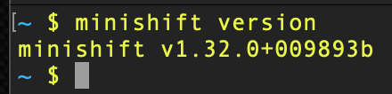
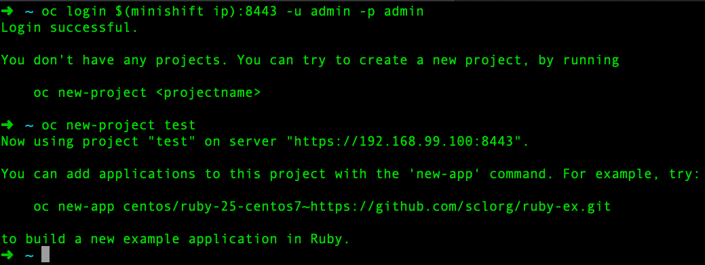
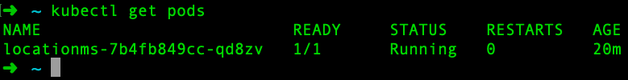

By following [my previous article in this series](https://developers.redhat.com/blog/2019/03/21/containers-kubernetes-and-microservices-start-here/), you’ve crushed the whole [containers](https://developers.redhat.com/blog/category/containers/) thing. It was much easier than you anticipated, and you’ve updated your resume. Now it’s time to move into the spotlight, walk the red carpet, and own the whole [Kubernetes](https://developers.redhat.com/topics/kubernetes/) game. In this blog post, we’ll get our Kubernetes environment up and running on macOS, spin up an image in a container, and head to [Coderland](https://developers.redhat.com/index.php/coderland/serverless/serverless-knative-intro/).

## The parts

Unlike a certain brand of kitchen cabinets that I recently purchased that had instructions only as diagrams with a stick figure person and some numbers and arrows, we’ll lay out the items and steps with diagrams and words. We need:

1. A way to run containers
2. Kubernetes
3. The Kubernetes command-line tool, `kubectl`.
4. The `oc` command-line tool for Red Hat OpenShift
5. An image to run as a test.

## A way to run containers

We need some sort of environment to run containers. Options include [Minikube](https://kubernetes.io/docs/tutorials/hello-minikube/), [Minishift](https://www.okd.io/minishift/), and a [Red Hat OpenShift](https://developers.redhat.com/products/openshift/overview/) cluster (running on, say, AWS). We’ll keep things simple and forward-looking by choosing Minishift. This will run on our local machine yet give us the power of Kubernetes (and OpenShift, by the way) without spending any money.

That’s always nice.

So let’s install Minishift on macOS. It’s one or four steps, depending on whether or not you’re using [Homebrew](https://brew.sh/).

## Installing Minishift: Two options

### Option 1: Install using Homebrew

```
brew cask install --force minishift
```

Boom. Done. You can skip to the “Installing Kubernetes” section.

### Option 2: DIY

1. Visit the [Minishift releases page ](https://github.com/minishift/minishift/releases)and download the latest macOS-compatible release (it has “darwin-amd64” in the name, around 9MB in size). Or download it using curl.
2. Uncompress the file. The easiest way to do this is to double-click on the file, or use `tar`.
3. Make sure the file is where you want it to reside (e.g., ~/minishift directory).
4. Make sure the directory is in your system PATH.

### Download using curl

Download the latest version (as of this publication) with this command:

```
curl -O https://github.com/minishift/minishift/releases/download/v1.32.0/minishift-1.32.0-darwin-amd64.tgz
```

### Uncompress the file

```
tar -xvzf minishift-1.32.0-darwin-amd64.tgz
```

### Move to where you want it

```
mv minishift-1.32.0-darwin-amd64/minishift /usr/local/bin/minishift
```

### Update PATH

```
export PATH=$PATH:/usr/local/bin/minishift
```

### Prove it

The command `minishift version` should yield:



## Installing Kubernetes

Bonus! It’s included in Minishift. Wow, that was easy.

## Installing kubectl

The Kubernetes command-line tool, kubectl, is a breeze to install on macOS:

```
brew install kubernetes-cli
```

(If that fails, there is a more in-depth explanation on the [kubectl installation page](https://kubernetes.io/docs/tasks/tools/install-kubectl/#install-kubectl-binary-via-curl).)

## Installing oc

```
brew install openshift-cli
```

(Or, you can use the DIY instructions at the [okd page](https://docs.okd.io/latest/cli_reference/get_started_cli.html#cli-mac). OKD is the upstream version of OpenShift. What is this upstream talk all about? It’s part of [Red Hat’s strategy](https://opensource.com/article/16/12/why-red-hat-takes-upstream-first-approach).)

## Fire it up

Time to get your cluster up and running. It’s quite simple; at the command line, use the following command:

```
minishift start
```

Note: If, at any time, you want to start fresh with Minishift, use the commands `minishift stop` and `minishift delete --force --clear-cache`.

When that finishes, we need a few commands to get “attached,” if you will, to our cluster. We’re going to cheat here and use some OpenShift commands. Those commands are shortcuts. If we didn’t use them, we’d have to alter our Kubernetes configuration and create a user and grant access. We can save a ton of steps. If you want to use only `kubectl` and be a purist, you can follow this blog post “[Logging Into a Kubernetes Cluster With Kubectl](https://blog.christianposta.com/kubernetes/logging-into-a-kubernetes-cluster-with-kubectl/).”

```
oc login $(minishift ip):8443 -u admin -p admin
oc new-project test
```



## An image to run

Finally, it’s a good idea to run a very basic image as a Kubernetes pod to test your setup. To do this, let’s run an image in a pod and then run `curl` to make sure it’s all working as expected.

Use this command to spin up a pod:

```
kubectl run locationms --image=quay.io/donschenck/locationms:v2 --port=8080
```

This will pull an image down from my public repository to your system and run it using Kubernetes.

A little more detail: This creates a [deployment](https://kubernetes.io/docs/concepts/workloads/controllers/deployment/) named *locationms*, retrieves the image, starts the image in a container, and uses port 8080 to route to it. Note that the deployment name and the name of the image do not need to match. This is an area where you want to put some management thought into place. In other words, this is a great opportunity to make things really confusing if you’re not thoughtful. Don’t ask how I know this.

Note that waiting for this pod to get up and running might take a few minutes, depending on your machine’s performance. When done on a server or high-performance PC, it takes about a minute or so. My MacBook Air with the i5 processor takes about four minutes. You can check on it by running `kubectl get pods`.

When the pod is up and running, you cannot access it from your command line. Why is that? Because it’s running “inside” your Kubernetes cluster. However, Kubernetes is smart and provides a proxy to your pods in Kubernetes because there may be several containers running the same application; a pod of containers. All with the same URI. When you run `kubectl get pods` you can see your *locationms* pod.


## Reaching the application

There are two aspects, if you will, to the proxy that Kubernetes has created. One aspect is the proxy itself. The other aspect is the public face of the proxy, that which allows you to access your pods. In other words, the proxy runs on port 8001, while the proxy routes are what allow you to reach your application.

To test the proxy and its access to your pod is a two-step process. Not to worry; this gets much better and much easier later. But for now, we must start the proxy and then access the pod through the proxy. You’ll need two terminal windows to do this.

In the first terminal window, run the following command:

```
kubectl proxy
```

The proxy is running. This will tie up the command line (i.e., it runs interactively), so you need a second terminal window to run the following command, which will return a list of the proxy routes:

```
curl http://localhost:8001
```


Kubernetes proxy routes

Wow. Those results. Those are all the routes built into the Kubernetes proxy. And that’s the thing: We’re not reaching our application yet … just the proxy.

The endpoint that leads to our application is `/api/v1`. The format we want is `api/v1/namespaces/{our namespace}/pods/{pod name}/proxy/`.

The {our namespace}, in our particular instance, is `test`.

The pod name can be found, again, by running `kubectl get pods`.



Put those pieces together and you can reach our application from your second terminal (remember: `kubectl proxy` is still running in our first terminal window):

```
curl http://localhost:8001/api/v1/namespaces/test/pods/locationms-7b4fb849cc-qd8zv/proxy/
```


## Let’s have some fun

While we’re here, let’s see the *locationms* app in action by passing in an IP address. You can get your machine’s IP address by using this:

```
curl https://ipv4.icanhazip.com
```

Then, using that IP address, run our application such as in this example:

```
curl http://localhost:8001/api/v1/namespaces/test/pods/locationms-7b4fb849cc-qd8zv/proxy/75.75.33.33
```

You should see the following output:

```
{"query":"75.75.33.33","status":"success","country":"United States","countryCode":"US","region":"VA","regionName":"Virginia","city":"Leesburg","zip":"20176","lat":39.1821,"lon":-77.5359,"timezone":"America/New_York","isp":"Comcast Cable Communications","org":"Comcast Cable Communications Holdings, Inc","as":"AS7922 Comcast Cable Communications, LLC"}
```

[Cool side note: icanhazip.com is owned and run by [@majorhayden](https://twitter.com/majorhayden). We worked at together at Rackspace, and now we work together at [Red Hat](https://developers.redhat.com/).]

## By the way…

By the way, *locationms* is a .NET Core program written in C#. The magic of containers: (almost) all development languages are welcomed!

## Wait, there’s more

Although you now have a Kubernetes cluster running on your local machine, there’s still a lot more to know and do. There must be an easier way to get to your application than running `kubectl proxy` in a second terminal. There must be a way to run more than one container, or more than one application. There must be a way to update your code while it’s running—a “rolling update” as it’s known.

And there is. We’ll cover all that as the series continues. In the meantime, own that red carpet.

P.S. It’s pronounced “kube-cuddle.”

## Also read

[How to set up your first Kubernetes environment on Windows](https://developers.redhat.com/blog/?p=580387)