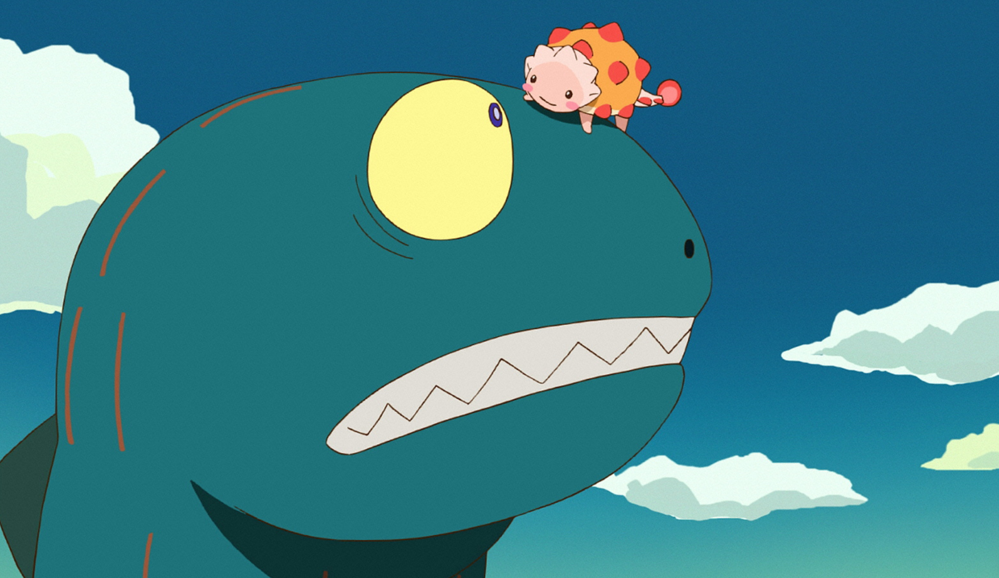

## 一

不论台湾，还是西藏新疆，

一寸一厘的国土都不能让，

谁知道上面能长出什么好吃的来。

## 二

我这辈子，

唯一拿得起放不下的，

就是筷子了。

## 三

作为入侵物种，

小龙虾在中国颜面扫地，

居然沦落到要靠人工养殖才能活下去……

如果有外来物种入侵中国成功了，

一定是因为它不好吃。

## 四

在我国，东西分三类，

直接吃的，

看着好像可以吃的，

得想点办法才能吃的。

## 五

“说，你除了吃还会什么？”

“还会饿。”

## 六

亚当和夏娃吃了蛇给他们的禁果，

遭到了上帝的惩罚！

被逐出伊甸园，所以有了人类。

如果亚当和夏娃是中国人，

那被吃的，应该是那条蛇。

## 七

你们吃是为了活着，

我们活着是为了吃。

## 八

晚上睡不着觉就开始数羊：

一只羊、两只羊、三只羊、

喜羊羊，美羊羊，懒羊羊，

沸羊羊，小肥羊，海底捞，

麻酱，小料，金针菇，虾滑，宽粉，

海带，豆芽，大海螺，茼蒿，菠菜……

TMD，下楼！不睡了！！！