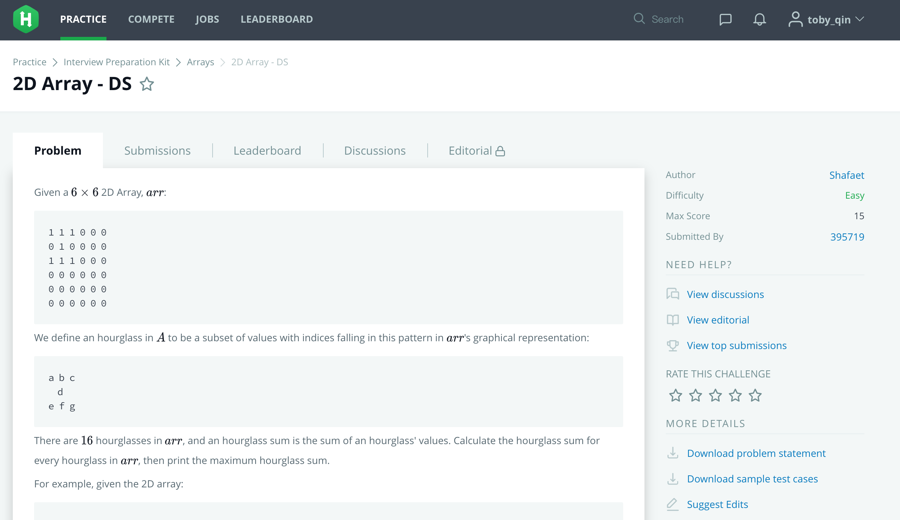

在线面试候选人编码能力可以用一些实时共享的编辑器。Talk is cheap, show me the code.

<!-- more -->

## ShowMeBug

国内的服务器，域名好念，支持语法高亮，带运行环境，还可以事先准备面试题。唯一的缺点是需要登录，可以用GitHub快速登录。但是你想啊，如果你电话里念完地址后，回车后居然还要注册登录，尴尬。

## CollabEdit

国外的服务，域名不好念，电话沟通时就有点蛋疼。不能运行代码，不用登录，其实可以作为第一方案，候选人打不开时再用上面那个。

## 其他

如果有条件到Google搜一下，类似的服务还有好几个，可不可靠需要自己验证，关键字：Online Realtime Code Editor

- https://codeshare.io/
- https://codebunk.com/
- https://coderpad.io/

曾经我面试某家公司时他们用了https://www.hackerrank.com/，那个体验真是太棒了。面试官给候选人发送面试的网页地址后，候选人可以自由选择做题的时间，可以查资料，但必须在指定时间交卷，比如45分钟。

描述可以有点苍白，有兴趣的同学可以去体验一下，有点像OJ（Online Jude）刷题。