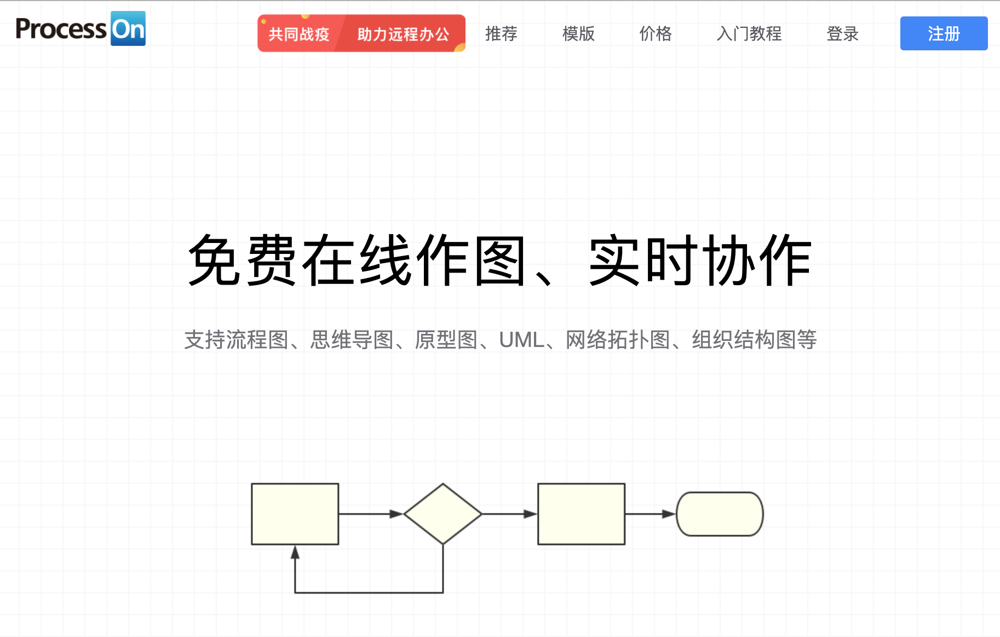
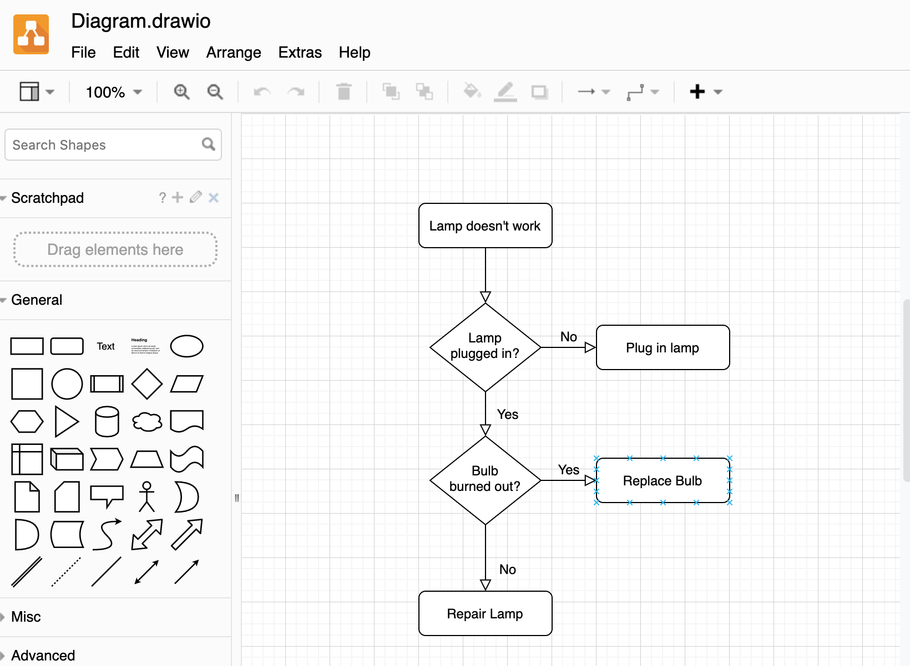
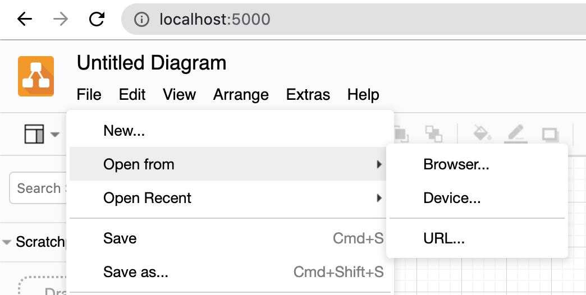

现在很多服务都已经云端化了，浏览器早已不是只用来浏览信息的浏览器了。

<!-- more -->

## 在线绘图

国内最常用的就是 ProcessOn 了，功能很全，就是免费额度有点少。



国外最知名的就是 [Draw.io](https://draw.io) 了，基本上就是免费的，常常集成在各种服务里。就是速度有点慢，不，是非常慢。



Draw.io 现在改名了，叫 diagrams.net。最关键的是，它还是开源的！

## 部署一个 Draw.io

Draw.io 是基于[mxGraph library](https://github.com/jgraph/mxgraph)构建的，后端用 Java 实现了简单的文件导出和处理功能，画图的功能都是通过 JavaScript 在浏览器的，所以是完全可以用静态页面的方式来托管一个不需要文件导出和鉴权的绘图站点。

欲知详情请移步至该项目：

- <https://github.com/jgraph/drawio>

要完整部署该项目需要用 ant 来编译 war，并用 tomcat 托管。但是，我不想用 ant 去编译也不想和 Tom 猫发生什么关系，所以我要对这个项目的功能进行阉割。

- 去除所有国外的在线服务，比如 Google Drive，OneDrive，Github 等等
- 避免跳转到 Draw.io 官网
- 去除后端服务，只要能在浏览器绘图并缓存，能保存为本地文件

来来来，folk 一下这个项目开干，新项目地址：

- <https://github.com/tobyqin/drawio-local>

```bash
# 第一步，干掉Java，只保留Web应用
mv -r src/main/webapp /temp/webapp
rm -rf *
mv -r /tmp/webapp .

# 第二步，去掉在线服务
code js/PreConfig.js
# 配置 local='1'
# 参考 https://desk.draw.io/support/solutions/articles/16000042546-what-url-parameters-are-supported-

# 第三步，修改错误的资源引用，用Chrome的开发者工具
# 第四步，加一些黑科技到 index.html 来hack外部跳转，balabala
```

完事具备，用一行代码在本地托管：

```bash
python3 -m http.server 8000
```

OK 啦，干净清爽的感觉就是那么好。



改一下 `README.md` 就推送了吧。感觉我只需要花几分钟，其实我调试了几小时，开发为什么总估不准时间呢？奇怪。

## 部署到 Docker

没有容器化的服务是没有灵魂的服务，那么我们就给它加点灵魂。加灵魂需要一个 `Dockerfile`，这样写：

```dockerfile
FROM frolvlad/alpine-python3:latest

RUN mkdir /app
WORKDIR /app

RUN pip3 install flask
ADD . /app/

EXPOSE 5000
CMD python3 app.py
```

这个灵魂是有讲究的，为什么这么说呢？

1. 用的是 apline 的基础镜像，这个是开源界最常用的基础镜像，因为它及其的小，一般只有几 MB 或者几十 MB。对应的 apline 镜像还有 node，java，go 版的，应有尽有。
2. 先安装 flask 后 copy 应用，因为 flask 安装后这个 layer 就不变了，但是 app 每次打包都会不一样。

为啥要加个 flask 啊？因为我想在它访问后端报错时可以更友好一点，人性化和用户体验，Understand？

```python
@app.route('/not-support', methods=['GET', 'POST'])
def not_support():
    return "Sorry, this action is not supported."
```

好啦，打包镜像走起。

```bash
docker build -t tobyqin/drawio-local:latest .
```

让这个灵魂跑起来。

```bash
docker run -it --rm -p 5000:5000  tobyqin/drawio-local
```

访问本地 5000 端口，一点毛病都没有，注意 `--rm` 在调试时很有用，它可以帮你自动清理退出的容器。

让我们来把这个灵魂发布到全世界。

```bash
docker login
docker push tobyqin/drawio-local
```

咦？这个灵魂好像有点重啊，完全推不动嘛。用 Portainer 查看一下里面到底有什么东西。


基础镜像层总共才 4M，应用层居然接近 100M，要给灵魂减减肥了。在根目录加个 `.dockerignore` 文件，把不想打包的文件统统写在里面。

```
.git
.DS_Store
.vscode
*.md
...
```

321 再来一遍灵魂序曲，嗯，有内味了。

## 拿来主义

我想你是不愿意再踩一遍我的坑了，反正这个东西做一遍就行了，拿去用吧。

### 1. 静态托管

直接到[Github](https://github.com/tobyqin/drawio-local) 下载 zip 解压后丢到 nginx 或者 iis 即可，顺手给项目加个星呗。

### 2. Docker 部署

一行命令即可。

```bash
docker run --name="drawio-local" --restart always -p 5000:5000  tobyqin/drawio-local
```

### 3. 薅我羊毛

这个服务我已经部署到了我的主机，免费用，随便用，但不保证它的速度和生命延续。

- <https://draw.pytips.cn>

就这样，Peace。
