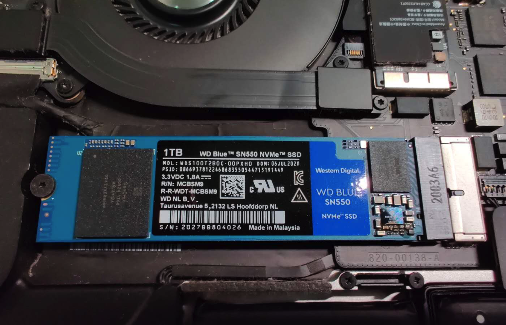

小记一下，其实过程比较简单。

## 购买工具

在淘宝可以买到，需要苹果后盖专门定制的五角螺丝刀和m2硬盘转接口。一般买转接口会送螺丝刀，但是需要螺丝还是要品质好一点的，我买了第一个转接口送了个山寨螺丝刀，结果只拧了5颗螺丝就滑丝了，郁闷的要死，只能重新网购第一把螺丝刀，结果还搞错了型号。

这个是比较好一点的，有两把螺丝刀，一个开后盖，一个拧硬盘，拧硬盘的螺丝属于标准六角螺丝，一般的工具箱里有。上面这套价格不超过30元就可以买到。

## 选购硬盘

选购硬盘前还需要确认你的MacBook能不能升级硬盘，简单区分就是2018年后的新款MacBook都不能升级，硬盘已经焊死在主板上，具体支持的型号淘宝卖转接口的店铺都有列表，2015之前型号基本都支持升级，不管是MacBook还是Pro。

然后就是选购的硬盘，需要M2接口的，型号也是有讲究的，不是所有都能很好的兼容，推荐比较多的是用三星的，因为原装的就是三星的。

也可以用西数的黑盘或者蓝盘，我买了蓝盘1T SN550，速度比黑盘差一点，但是发热量小不少。M2硬盘基本上速度越快热量越高。

东西齐了，就可以开工了。

## 升级过程

整个过程挺简单的，就是比较费时间。

1. 确保系统版本大于10.13，这样它才认识NVME的M2硬盘
2. 用一块空的移动硬盘备份整个系统：插入硬盘，格式化，启动TimeMachine等待备份完成即可
3. 拆开后盖，卸下老硬盘，装上新硬盘（需要第一步的工具和转接口）
4. 顺便清理一下里面的灰，合上后盖，开始恢复系统
5. 恢复完成后确认系统OK后再拧上螺丝钉

具体到恢复系统，大致的步骤如下：

1. 先插入有TimeMachine备份的移动硬盘
2. 同时按住 电源+cmd+option+r开机，等待小地球出现
3. 进入MacOS实用工具系统，有可能需要输入wifi，我的没输入
4. 选择磁盘工具，把新硬盘格式化为APFS，分区GUID
5. 格式完成后回到前一个页面，选择从时间机器恢复
6. 等待恢复完成后开机就是你原来的系统，除了需要重新输入密码里面啥也不会丢

恢复需要的时间取决于你备份的大小和移动硬盘的速度，最好是USB3.0和M2的移动硬盘，我用的是普通移动硬盘恢复了200多G的数据，花了4个小时以上。

## 总结

整个升级还是很划算的，从256G的空间一下子变成1G，再也不会因为多跑两个虚拟机而删这删那，硬盘的整体速度也有了很大提升。原装的硬盘是5年前的产品，读写和现在的真的没法比。

关于升级的细节网上也有很多文章，可以很容易查到。或者去淘宝找店家要视频甚至远程指导，也是有可能的。

发一个链接，仅供参考：https://post.smzdm.com/p/a783vk9g/

