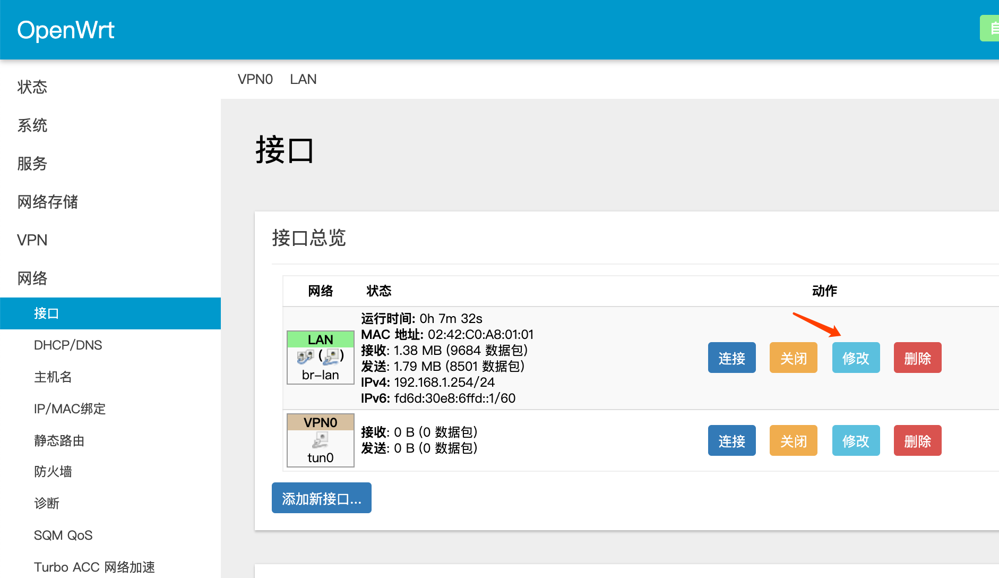
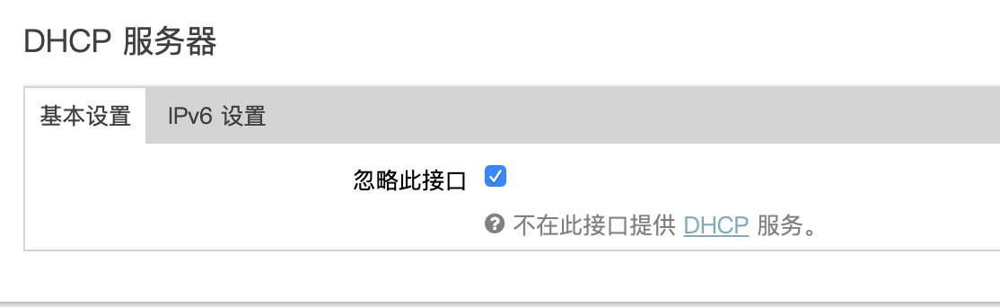
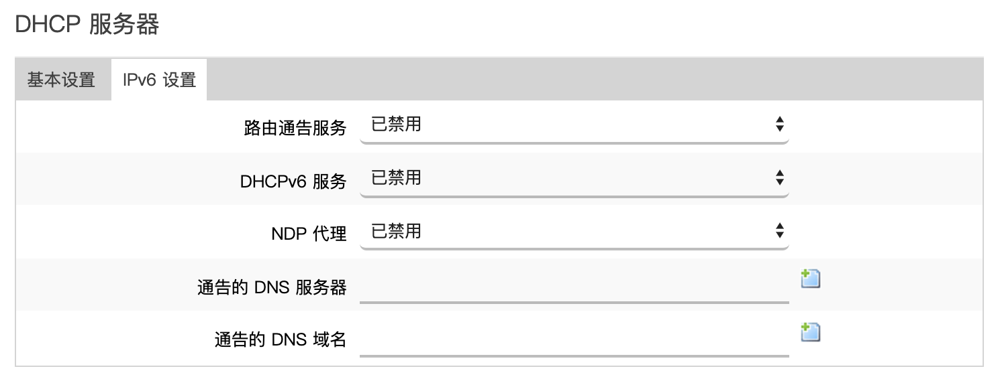
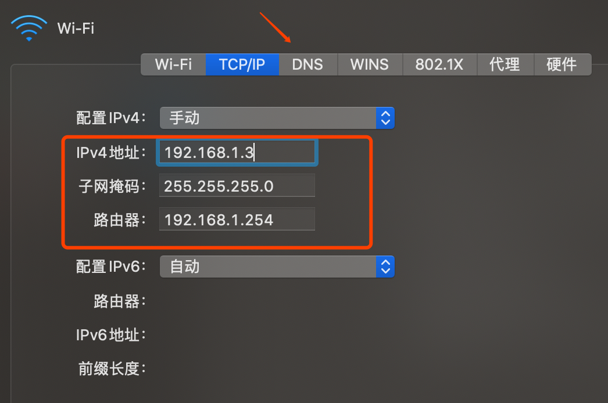
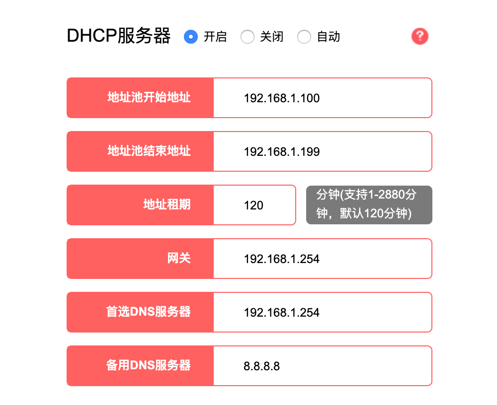
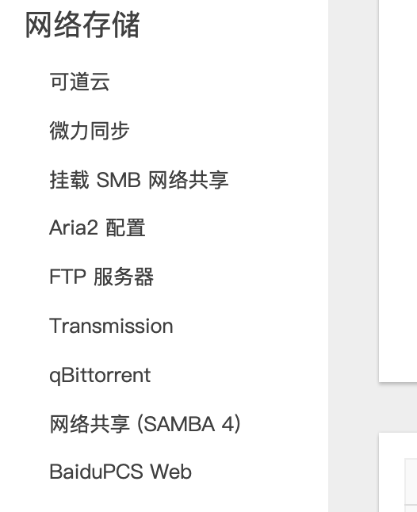
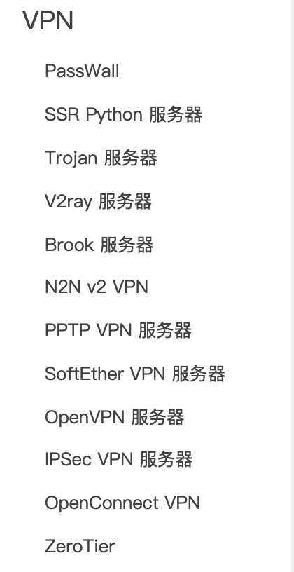

前提条件是docker已经安装，用网线连接N1。

<!-- more -->

## 准备工作

安装Portainer很有用。

```
docker volume create portainer_data
docker run -d -p 9000:9000 -v /var/run/docker.sock:/var/run/docker.sock -v portainer_data:/data portainer/portainer:linux-arm64
```

打开网卡混淆模式

```
ip link set eth0 promisc on
```

创建docker虚拟网络，IP段需要和主路由的一致。

```
docker network create -d macvlan --subnet=192.168.1.0/24 --gateway=192.168.1.254 -o parent=eth0 macnet
```

`192.168.1.254` 就是旁路由的地址，后面的登录和配置都要用这个地址。

## 配置OpenWrt

运行OpenWrt容器。

```
docker run --restart always --name=openwrt -d --network macnet --privileged unifreq/openwrt-aarch64:latest
```

进入OpenWrt的shell，修改网络。

```
docker exec -it openwrt bash
vi /etc/config/network

# 把 192.168.1.1 改成 192.168.0.254

config interface 'lan'
        option type 'bridge'
        option ifname 'eth0'
        option proto 'static'
        option ipaddr '192.168.1.254' # 改这行
        option netmask '255.255.255.0'
        option ip6assign '60'
```

退出容器里的shell，重启N1。

```
reboot
```

重启完成后就可以在浏览器访问旁路由了。

```
http://192.168.1.254/
# 默认用户名密码 root / password
```

修改网络接口，使用主路由网关和DNS。




关闭旁路由DHCP服务。





到此为止，旁路由的配置基本完毕，后面就是测试了。如果中间任何配置有问题想重来，停止并删除容器即可。

```
docker stop openwrt
docker rm openwrt
```

## 使用旁路由

第一种方式，非全局模式。如果只需要某一些设备走旁路由，需要手动配置网络为旁路由地址，主路由不需要做任何配置。好处是旁路由挂了只会影响这些特定的设备，坏处就是比较麻烦。



第二种方式，主路由全局模式。经旁路由的网关配置到主路由的DHCP即可，以后所有连接主路由的设备都会先经过旁路由。

配置方法就是进入主路由后台，将DHCP默认网关改成 192.168.1.254，DNS也改成这个地址。已经连接的设备重新连接主路由一下才会生效。



一般用第一种方式测试一下旁路由是不是正常工作了，然后我会全局都走旁路由。我发现N1放那么几天就会死机，所有最后配置一下自动重启，比如每天重启一次。

## 旁路由的作用

配置了半天，旁路由的作用都没说出来，在旁路由里世界无穷大。去广告什么的都不说了，还有很多只可以意会不可言传的功能。




