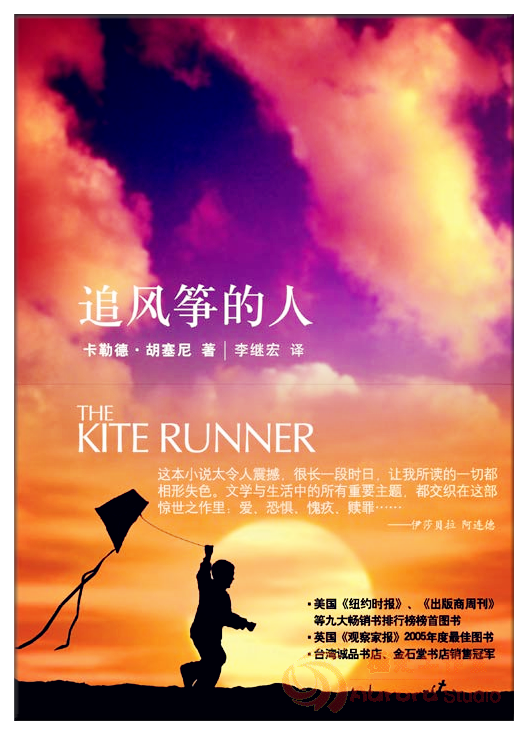

文/大橙子

> **五星好评，强烈推荐！**

贯穿整本书的是作者（阿米尔）的懦弱与自私，整个故事，直至最后，当阿米尔决定去挽救哈桑的儿子叫索拉博时，才是救赎的开始。

整个故事的背景是俄罗斯入侵阿富汗，以及后来的阿富汗内战，以及种族问题。善良的哈桑被人始终被对立种族看不起，内战也是因为种族对立的问题。战争带来的是可怕的毁灭，尤其对儿童的造成的毁灭性影响，世人值得惊醒。善良的人，应该被世界善待。

拉辛汗是位智者：当阿米尔还是个孩子的时候，在屡屡被父亲忽视的时候，拉辛汗鼓励他读书、写作，这也会日后阿米尔的写作奠定了基础；当阿米尔的父子逃难离开美国后，拉辛汗找到了哈桑，并接回一同住；最后也是拉辛汗，将远隔千山万水，大洋彼岸的阿米尔拉回阿富汗，开始救赎的路。

哈桑写给阿米尔的信真让人心碎。

信里有他们的童年，童年时的阿富汗，阿富汗天空下那一群群追着风筝跑的孩子。信里有现在的阿富汗，满目疮痍。信里有哈桑的儿子索拉博，聪明的索拉博、会识字的索拉博、开心的索拉博。信里有病重的拉辛汗，一个令人敬爱的男人。信里有哈桑的梦，鲜花盛开的喀布尔街头、风筝再次在天空飞翔，而他的朋友阿米尔再次回到他们儿时的土地。读完哈桑的信，有种特别想哭的冲动。

> “如果你回来，你会发现有个忠诚的老朋友在等着你。愿安拉永远与你用在”。

故事的最后，哈桑原谅了从出生那天起就抛弃了自己的母亲，并陪伴她终老。拉辛汗说主会原谅你的父亲，而最终阿米尔承认了那些年自己和父亲所犯下的错，而当他决心为他们曾经的过错做出弥补的时候，他便原谅了父亲，开始了救赎的道路。

> **为你，千千万万遍。**

