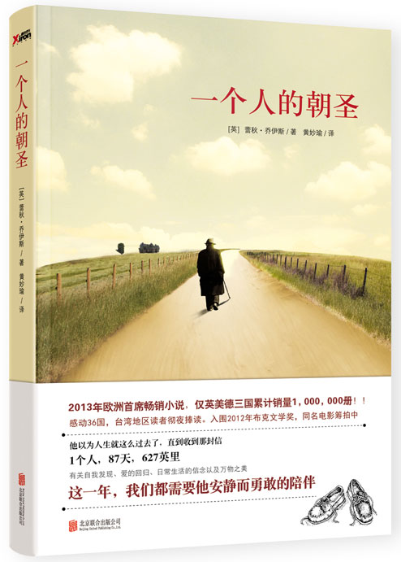

文/大橙子

> **四星好评，不错哦！**

哎哟喂，写作手法很有意思，故事从头到尾都很平淡。

本是带着疑惑上路的，一个退休的65岁的老头，莫名其妙的想靠走路的精神力量去拯救生命垂危的故人奎妮。想知道哈罗德跟奎妮之间到底是什么样的关系，是情人吗？他老婆莫林跟邻居都深以为然，哈罗德为了旧情人将老婆一个人抛弃在家！

更别提后文，当媒体大肆的报道哈罗德这位朝圣者时，哈罗德同奎妮之间的关系，在吃瓜观众面前越来越微妙！不过当我们细细梳理时，又发现不是那么回事。从哈罗德徒步的第一天开始，他每天都会给老婆莫林打电话，每次购买纪念品时，除了给奎妮带去的，一定还会有莫林的那一份。哈罗德心理深深的爱着他的妻子莫林。

哈罗德的妻子莫林，一直在同他们的儿子戴维对话。她告诉儿子哈罗德做了疯狂的决定，要徒步去看奎妮，儿子说他知道奎妮。她告诉儿子，今天她一个人去医院看病了，儿子说可以陪她去的。而在哈罗德的回忆中，好似他同儿子之间有不可逾越的鸿沟；好似因为这道鸿沟，导致他同妻子的关系也出现了问题，最终导致了哈罗德的离家出走。

不过你真要这么以为，就错啦。最后你会明白，他们儿子戴维，很多年前因为抑郁症自杀。什么，惊天霹雳！原来莫林是有精神病哟，一直在跟死人对话！NO，作者给你的回答要委婉一点，人家只不过思念儿子，多年了养成了这个习惯而已。那么奎妮又是为什么呢？原来是当初丧子的哈罗德在悲愤之中所犯下的过错，奎妮默默的替他承担了后果，而哈罗德却连声谢谢都没来得及对她说过。这才是他不顾一切踏上这道路的原因，不是爱情！

哈罗德在将近3个月的时间里，600度英里的路上，回顾了他的一生，他的父母，他的妻子莫林，他的儿子戴维。他们匆忙的一生，他们来不及做的事情，他们所亏欠的事情，他们所怨恨的事情。最终莫林明白，这么多年，她盲目的将儿子的问题归咎于哈罗德，是不对的。

当她仔细去回忆，去查看，戴维的成长过程是有哈罗德的陪伴的！奎妮的死是无法避免的结局，哈罗德同莫林，在经历这么多年的相互埋怨之后，终于相互原谅了对方。

人生路上，我们会遇到很多形形色色的人，他们来了，又走了。但终会有人陪伴你走完全程。
