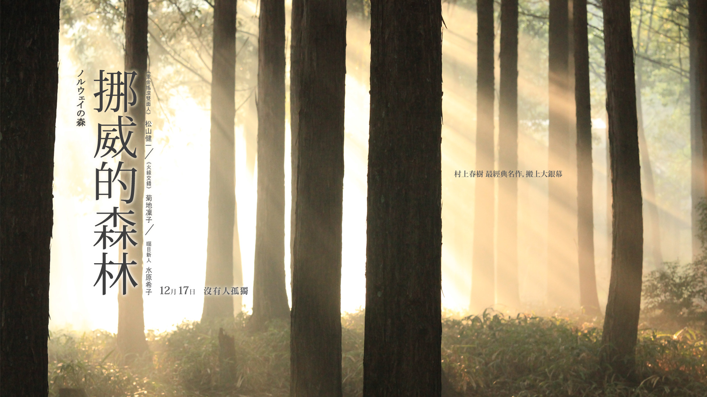

文/大橙子

不清楚村上在表达什么，故事里的木月、直子、直子的姐姐、永泽的女朋友初美，以及哪所疗养院里的许许多多的人，忧郁、自杀。那么多人死了，也没有交代原因，我想这应该是那个年代日本社会经常发生的事情。

故事里也又例外，像永泽这样的不缺钱的富二代，头脑清楚，目标明确，即使在考取公务员后，回到宿舍还自学班牙语，即使他已经自学掌握了好几门外语了。永泽的私生活，涉及到另外一个话题，性。整个故事里，对性的开放程度也是令人惊讶。不过在青少年成长时期，这也是没法回避的一个话题。

还有一个人，就是绿子，虽然经历种种挫折，也始终没有放弃对爱情的追求，这个姑娘还是蛮讨人喜爱的，她也是为数不多的精神正常的人。

村上的文字真是令人受不了，虽有幽默，却低沉的让人受不了。如果说那是一座森林，有人在森林里迷失了，有些人再也没有出来过，如木月等人；有些人在迷失中走出来了，如疗养院里走出的玲子；也有些人，生活好也罢、坏也罢，始终向前行走，如绿子、渡边。

青春，就是这样。