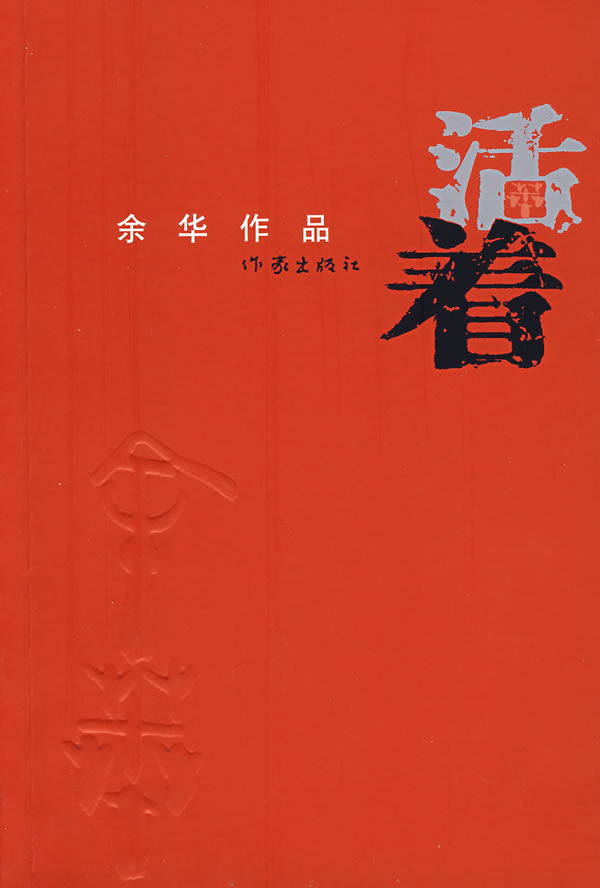

文/大橙子

没什么好说的，白花花的语言，依托中国抗日战后至今的时代背景，以富贵的经历叙述了很多中国式悲哀。

富二代的富贵，吃喝嫖赌，散尽家财，老爹气死。

搬出豪宅，交出家财，开始辛勤劳作，不料老丈人八抬大轿把嫁出去的女儿接了回去。

媳妇终究还是回来了，这时的母亲却生病了。

去城里请医生，却被国民党抓了去做炮兵。

仗也没怎么打。日本鬼子撤出中国，继而开始了国共内战。

战场上的每个人都想活着，都想活着回家去。

后国军被围，被俘虏。共军优待俘虏，给了路费，富贵回家了。

回家后发现老母已不再，女儿凤霞不会说话了。

想带着老婆儿女好好过日子，发现挣得太少，没法让儿子上学。

心生一妙计，把女儿送给大户人家，就供得起儿子上学了。

好不容易送走的女儿，最后还是偷偷跑回来了，心一横，还是自己养着吧。

这时候，村里搞炼钢铁，收了每户人家的锅。还收了儿子的羊，说是从此以后吃食堂了，再也不用自己家做饭了，方便啊。

儿子在学校跑步跑的好，体育老师说可以训练，日后出国比赛，为国争光。富贵不懂，硬是阻止了。

富贵带着老婆、女儿，一家三个轻壮年劳动，日子倒也可以。

不料老婆却病了，身体一天比一天差。

国庆节来的时候，富贵一家守着锅炉，终于把铁给融化了。

村长高高兴兴带着一帮人去县里汇报。富贵背着老婆去城里看病。

天有不测风云，儿子学校的校长，县长的老婆，生孩子大出血。

学校把他们年级的孩子都拉到医院，不料只有富贵儿子的血型匹配，医生心一横，抽血往死里抽，最后出了人命。

儿子死了，老婆的病更加重了，眼看一天天不行了，却撑住了。

村里人娶媳妇嫁女儿，看得凤霞眼红，虽然她不会说话，也是羡慕别人家的。

富贵托村长给凤霞介绍婚事，村长还真找来了，就是头有点偏，人在城里还有正经工作。

好在偏头对凤霞挺好，不久还怀上了。

不料凤霞生孩子时难产，又挂了。

到这时，富贵老婆终于顶不住，也归西了。

富贵就经常去看偏头和外孙，没想一天偏头干活时被砸死，留下外孙一人。

富贵把外孙接回家一同过。

一天，收棉花时，外孙不舒服，富贵就把他送回家，还给他煮了好多豆子。

真是，屋漏偏逢连夜雨，富贵回家发现外孙吃豆子噎死了，嘴里塞着豆子。

最后，富贵买了头牛，相依相伴。

不太愿意相信，富贵是集所有悲剧于一身的人。

故事太刻意了些，不推荐。
