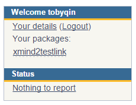

本文仅讨论上传相关的步骤，关于如何给写一个`setup.py` 请参阅官方文档：

- https://docs.python.org/2/distutils/setupscript.html

##  上传前的注意事项

- 假设你的包已经开发完成，并且根目录必须要有一个[setup.py](https://github.com/pypa/sampleproject/blob/master/setup.py)。
- 最好有一个[README.rst](https://github.com/pypa/sampleproject/blob/master/README.rst) 用来描述你的轮子，虽然这不是必须的，但文档就像内裤，你最好还是要有的。
- 如果你需要打包代码文件夹以外的文件，比如版权信息等等，你还需要写一个 [MANIFEST.in](https://github.com/pypa/sampleproject/blob/master/MANIFEST.in)。

## 关于`setup.py`的补充说明

- `name` 必须是唯一的，允许使用数字和字母，推荐使用中划线（-）而不是下划线（_），因为pip安装只支持中划线，比如`pip install my-pkg`，为了不给自己找麻烦请听话。
- `version`推荐遵循[语义化版本号](https://packaging.python.org/distributing/#semantic-versioning-preferred)规则，简单说就像这样：1.2.0
- 作者姓名和邮箱地址不一定要和你的PyPI账号一致。

## 测试本地打包命令

如果上面的都没问题，在本地目录执行以下命令应该能成功在dist目录下生成*.tar.gz的包文件。

```shell
python setup.py sdist
```

## 上传并发布包文件到PyPI

### 创建 PyPI账号

非常简单，直接通过官网注册 https://pypi.python.org/pypi?%3Aaction=register_form， 但是需要验证邮件并确认激活。

### 创建用户验证文件 `~/.pypirc`

在自己的用户目录下新建一个空白文件命名为`.pypirc`，内容如下：

```
[distutils]
index-servers=pypi

[pypi]
repository = https://upload.pypi.org/legacy/
username = <username>
password = <password>
```

用户名和密码就是上一步骤所创建的，直接明文输入。如果你觉得明文密码不安全也可以留空，在后面的上传过程中会提示你手动输入。

### 注册你的包

你需要到PyPI注册并验证你的包，之后才能开始真正上传，注册的方式有以下几种。

1. 使用命令`python setup.py register`，最简单但官网不推荐，因为使用的是HTTP未加密，有可能会被攻击人嗅探到你的密码。
2. 通过[PyPI网站提交表单](https://pypi.python.org/pypi?%3Aaction=submit_form)完成注册验证。
3. 安装 `pip install twine` 然后在通过命令 `twine register dist/mypkg.whl` 完成注册。

### 上传并完成发布

你可以任选以下两种方式之一发布你的轮子。

1. 使用命令：`python setup.py sdist upload`，还是和上面一样，最简单但是有安全隐患。
2. 使用 [twine](https://packaging.python.org/key_projects/#twine)： `twine upload dist/*`


### 管理你的包

如果你的包已经上传成功，那么当你登录PyPI网站后应该能在右侧导航栏看到管理入口。



点击包名进去后你可以对你的包进行管理，当然你也可以从这里删除这个包。

### 让别人使用你的包

包发布完成后，其他人只需要使用pip就可以安装你的包文件。比如：

```
pip install package-name
```

如果你更新了包，别人可以可以通过`--update`参数来更新：

```
pip install package-name --update
```

## 可能遇到的错误

### Upload failed (403): Invalid or non-existent authentication information. 

错误的用户验证信息，你需要创建一个用户验证文件 `~/.pypirc`。请参阅上文。

### Upload failed (403): You are not allowed to edit 'xxx' package information

你需要先注册你的包才可以开始上传，运行注册命令：`python setup.py register`

### Server response (401): Incomplete registration; check your email

你的PyPI账户还没完成邮箱验证，你需要去注册邮箱找到一封验证邮件完成验证后再重试失败的步骤。

### Server response (400): Invalid classifier "Topic :: Software Development :: Utilities"

你的setup.py文件中的**classifier**信息有误，请按[官网](https://pypi.python.org/pypi?%3Aaction=browse)的正确分类书写**classifier**.

### error: No dist file created in earlier command

你还没打包就开始了上传命令，建议打包和上传的操作放在一起做，比如：

```
python setup sdist upload
```

### error: Upload failed (499): Client Disconnected

这应该是网络问题，多重试几次。

### Upload failed (400): File already exists

文件已经存在了，你每一次上次都应该更新版本号。

### 参考文档

- https://packaging.python.org/distributing/


