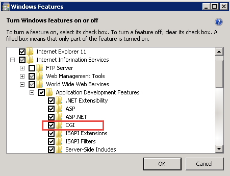
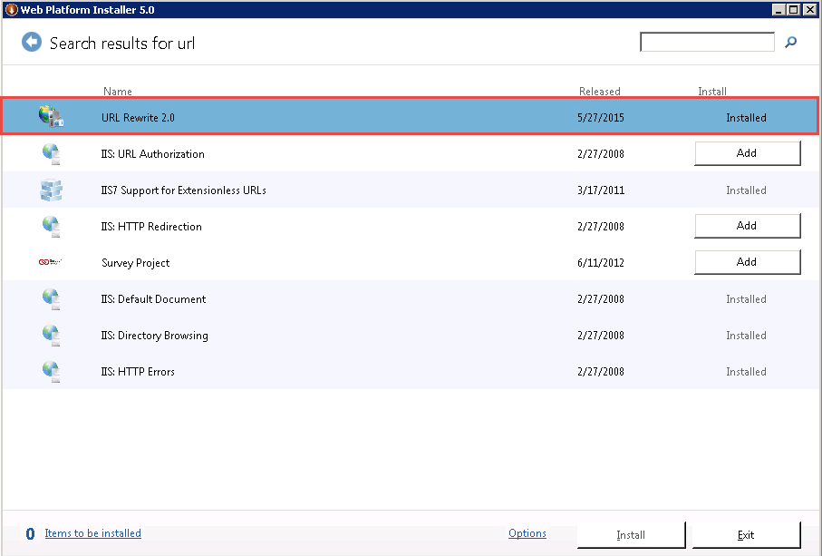
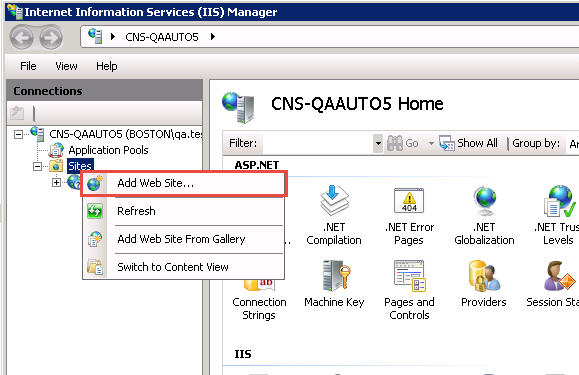
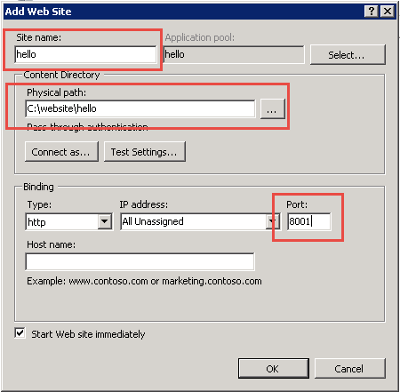
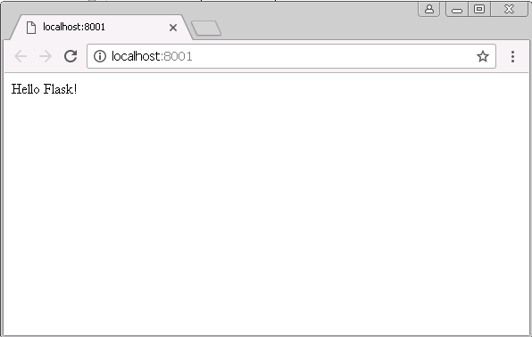
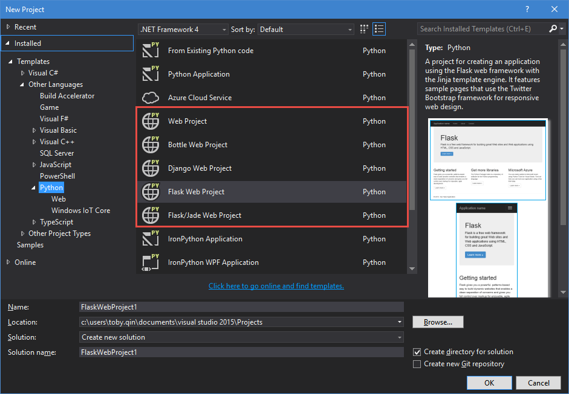

在 Windows 平台**部署**基于 Python 的网站是一件非常折腾的事情，Linux/Unix 平台下有很多选择，本文记录了 Flask 部署到 IIS 的主要步骤，希望对你有所帮助。

## 涉及工具和平台
- Windows 7 x64
- Python 3.4+
- Flask

## 完成 Hello Flask 网站

这是一个最简单的 Flask 网站：
```python
# hello.py
from flask import Flask
app=Flask(__name__)

@app.route('/',methods=['GET'])
def index():
    return "Hello Flask!"

if __name__=='__main__':
    app.run(debug=True)
```
运行`python hello.py`后没有错误说明你的 Python 环境一切正常，可以继续后面的步骤。

## 安装 IIS，启用 CGI

在控制面板中找到*打开或者关闭 Windows 功能*，安装 IIS 和 CGI，如下图。



## 安装 URL 重写组件

IIS 需要安装 URL 重写组件，这个可以通过[Microsoft Web Platform Installer](https://www.microsoft.com/web/downloads/platform.aspx)来安装。下载[Microsoft Web Platform Installer](https://www.microsoft.com/web/downloads/platform.aspx)后运行，搜索`url`，分别安装。



*注：据说 Windows10 上的 IIS 10 现在不支持 url 重写？待验证*

## 安装 wfastcgi

通过pip就可以安装：
```
pip install wfastcgi
```

## 启用 wfastcgi

剩下的事情就只有一些配置了。首先以管理员身份运行`wfastcgi-enable`来在IIS上启用wfastcgi，这个命令位于`c:\python_dir\scripts`，也就是你需要确保此目录在系统的PATH里，或者你需要cd到这个目录后再执行。
```shell
# cd to python_dir\scripts if it is not in PATH
wfastcgi-enable
```

记住命令执行成功后返回的信息：
```
C:\Python34\Scripts> wfastcgi-enable
Applied configuration changes to section "system.webServer/fastCgi" for "MACHINE/WEBROOT/APPHOST" at configuration commit path "MACHINE/WEBROOT/APPHOST"
"C:\Python34\python.exe|C:\Python34\lib\site-packages\wfastcgi.py" can now be used as a FastCGI script processor
```
 "C:\Python34\python.exe|C:\Python34\lib\site-packages\wfastcgi.py" 在下文的配置文件中需要使用。

*Tips: 使用命令 `wfastcgi-disable` 可以将其移除。*


## 创建 web.config 文件

下面是一个`web.config`文件的例子，你只需要修改对应部分就可以使用。

```xml
<?xml version="1.0" encoding="UTF-8"?>
<configuration>
  <system.webServer>
    <handlers>
      <!-- scriptProcessor 的值来自命令行工具 wfastcgi-enable -->
      <add name="FlaskFastCGI" path="*" verb="*" modules="FastCgiModule" scriptProcessor="C:\Python34\python.exe|C:\Python34\lib\site-packages\wfastcgi.py" resourceType="Unspecified" requireAccess="Script" />
    </handlers>
    <security>
        <!-- URL 重写中的特殊字符，比如加号+等等 -->
        <requestFiltering allowDoubleEscaping="true"></requestFiltering>
    </security>
  </system.webServer>

  <appSettings>
    <!-- Required settings -->
    <!-- 在这里指定Falsk app在模块中的具体位置 -->
    <add key="WSGI_HANDLER" value="hello.app" />
    <add key="PYTHONPATH" value="~/" />

    <!-- Optional settings -->
    <!-- 需要先创建日志目录，否则报错 -->
    <add key="WSGI_LOG" value="C:\logs\oboeqa_web.log" />
    <add key="WSGI_RESTART_FILE_REGEX" value="" />
  </appSettings>
</configuration>
```

## 配置 IIS 目录及权限

假设你的 Flask 程序将部署在 C:\website\hello 下面，那么你的目录结构大致如此。
```
C:\WEBSITE
└───hello
        hello.py
        web.config
```

现在你需要让IIS用户拥有访问和执行你的网站脚本的权限，进入 C:\website 目录，执行下面两条命令：

```
cd C:\website
icacls . /grant "NT AUTHORITY\IUSR:(OI)(CI)(RX)"
icacls . /grant "Builtin\IIS_IUSRS:(OI)(CI)(RX)"
```

## 创建并访问你的网站

现在你离成功只差一步之遥，打开 IIS 管理面板，新建一个网站。



你只需要填上网站名称，物理地址和相应的端口号，点击确认。



打开浏览器，就可以访问你配置好的网站。如果有错误，可以去检查 `web.config` 中配置的日志文件。



## 简单总结

写完之后发现其实要完成的步骤并不是特别复杂，但是从摸索到实践的过程确实不易。本文仅讨论了部署的主要步骤，其实真正的生产环境你要考虑的问题可能更多，比如使用virtualenv 对网站进行隔离，安全问题，静态文件解析等等。

## 最后的惊喜

**据说**部署Python 网站到 IIS 还有更简单的办法，那就是安装宇宙最强的IDE - [Visual Studio 2015](https://www.visualstudio.com/) （VS2017 暂不支持 Python 开发），个人开发者可以免授权使用社区版。在 VS 中你可以使用 [PTVS](https://microsoft.github.io/PTVS/) 来快捷开发**并部署**Python 程序，真正让你一键无忧。



PTVS 支持了常见的 Python Web 框架，比如 Flask，Django，Bottle，Jade 等等，调试的时候只需要按 F5，部署右键选择 publish，跟着向导一步两步你就可以完成魔鬼的步伐。

## 参考链接

- http://stackoverflow.com/questions/5072166/how-do-i-deploy-a-flask-application-in-iis
- http://stackoverflow.com/questions/20134329/how-to-deploy-a-flask-application-in-iis-8-windows-server-2012
- http://blog.csdn.net/firefox1/article/details/46438769
- http://www.cnblogs.com/liulixiang/p/4999608.html
- http://www.cnblogs.com/xiaolecn/p/5111076.html

