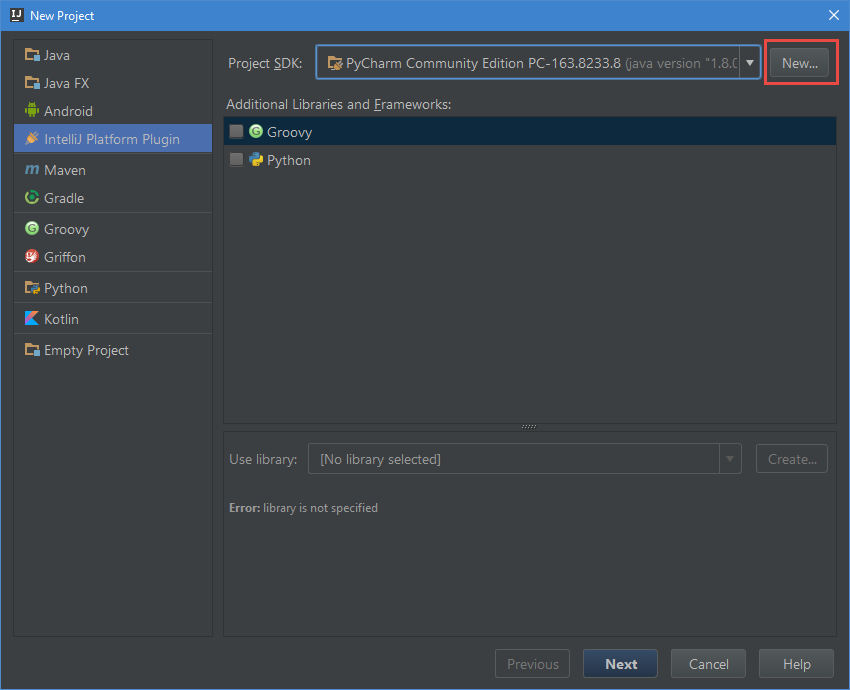
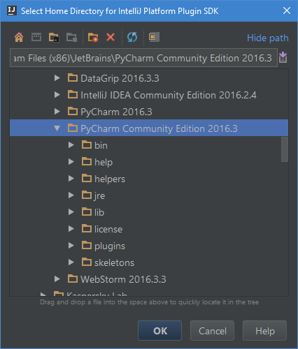
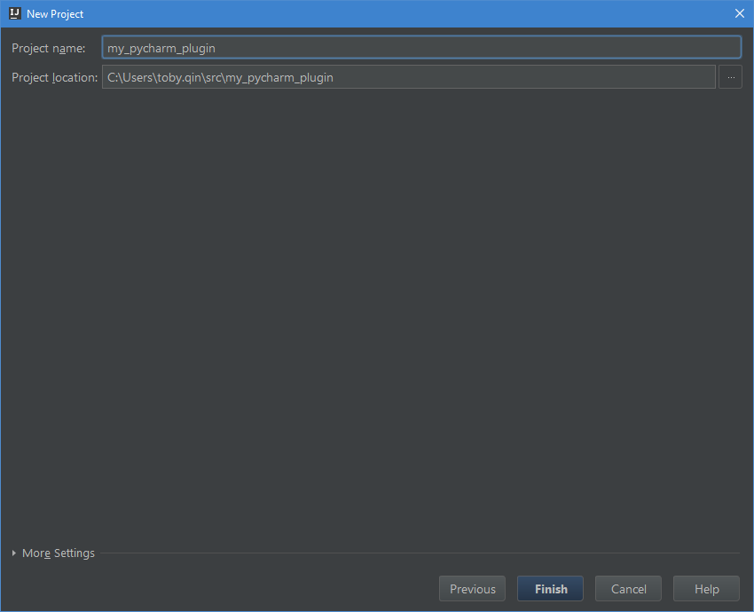
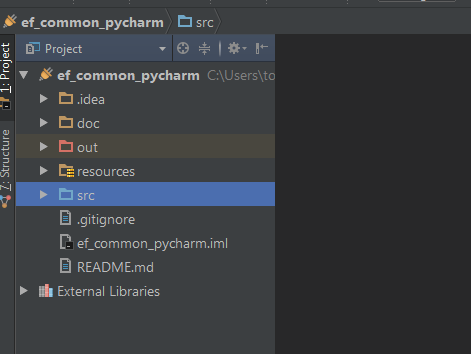
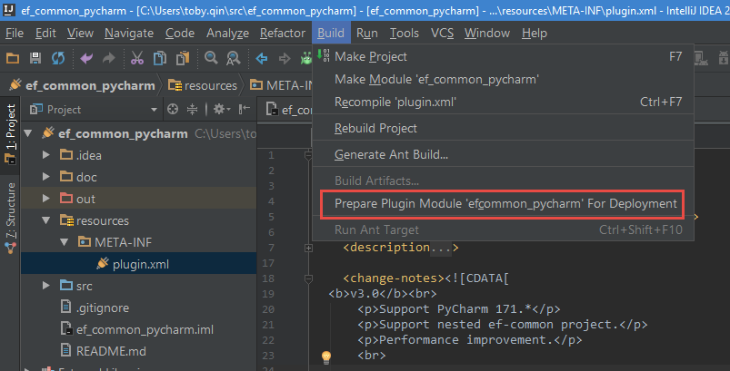
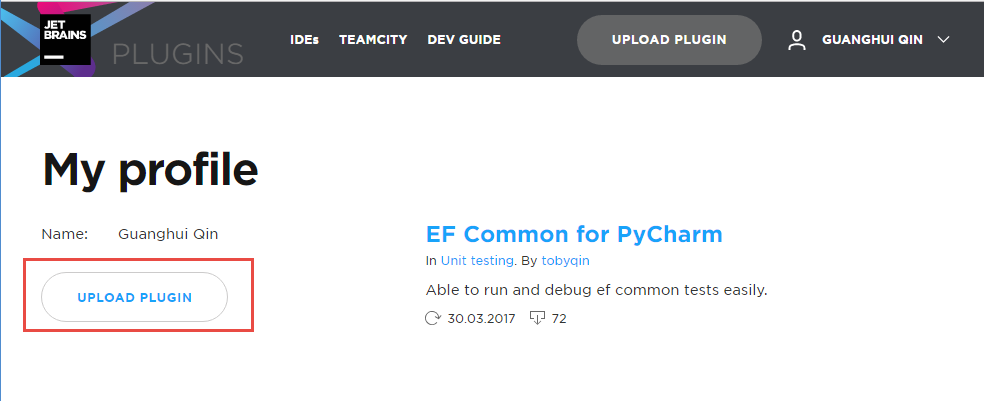

PyCharm 是很多 Python 开发者优先选择的 IDE，功能强大，跨平台，提供免费社区版，非常良心。如果你想自己给PyCharm添加一些功能怎么办呢？有两个办法：

1. 通过提需求实现，到 JetBrains 的 [github](https://github.com/JetBrains/intellij-community/) 去提issue或者自己发Pull Request请他们merge。
2. 通过安装插件实现，你可以查找现有的[插件仓库](https://plugins.jetbrains.com/)，或者，自己写一个。

今天我们说说怎么搭建环境自己写一个 PyCharm 插件。

## 前期准备

先普及一下知识，开发 PyCharm 插件和开发 IntellJ IDEA 插件需要的环境是一样的，因为 PyCharm 本身就是 IDEA 的一个子集，说白了就是 IDEA 上套了一个 Python 语言支持的插件。其他系列的 IDEA IDE 其实也是一样的道理，都是套了对应语言支持的框架外加一点外观修改，就成了新的产品，比如 WebStrom，PhpStorm，RubyMine。到这里你应该有个印象，JetBrains 这个公司太能玩了，就一个 IDEA 能整出那么多产品来，很厉害吧？

**开发 PyCharm 插件你需要：**

- 对 Java  语言有一定了解，因为你只能用 Java 开发插件

- 安装最新版的 [IntelliJ IDEA](https://www.jetbrains.com/idea/)

- 安装 PyCharm Community Edition 到本地

- 确保 IntelliJ 安装并启用了 `Plugin DevKit` 插件，默认自带

- 配置 IntelliJ Platform SDK， 下文会涉及相关步骤

- （非必需）将[IntellJ IDEA Community Edition](https://github.com/JetBrains/intellij-community/) 的代码克隆到本地，方便调试

  ​

如果你英文还可以，也可以阅读官方的帮助文档。

- http://www.jetbrains.org/intellij/sdk/docs/basics/getting_started.html


## 新建插件工程

从文件菜单选择 **New Project**， 选择 **IntelliJ Platform Plugin**，如果你没有配置**SDK**，点击**New** 菜单。




选择你本地 PyCharm Community Edition（社区版）的安装路径作为SDK目录，Java SDK 选择 1.8 以上的版本。

> 请注意，你也可以使用 PyCharm Professional (旗舰版) 的安装路径作为SDK目录，不过当你调试插件碰到核心代码时，社区版你可以一步一步跟到最里面，但旗舰版不行，因为旗舰版并不是开源的，你拿不到源代码。



回到 **New Project** 的界面，点击 **Next**，输入 **Project name** 和 **Project location**，点击完成。




**小贴士：**如果你是打开别人的写的插件，那么你直接选择打开工程目录是没有用的，因为 IntelliJ IDEA 不认为这是个插件工程，所以你没法运行和调试这个插件，一个不怎么优雅的办法就是**从现有代码新建一个插件工程**，StackOverflow 关于这个的吐槽问题你搜到，如果你有更好的办法请告诉我。当你换一台机器把插件代码克隆下来之后应该就知道我在说什么了。

## 插件工程目录结构

一个典型的插件目录结构就像下图。



- **.idea** 目录 - JetBrains IDE 生成的工程都会有这么一个目录，存放用户配置和缓存，无需关心。
- **doc** 目录 - 插件的文档，可选。
- **out** 目录 - 编译后的代码字节，无需关心。
- **resources** 目录 - 资源存放目录，插件的配置文件在此。
- **src** 目录 - 代码存放的位置。
- ***.iml** 文件 - 项目的配置文件。

## 修改插件信息

打开 `/resources/META-INF/plugin.xml`， 更新插件信息，举例说明。

```xml
<idea-plugin version="2">
    <id>com.eflabs.plugin.efcommon</id>
    <name>EF Common for PyCharm</name>
    <version>3.1</version>
    <vendor email="toby.qin@live.com">Toby Qin</vendor>
    <description><![CDATA[
      <b>Able to run and debug ef common tests easily.</b><br>
      <br>
      <ul>
      <li>Support run/debug ef-common tests via context menu.</li>
      <li>Show run button in the line of test case.</li>
      </ul>]]>
    </description>
    <change-notes><![CDATA[
      <b>v3.0</b><br>
      <p>Support PyCharm 171.*</p>
      <p>Support nested ef-common project.</p>
      <br>

      <b>Early version</b><br>
      <p>Bug fix: failed to get run.template in resource.</p>
      <p>The baby version.</p>
      <br>]]>
    </change-notes>
    <!-- please see http://www.jetbrains.org/intellij/sdk/docs/basics/getting_started/build_number_ranges.html for description -->
    <idea-version since-build="171.1"/>
    <!-- please see http://confluence.jetbrains.com/display/IDEADEV/Plugin+Compatibility+with+IntelliJ+Platform+Products
         on how to target different products -->
    <depends>com.intellij.modules.python</depends>
    <extensions defaultExtensionNs="com.intellij">
        <!-- Add your extensions here -->
        <configurationType implementation="com.eflabs.efcommon.runConfiguration.EfCommonConfigurationType"
                           order="FIRST"/>
        <runConfigurationProducer implementation="com.eflabs.efcommon.runConfiguration.EfCommonConfigurationProducer"
                                  order="FIRST"/>
        <runLineMarkerContributor
                implementationClass="com.eflabs.efcommon.runLineMarker.EfCommonRunLineMarkerContributor"
                language="Python"/>
    </extensions>

    <actions>
        <!-- Add your actions here -->
    </actions>

</idea-plugin>
```

这个配置文件里有几点要注意的：

1. `<id>`和`<version>` 用于声明你的插件唯一标识，同id和version的插件不能够重复上传。
2. `<depends>` 节点声明了此插件的依赖条件，如果是PyCharm 适用的，那么就写 `com.intellij.modules.python`
3. `<extenstions` 节点用于声明你要扩展的类，只要继承和实现对应的接口就可以了。
4. `<actions>` 节点用于注册你要实现的 Action，比如你先写一些 Action，然后[注册到某个菜单](http://www.jetbrains.org/intellij/sdk/docs/basics/getting_started/creating_an_action.html)。

## 实现具体的业务代码

这里我略过最核心的部分，因为每个人的需求和代码能力都不一样，这应该去查阅Java编程规范。

简而言之，就是根据你自己的需求用Java实现一些接口和方法。

## 运行和调试你的插件

如果你的代码已经实现了，那么运行和调试就比较简单。

- 使用 **Run | Run** 菜单来运行你的插件，这时候会启动一个新的PyCharm，默认安装好你的插件。
- 使用 **Run | Debug**  菜单来调试你的插件，你可以设置断点进行调试。

## 发布你的插件

你可以选择本地发布你的插件，也可以选择上传到 JetBrains 的插件仓库。

### 本地发布安装

如果你的插件是内部小范围使用，并且可能带有敏感信息，那么这样的方式会比较适合你。从主菜单选择 **Build > Prepare plugin 'my_plugin' For Deployment**。



如果成功那么在工程目录就会生成一个同名的 jar 文件。


将这个文件 copy 到目标机器就可以通过 **Install Plugin from disk ... ** 完成安装。

### 发布插件到 JetBrains Plugin 仓库

生成插件的步骤和本地发布是一样的，唯一不同的就是你需要到 JetBrains Plugins 网站去注册一个账号。

- https://plugins.jetbrains.com/

登录之后选择 **UPLOAD PLUGIN** 菜单，上传之后大概需要2个工作日审核。



审核通过后其他用户就可以直接从 **Browse Repositories...** 里搜索到你的插件并安装。通过插件仓库安装的插件，一旦有新版本发布，用户将收到更新提示。

## 写在最后

关于如何实现具体的插件业务代码，一个偷懒的办法就是去看现有功能大概是怎么实现的，你既然可以拿到 PyCharm Community Edition 的所有代码，还有啥看不到的，看懂只是时间问题。再或者去 github 搜搜看，万一有惊喜呢？

就 PyCharm 本身来说，我觉得作为 IDE 提供的功能已经很丰富了，为啥还要写插件呢？对啊，哪里来的需求，会不会是一个伪需求呢。写插件前请你想一想这个问题。