## 前言

本来并不打算写这么一篇文章，但是实践下来发现网上的各种教程里大致有两个问题。一是文章有些跟不上时代，目前android开发和测试的技术更新都比较快，内容有些过期。二是细节部分不是太完整，拼拼凑凑也能完成，但对新手来说就比较痛苦。那么，我也来试着总结一下自己踩过的坑。

**备注：**Android自动化测试环境和开发环境并不完全相同，测试环境可以很简单粗暴，很多工具可以不用安装，比如JDK，SDK Tools，测试脚本用C#，Python都可以完成；但是开发环境一般都是需要JDK和不少编译工具。

## 实践平台

Windows 10 Pro 64bit + Python 3.5.3

## 安装 JAVA 环境

如果只是自动化测试用，安装JRE就可以了，如果需要开发或者调试APK，那么请安装JDK。

1. JRE = JVM + Java SE 标准类库，相当于Java程序最基本的运行环境。
2. JDK = JRE + 开发工具集，包括javac编译工具等等。

JRE只有50多MB，JDK则接近200MB，请前往[Java官网](https://www.java.com/en/download/)下载最新版安装，选择64位。

## 安装 Android Studio / SDK

以前的教程里都会让你去装 Android SDK，但现在你从Google或者Bing里很难搜索到 Android SDK的下载链接，因为目前[官网](https://developer.android.com)推荐的做法有两个：

1. 安装Android Studio （包含 Android SDK） -- 推荐
2. 仅安装Android SDK 命令行工具

新版本的Android SDK和以前也不太一样，以前我们有一个 SDK Manager.exe 的工具用于更新和下载各版本的API，还有一个 AVD Manager.exe 的工具可以模拟各种型号的安卓设备。最新的 SDK 工具把UI 界面基本都去掉了，只留下命令行工具，具体的使用可以参阅官方文档：

- https://developer.android.com/studio/releases/sdk-tools.html

那么多一事不如少一事，我建议推荐你直接安装Android Studio，这样不仅省事，而且万一你想写个App玩玩，也是极其方便的。

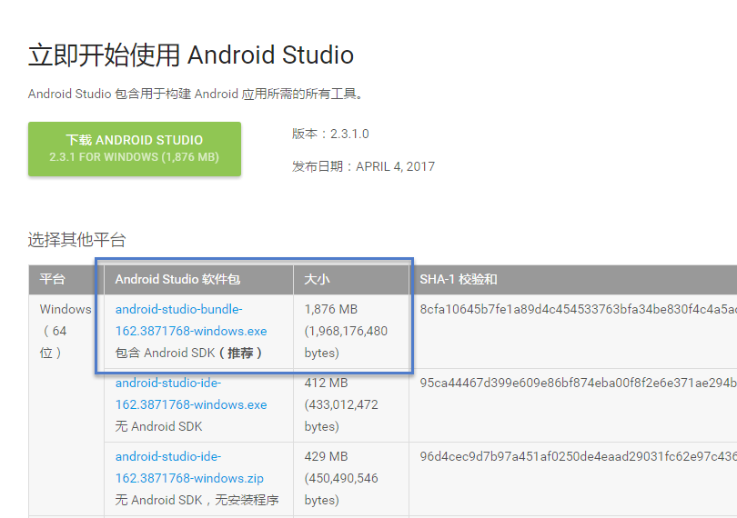

下载地址：https://developer.android.com/studio/index.html

安装过程非常简单，双击后一路Next，中间你也可以另外指定SDK的安装目标路径（不建议修改）。安装好之后，直接启动 Android Studio，首先会提示你联网下载一些必要的工具（你需要一个好的网络和梯子）。

一切就绪后，你可以在启动界面就可以打开 SDK Manager。

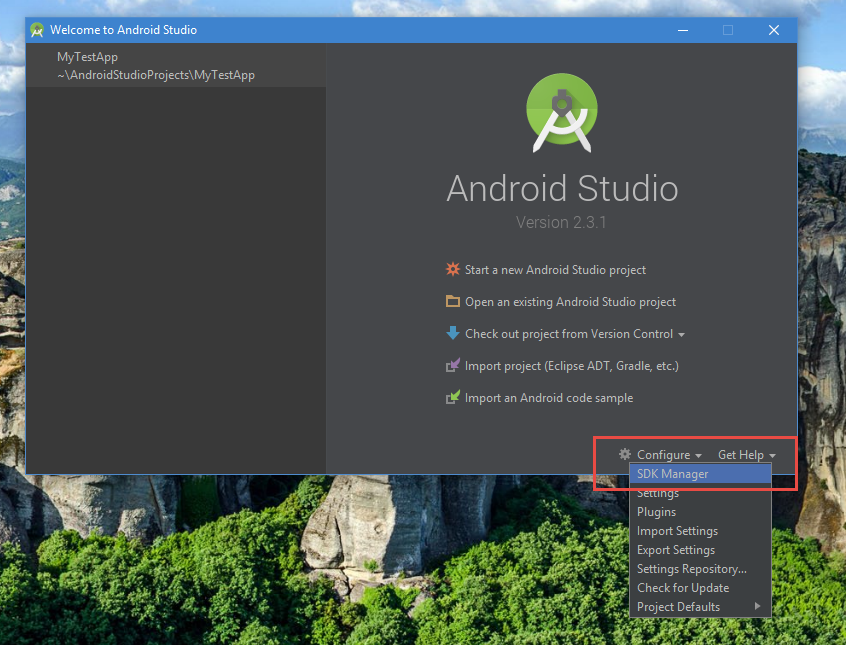

或者新建一个工程，从工程界面打开SDK Manager。

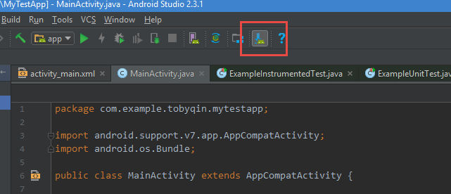

SDK Manager 打开之后，使用的方法就一目了然了。这就是个让你更新API和各种开发工具的工具。

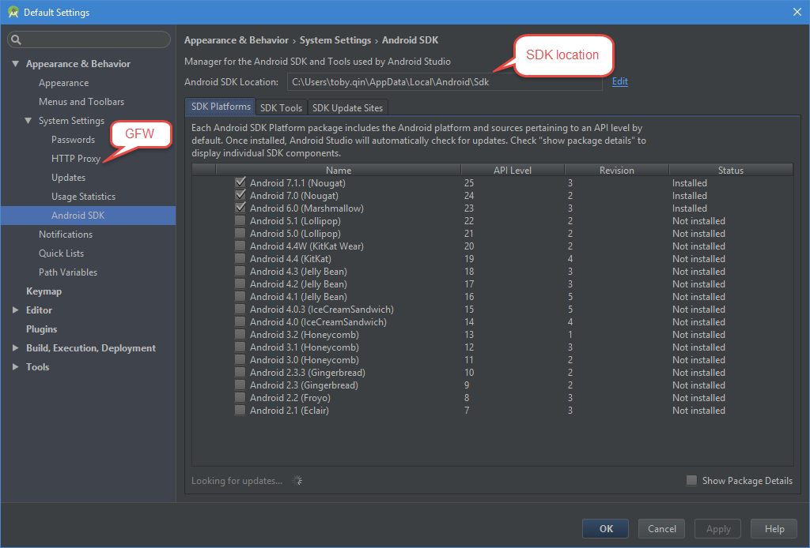

如果只是为了自动化测试其实你只要记住SDK安装目录就可以了，不需要安装任何多余的工具。SDK的安装目录在配置环境变量时需要用到。

如果你的网络不畅通，那么需要先设置代理。接下来才能安装你想要的SDK版本和开发者工具。

## 安装 Android 模拟器

如果你已经安装了Android Studio，模拟器也已经有了，从工程界面找到AVD Manager的按钮，按照下图三个步骤就可以添加并启动一个模拟器。

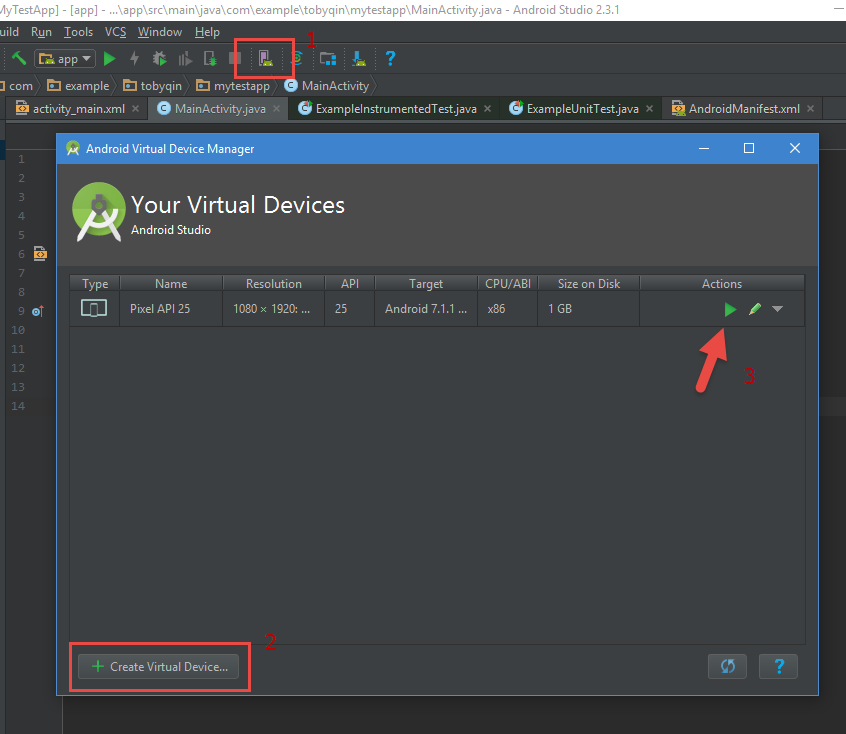

每当你安装新版本的模拟器都是需要翻墙或者代理的，最开始启动Android Studio时它已经给你下一个最新版的Android，我当前模拟器中的Android版本是7.1.1。

如果一切顺利，那么当你启动模拟器后，你就可以看到一台虚拟的Android设备了，手动测试基本条件已经达成，自动化测试指日可待。

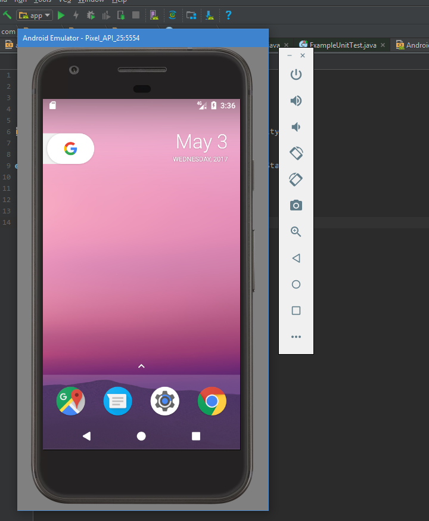

多说几句，除了使用 Android SDK 自带的模拟器外，我们还有两个选择，一是使用真机，速度和体验上会更好。另外一个选择就选择别的模拟器产品，比如 [Genymotion]()，因为是商业软件，所以对个人用户（免费）会有诸多限制，尽管如此，其成熟度也比Android SDK自带的模拟器高很多。因为这两个方案的具体实现涉及到的内容比较多，故不在本文讨论。

## 安装 Appium

Appium是开源的自动化测试框架，主要用于iOS，Android以及Windows apps等移动平台的自动化测试。官网的介绍说是它实现一套适用于移动端的WebDriver协议，所以使用Appium时用的还是依赖于Selenium，和Web自动化测试的主要区别就在Driver不一样。

举一个例子，如果我们需要用Google Chrome来跑Selenium的自动化测试，那么首先需要一个ChromeDriver。如果需要跑在IE上，那么需要一个IEDriver。那么现在需要在移动端比如Android里跑Selenium，这时候你需要一个Appium就够了，它担当了Driver的角色。Appium实现了一套标准的WebDriver，只要Appium服务起来之后，你的代码只需要和Appium交互，Appium会去告诉设备该干嘛干嘛。这里提到的设备可以是iOS或者Android，甚至是Windows Phone 和Firefox OS。

Appium 官网： http://appium.io/

### 安装方式一： 使用NodeJS 安装

首先到[NodeJS官网]()下载安装最新的NodeJS，Windows下属于傻瓜安装。安装好之后你可以配置NodeJS的安装源，在国内一般都用taobao的镜像，速度还不错。

在个人目录下新建一个 .npmrc 文件，写入：

```
registry=https://registry.npm.taobao.org/
```

然后使用npm命令安装 Appium

```
npm install -g appium
```

建议顺便安装一下appium-doctor，通过运行appium-doctor命令可以快速检查appium的环境问题。

```
npm install -g appium-doctor
```

如果安装成功，那么就可以通过 `appium` 命令启动appium server。

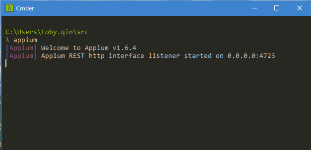

关闭命令行或者按 Ctrl - C 就可以停止 Appium Server。

### 安装方式二： 使用Appium安装包

网上很多教程所引导的Appium安装包一般在百度网盘或者bitbucket里，其实这两者都不是最新的。最新版的安装包应该从官网下载，Appium 目前托管在github，正确的下载地址应该为：

- https://github.com/appium/appium-desktop/releases

最新版的Appium 桌面安装后启动是这样的。

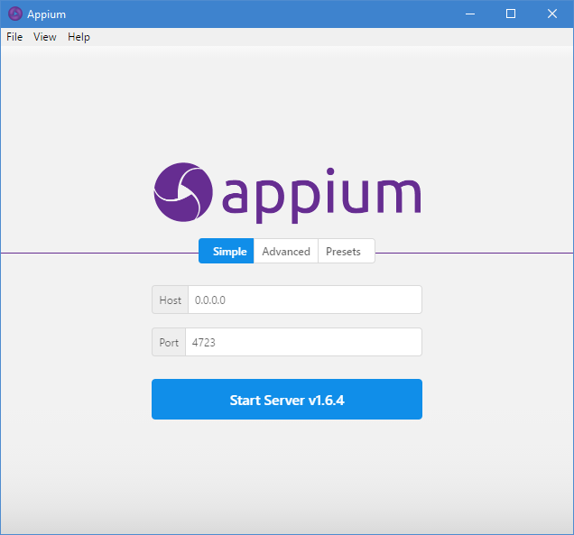

功能上和老的版本没太大区别，但是日志和UI显示更加清晰，一旦错误发生让你更容易找到问题所在。

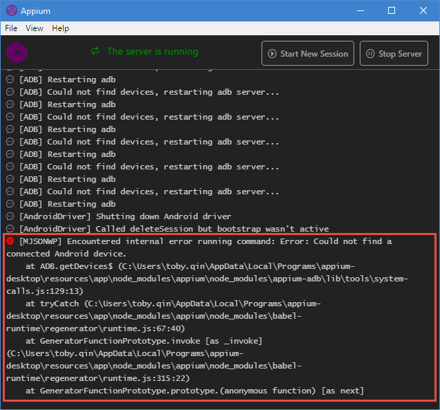

注意，你可以不安装Appium 桌面版，但是命令行版应该还是需要安装的，因为自动化测试运行时一般都是通过命令启动和关闭Appium，桌面版并不提供命令行功能，只是为了调试方便。

关于Appium的介绍，这里有一份非常好的文档：http://appium.io/slate/cn/master

### 安装 Appium-Client

本文只讨论Python实现的Appium测试，所以你只需要允许以下命令：

```
pip install Appium-Python-Client
```

如果需要使用其他编程语言，下表供参考：

| 语言/框架                | Github版本库以及安装指南                          |
| -------------------- | ---------------------------------------- |
| Ruby                 | [https://github.com/appium/ruby_lib](https://github.com/appium/ruby_lib) |
| Python               | [https://github.com/appium/python-client](https://github.com/appium/python-client) |
| Java                 | [https://github.com/appium/java-client](https://github.com/appium/java-client) |
| JavaScript (Node.js) | [https://github.com/admc/wd](https://github.com/admc/wd) |
| Objective C          | [https://github.com/appium/selenium-objective-c](https://github.com/appium/selenium-objective-c) |
| PHP                  | [https://github.com/appium/php-client](https://github.com/appium/php-client) |
| C# (.NET)            | [https://github.com/appium/appium-dotnet-driver](https://github.com/appium/appium-dotnet-driver) |
| RobotFramework       | [https://github.com/jollychang/robotframework-appiumlibrary](https://github.com/jollychang/robotframework-appiumlibrary) |

## 必要的环境变量设置

如果你已经安装了appium-doctor，那么你只要运行appium-doctor命令就可以知道你还需要设置哪些环境变量，比如：

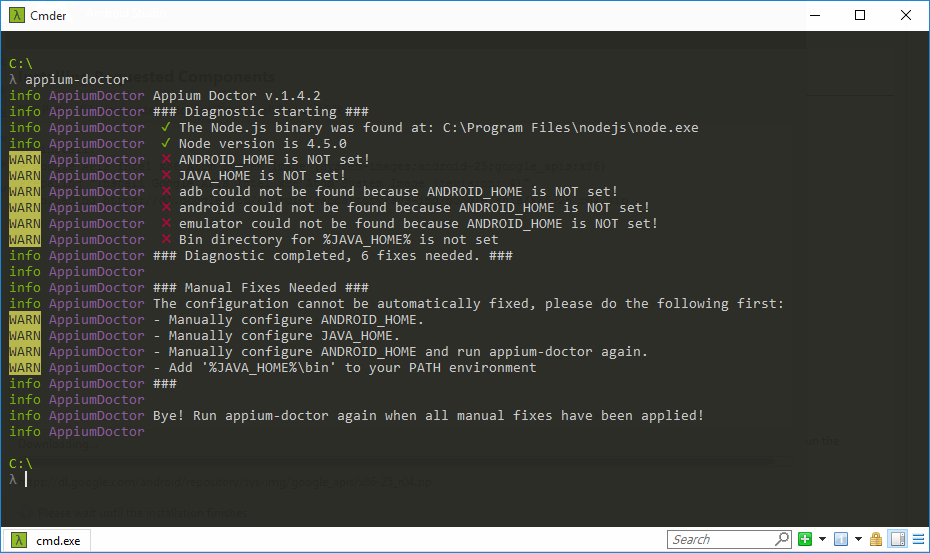

不要慌，其实你只需要设置以下环境变量：

| 环境变量         | 值                                        |
| ------------ | ---------------------------------------- |
| ANDROID_HOME | Android SDK 的安装位置                        |
| JAVA_HOME    | JDK 或者 JRE 的安装位置                         |
| 加入 PATH      | %ANDROID_HOME%\tools                     |
| 加入 PATH      | %ANDROID_HOME%\platform-tools            |
| 加入 PATH      | %JAVA_HOME%\bin                          |
| 加入 PATH      | %ANDROID_HOME%\build-tools\??version?? (可选) |

最后一个环境变量是为了更方便地使用aapt这个工具，完成环境变量配置后你可以再次运行appium-doctor进行检查。不出意外，你应该能通过检查。

## 完成第一个自动化测试

终于来到了动真刀真枪的时候了，很多人一开始就放弃了，更多人开始了之后就放弃了，走到这一步真的挺不容易的。

开始写代码之前有些事情你应该清楚：

1. 模拟器或者测试机必须是Ready的状态，每次启动模拟器都很费时间，所以建议模拟器不要关闭，通过代码来启动模拟器是一个办法，但是时间成本有点高。
2. 如果是调试代码阶段，建议保持Appium桌面版长期运行，远程运行时再通过代码自动启动和关闭Appium。
3. Appium会根据你的测试代码去寻找符合要求的设备，如果你启动了多台虚拟机或者连接了多台实体机，请显式地在代码中指定设备名称或者版本号。

第一个自动化测试需求很就简单，就是启动内置的拨号软件，搜索 “hello toby”。代码如下：

```python
from appium import webdriver

desired_caps = {}
desired_caps['platformName'] = 'Android'
desired_caps['platformVersion'] = '7.1.1'
desired_caps['deviceName'] = 'Android Emulator'
desired_caps['appPackage'] = 'com.android.dialer'
desired_caps['appActivity'] = 'DialtactsActivity'

driver = webdriver.Remote('http://localhost:4723/wd/hub', desired_caps)
driver.find_element_by_id('com.android.dialer:id/search_box_collapsed').click()
search_box = driver.find_element_by_id('com.android.dialer:id/search_view')
search_box.click()
search_box.send_keys('hello toby')
```

运行效果：

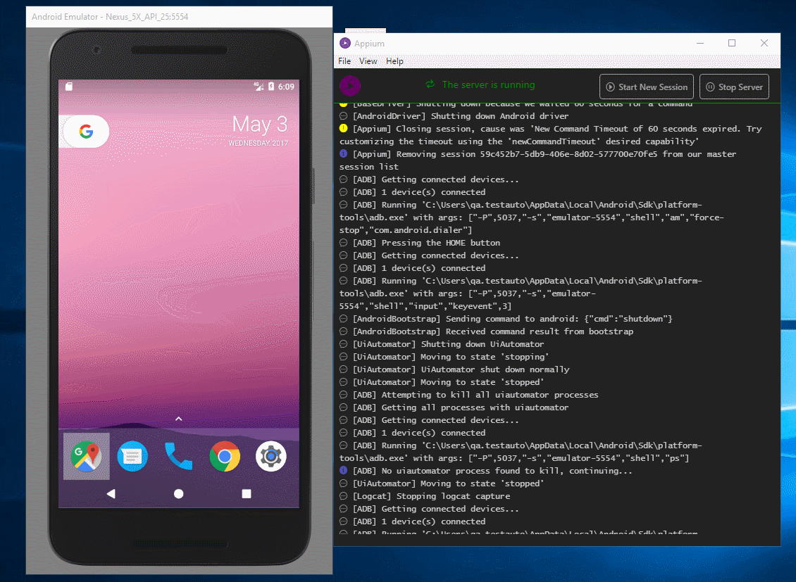

恭喜你，你已经开始进入移动端的自动化测试的大门了！

## 参考

- [在Mac OSX 上配置Appium+Android自动化测试环境](/posts/2017-12-10/setup-appium-test-environment-on-mac-osx/)