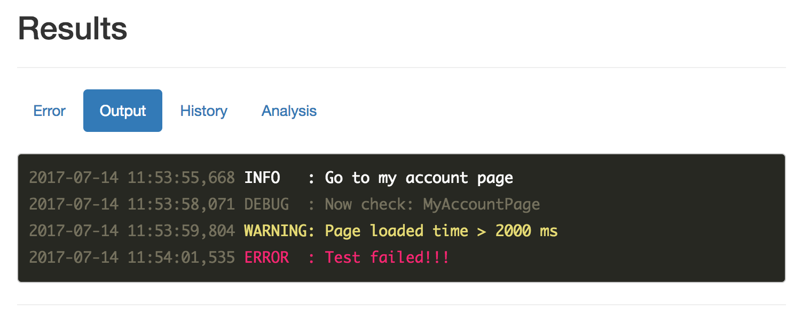

## 缘起

代码高亮的js库也不少，最知名的莫过于 [highlightjs](https://highlightjs.org/)，支持你听过的没听过的各种编程语言，兼容你用过没用过的各种浏览器，有着多姿多彩的配色方案。然而，唯有一点我还是选择放弃了它，因为它不能很方便的自定义高亮语言。

现在我的需求是是这样的，有一个自动化测试结果的页面，里面会显示一个测试案例运行的数据，比如控制台输出 stdout， 我需要高亮控制台输出的一些信息，例如：INFO 级别是默认色，WARN 级别是橙色，ERROR 级别是红色。一句话，我需要自定义日志输出高亮。

```
...
2017-07-14 11:53:55,668 INFO   : Go to my account page
2017-07-14 11:53:58,071 DEBUG  : Now check: MyAccountPage
2017-07-14 11:53:59,804 WARNING: Page loaded time > 2000 ms
2017-07-14 11:54:01,535 ERROR  : Test failed!!!
...
```

像这样的需求使用 highlightjs 来实现就显得不够灵活，甚至有点无从下手。

## 初试 RainbowJS

> RainbowJS 项目地址： https://github.com/ccampbell/rainbow

RainbowJS 虽然简单而且支持的编程语言也不多（压缩后大小只有不到3kb），但是恰恰能满足自定义高亮的需求。入门只需要三步即可：

### 1. 导入配色文件 - css

官方的github 仓库里提供了 20 多种配色，常见主题配色都可以找到。

```html
<link href="/rainbow/css/theme.css" rel="stylesheet" type="text/css">
```

### 2. 使用 `<pre><code>` 包住你的代码

在 `code` 标签里你可以使用`data-language` 指定代码语言。

```html
<pre><code data-language="python">def openFile(path):
    file = open(path, "r")
    content = file.read()
    file.close()
    return content</code></pre>
```

### 3. 开始高亮你的代码

如果整个过程是同步的，那么你只需要在页面最后导入RainbowJS和你需要的高亮语言库，就可以自动高亮代码块。

```html
<script src="/js/rainbow.js"></script>
<script src="/js/language/generic.js"></script>
<script src="/js/language/python.js"></script>
```

如果你的代码块是异步生成的，你可以选择提前引入Rainbow及相关语言的js文件，然后调用`Rainbow.color()`方法来给代码块着色。

```Js
// load rainbow js and language support
...
// call your function to generate dyanmc code blocks
...
// finally, highligh your code blocks
Rainbow.color();
// optionally, you can pass in a callback function in color()
// for example:
Rainbow.color(function() {
    console.log('The new blocks are now highlighted!');
});
```

## 高亮自定义语言

从前面的例子可以看到rainbow的上手还是很简单的，如果要自定义高亮规则应该怎么办？非常简单，只要调用`extend`方法即可。比如给`True`，`False`，`None`添加`constant`的css类：

```javascript
Rainbow.extend('python', [
    {
        name: 'constant',
        pattern: /True|False|None/g
    }
], 'generic');
```

用`extend`方法可以给指定语言添加高亮规则，规则的名字就是即将添加的css类的名字，只要匹配了规则中指定的正则表达式，RainbowJS就会给匹配的结果添加上对应的css类。

接下来我们要给log添加高亮规则，为了避免去写新的css类，我们可以重用主题配色里已经存在的类，根据主题颜色我们暂定高亮规则如下：

```
1. debug - 灰色 - css: comment
2. info  - 白色 - css: support
3. warn  - 橙色 - css: string
4. error - 红色 - css: keyword
5. 时间日期格式 - 灰色 - css: comment
```
对应的extend实现如下：

```js
// log.js
Rainbow.extend('log', [
    // debug level
    {
        name: 'comment',
        pattern: /([^ ]*debug).*/gi
    },

    // info level
    {
        name: 'support.tag',
        pattern: /([^ ]*info).*/gi
    },

    // warn level
    {
        name: 'string',
        pattern: /([^ ]*warn).*/gi
    },

    // error level
    {
        name: 'keyword',
        pattern: /([^ ]*error[^(]).*|([^ ]*fatal).*|([^ ]*failure).*|([^ ]*failed).*|([^ ]*exception[^(]).*/gi
    },

    // time format
    {
        name: 'comment',
        pattern: /\b([\d\-:,]+)\b/gi
    },

], 'python');
```

当log行正确匹配后就会被添加上对应规则的css类，并且所有高亮规则继承自python语言，因为我的log是从python程序中记录的，当中可能会有一些python代码，我希望这些代码也能正常被着色。

最后就是在网页中生成对应的代码块，指定高亮语言为log：

```html
<pre><code data-language="log">
...
2017-07-14 11:53:55,668 INFO   : Go to my account page
2017-07-14 11:53:58,071 DEBUG  : Now check: MyAccountPage
2017-07-14 11:53:59,804 WARNING: Page loaded time > 2000 ms
2017-07-14 11:54:01,535 ERROR  : Test failed!!!
...
</code></pre>
```

效果图如下：



## 一些改进方法

在页面中加载多个js文件的写法挺不方便也不好维护，而且也会影响页面加载的速度。比如上文的例子中如果是直接把`<script>`片段写到页面里会是这个样子。

```html
<body>
...
<pre /><code />
...
<script src="/js/rainbow.js"></script>
<script src="/js/language/generic.js"></script>
<script src="/js/language/python.js"></script>
<script src="/js/language/log.js"></script>
</body>

```

一个改进的建议是就是当页面加载完成后再加载RainbowJS，然后调用高亮函数，你可以这样写：

```js
// page html
<script>
$(highlightLog);
</script>

// app.js
function highlightLog(){
    $.getScript('/libs/rainbow/rainbow.min.js', function () {
        $.getScript('/libs/rainbow/language/generic.js', function () {
            $.getScript('/libs/rainbow/language/python.js', function () {
                $.getScript('/libs/rainbow/language/log.js', function () {
                    Rainbow.color();
                    });
                });
            });
        });
    };
```

虽然有点丑，但是功能没问题。如果你使用的是比较流行的[requirejs](http://www.requirejs.org/)，那么可以这样使用RainbowJS：

```js
// config.js
requirejs.config({
    baseUrl: '/libs',
    shim: {
        rainbow: {
            exports: 'Rainbow'
        },
        rainbow_generic: {
            deps: ['rainbow']
        },
        rainbow_python: {
            deps: ['rainbow_generic']
        },
        rainbow_log: {
            deps: ['rainbow_python']
        }
    },
    paths: {
        rainbow: 'rainbow/rainbow',
        rainbow_generic: 'rainbow/language/generic',
        rainbow_python: 'rainbow/language/python',
        rainbow_log: 'rainbow/language/log'
    }
});

// app.js
function highlightLog() {
    require(['rainbow'], function (Rainbow) {
        window.Rainbow = Rainbow; // must
        require(['rainbow_log'], function () {
            Rainbow.color();
        });
    });
}

// page embeded
<script src="/require.js"></script>
<script>
    require(['/config.js'], function () {
        require(['app'], function (app) {
            app.highlightLog();
        });
    });
</script>
```

再或者先通过js的压缩和打包工具将写好的代码进行优化，亦是目前比较流行和推荐的做法。本文旨在介绍和使用RainbowJS，不做过多拓展，希望对你有所启发和帮助。

如果需要完整的演示代码，可以查看我得GitHub项目：https://github.com/tobyqin/testcube