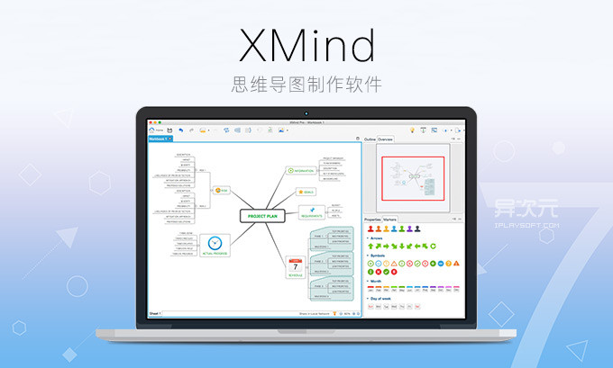
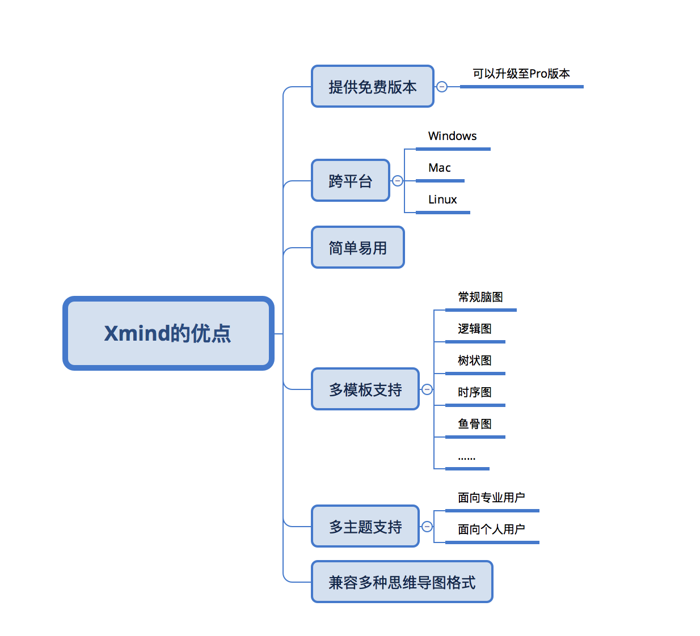
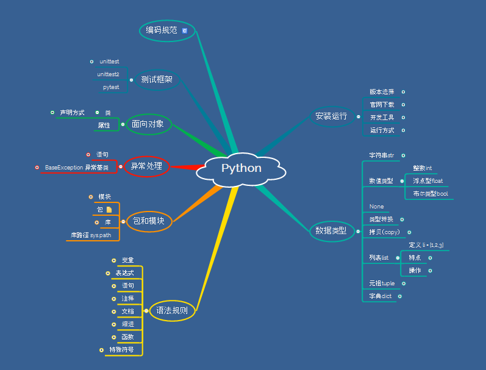
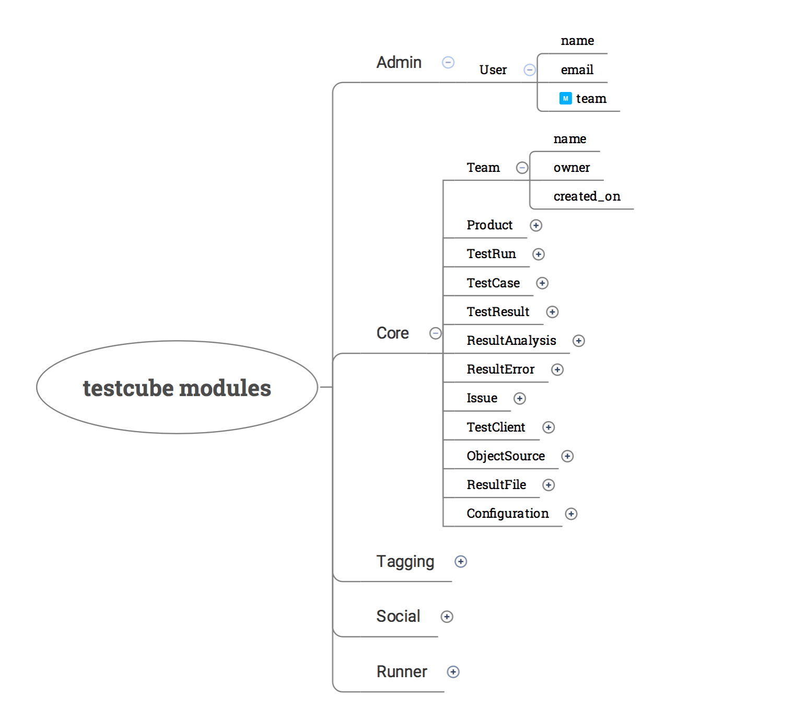

## 引子

如果你没听说过思维导图，那么你可能错过了很美妙的一个工具。不过没关系，现在了解一下也不算迟。

> 思维导图又叫心智导图是表达发散性思维的有效的图形思维工具 ，它简单却又极其有效，是一种革命性的思维工具。

名词解释大家都不爱看，所谓的思维导图其实就是类似于下面这样一张图。

是不是觉得好复杂，徒手画图？我可没说。我们现在接触到的文档大多数都是电子化的，所以你经常看到的思维导图应该像这个样子。

是不是挺清晰易懂的？思维导图也叫 MindMap，脑图等等。作为一个头脑风暴的工具，灵活运用「思维导图」将会对你在学习和工作帮助甚大！上面这张思维导图就是我在分享从Python2迁移到Python3的知识点总结。

## 思维导图有用吗

这玩意有用吗？这是你在学习任何一个东西之前都必须弄明白的一件事。

建议阅读知乎问答：[思维导图真的有效吗？](https://www.zhihu.com/question/20273625)。简单总结一下：

1. 作为一种工具它当然有效，但必然有它擅长和不擅长的事
2. 但不要高估它的价值，它不是万能的
3. 思维导图主要用于激发思维，整理思路，系统分析等脑力劳动上

举例说明它擅长的事：

- 问题解决，项目计划，知识管理，思考写作，做笔记，项目演示，做计划

缺点也提一下：

- 结构固定，一般用于主题或者树状信息整理，不适合交互复杂的信息处理
- 制图费时，尤其是手动绘图，时间成本很高

所以说，我们尽量用它的长处，避免用它的短处。说到绘制思维导图的学习和时间成本，其实不能一口咬死这玩意真的很难画，关键是你有没有选对工具。

## 思维导图工具

当你在电脑上使用思维导图工具绘制思维导图时，你会发现，真的很不费事，甚至是自然而然，因为你只需要记住两个快捷键：

- TAB - 添加子主题
- ENTER - 发散思维

基本上99%的思维导图软件都使用了以上两个快捷键，当你的手指放在键盘上时，你只要集中精力去整理思路，不需要去关心图是怎么画出来的。使用TAB进行大纲整理，使用ENTER添加平行内容。

在这里我推荐大家尝试使用Xmind来制作思维导图，它提供免费版，跨平台而且兼容很多其他同类软件的文件格式。

Xmind可谓是杀人越货，居家必备之良品，优点多多，可以用下面这张思维导图来总结。

如果你不想或者没条件在每台电脑上都装Xmind，那么网页版也有不少选择方案。我特别推荐ProcessOn和百度脑图。

- ProcessOn：https://www.processon.com/
- 百度脑图：http://naotu.baidu.com/

## 思维导图实例

思维导图主要还是用于思维发散或者思路整理，我举一些我在实际工作中用到思维导图的例子。

### 做工作计划

思维导图非常适合做规划类的事情，因为规划需要有条理和步骤，需要细化和调整。当你用Xmind做好一个初步计划后，可以通过鼠标去拖动子项目来调整顺序优先级，并且还可以添加一些图标来标注状态或者优先级，例如下图。

### 做知识梳理

当你需要做读书笔记或者归纳总结知识点时，思维导图也十分有效。下图是我开始学习Python后做的思维导图，里面包含了读书笔记和经验总结，通过思维导图我能很方便的回顾各个知识点，查缺补漏。

### 协助软件开发

软件开发过程中你需要了解业务，设计模型，整理API，其实思维导图也是一个不错的帮手。

### 设计测试案例

不知道你发现没有，其实设计测试案例（TestCase Desgin）其实就是发散思维的一个典型应用。作为测试人员你需要尽可能多的考虑测试路径，如果用图来表示测试案例，那么其实就是一棵树，树的根节点就是你要测试的功能，发散出来的分支就是你要考虑的各种情况。用思维导图来设计测试案例再合适不过。

## 小结

写到这应该收尾了，如果你对思维导图感兴趣，不如现在就动手起来，应用到你的生活或者工作中去，实践才是检验真理的唯一办法。