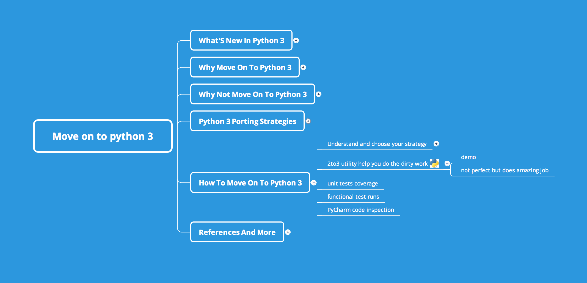

## 前言

最近升级了一下[xmind2testlink](https://github.com/tobyqin/xmind2testlink)，顺带产生了一个中间轮子：[xmindparser](https://github.com/tobyqin/xmindparser)。

[xmind](https://www.xmind.cn/)是知名的思维导图软件，可以用来整理思路，设计测试案例等等。一旦完稿后软件本身支持导出为图片，PDF，Excel等等文件格式。免费版相对于Pro版能导出的文件种类少一些，但有时候你可能想我做的xmind能不能通过编程再加工一下，比如集成到某个网页，或者通过api和某某系统集成。

那么[xmindparser](https://github.com/tobyqin/xmindparser)就是这么一个项目，了解一下。

## 安装xmindparser

这个项目已经打包到PyPI，可以通过pip安装。

```
pip install xmindparser
```

## Xmind 转Python 数据类型

xmindparser可以将xmind转成`dict`数据类型，比如下面这么一个xmind文件：



转换代码的示例：

```python
from xmindparser import xmind_to_dict
out = xmind_to_dict(xmind_file)
```

例子中`out`的数据结构如下：

```json
[
  {
    "title": "Sheet 1",
    "topic": {
      "makers": [
        "star-orange"
      ],
      "topics": [
        {
          "link": "http://test.com",
          "topics": [
            {
              "topics": [...]
              "title": "e"
            },
            ...
      ],
      "title": "test"
    },
    "structure": "org.xmind.ui.map.unbalanced"
  },
  {
    "title": "Sheet 2",
     ...
  }
]
```

通过遍历sheet和topics就可以获取到xmind中每个节点的信息。

## Xmind 转 JSON

转成JSON非常简单，如果你还是使用Python编程，可以这样写：

```python
from xmindpraser import xmind_to_json
out_file = xmind_to_json(xmind_file)
```

或者你直接调用命令行工具：

```
xmindparser your.xmind -json
```

## Xmind 转 XML

转成XML是类似的，使用Python编程，这样写：

```python
from xmindpraser import xmind_to_xml
out_file = xmind_to_xml(xmind_file)
```

或者你直接调用命令行工具：

```
xmindparser your.xmind -xml
```

## 结束语

单个工具本身可能作用有限，但如果你能将各种工具融合起来，威力也许大很多。我们常说1+1，很多时候都是大于2的。