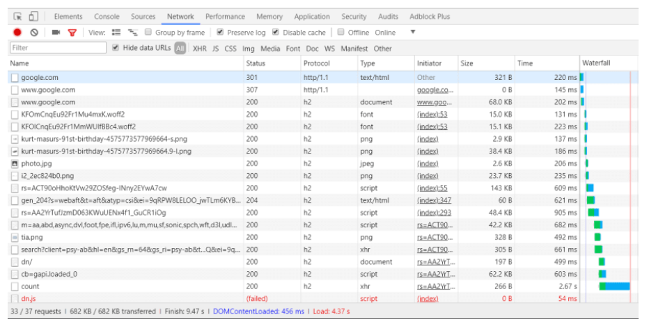
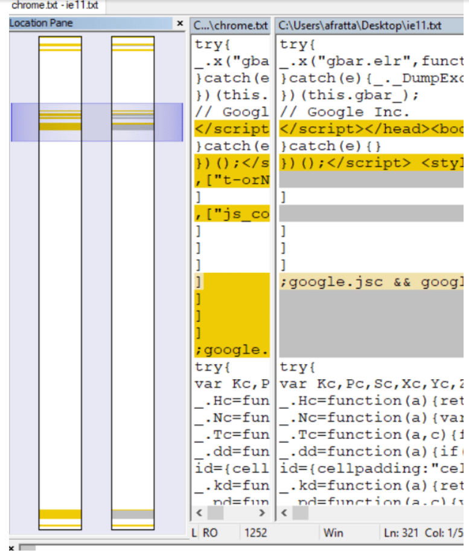

> 原文： https://www.cnbeta.com/articles/tech/808191.htm

我遇到过的最喜欢的面试问题是："你键入'google. com'到一个浏览器的地址栏中, 并点击`Enter`, 之后会发生什么呢？"

有人可以滔滔不绝几天, 试图以某种形式的完备性来回答此问题。他们会走多深？纯粹出于兴趣, 我要把我的答案罗列在此。当我在一次实际面试中被问到这个问题时, 在他们阻止我之前我漫谈了10分钟。之后即使在面试结束后，我一直记得当时我所遗漏的东西。

我将把这个格式化为文本墙, 因为在谈话中回答这个问题就是这样的感觉.

## 那么发生了什么呢?

浏览器将分析输入。通常情况下, 如果输入中有". com", 它不会认为你在输入搜索词。一旦它决定其必定是一个url时, 它会检查输入是否有协议头，如果没有, 它会在其开头添加"http://"。由于你没有指定一系列http协议功能, 因此它将假定使用默认值, 如端口80、GET方法和无基本身份认证。

然后, 它将创建一个http请求并发送该请求。我对我的底层网络知识没有信心, 但如果我确实要说, 我会说一些关于MAC地址, TCP数据包传输, 丢包处理等。但无论如何, 一个对"google. com"DNS的查找将会发生, 如果它还没有对此的缓存，DNS服务将应答一系列IP地址列表, 因为"google. com"不只单IP的。我认为在默认情况下浏览器会选择第一个。不确定它们是区域性的以及它是如何工作的, 但我知道它就在那里。

因此, http 请求从一个节点跳转到另一个节点, 直到它找到google. com负载均衡器的IP地址。这不会持续很久, 谷歌会回应说, 你需要使用https-假定是301永久重定向。因此, 它会原路返回到你的浏览器, 浏览器将协议更改为 https, 默认使用443端口并重新发送。这一次,TLS握手将在负载均衡器和浏览器客户端之间进行。我不是100%确定其工作原理, 但我知道该请求会告诉谷歌, 它支持什么协议 (TLS 1.0, 1.1, 1.2) ，然后谷歌将响应 "让我们使用1.2吧"。之后使用TLS加密发送请求。

我认为谷歌接下来要做的是将其放到负载均衡器上的网络应用程序防火墙规则集上, 看看它是否是一个恶意请求。当这通过之后, 安全连接可能已被终止 (因为PCI-DSS规则规定你不需要加密内部流量), 请求将被分配到其CDN中的某个池上, 而google端缓存主页将在http响应中返回。可能是预先压缩的。

谷歌的响应头将由浏览器读取，根据响应头的缓存策略进行缓存，然后正文将被解压缩。而且因为这是谷歌，它可能是超优化的：压缩，可能是许多预渲染内容、内联CSS、JavaScript和图像，以减少网络请求和首次渲染时间。但该请求将触发一系列其他请求，所有这些请求都是并发的，因为它应该运行HTTP/2。当这些请求正在进行时，JavaScript会被解析，可能没有阻塞，因为他们在标签上使用了defer属性 - 或者async，我从来没有单独阅读过这里他们做了些什么的资料。

但浏览器可能已经渲染了搜索框并且正在顶部的工具栏上工作，这将需要一些额外的网络请求 - 我可能已经有一个cookie或可能是带有OAuth令牌的本地存储 - 或我可能是使用Chrome并且它已经知道我是谁，并且使用auth的请求会被发送到他们的Google+ API上，告诉Google搜索页面的应用程序我的身份。

另一个请求将被发送, 以获取我的头像图像。在这一点上, 他们已经浏览器可嗅探的, 看看我是否未使用 chrome, 在这种情况下, 他们会有弹出一个工具栏提示, 告诉我：chrome 是真棒, 我应该使用它, 而不是其他任何浏览器。

我想此时需要冷静下来。所有这些都发生在一秒的时间内。

何为显著地不同?让我们看看对应的DNS:

我知道我以前见过google.com返回包中带有多个IP地址，但似乎不再是这种情况了。似乎他们之前常常使用轮巡策略，但现在不再使用了。 这个[StackOverflow](https://stackoverflow.com/questions/10257969/is-it-possible-that-one-domain-name-has-multiple-corresponding-ip-addresses)提问涉及了此情况。我已忘记了它被称为轮2。

## 网络层

在一个正式结构化回答中，你可能会参考我有所了解但并不精通的OSI模型。在查阅资料之后，我将它视为如下的网络分层映射：

1. 应用 - 触发请求的逻辑
2. 表示层 - HTTP
3. 会话 - TLS
4. 传输 - TCP
5. 网络 - 路由 (IP)
6. 数据链路 - 帧 (可看做数据包的容器)
7. 物理层 - 比特流

我记得在TLS中他们会在协议协商时交换证书。网络并不是我的强项。在我的浏览器中打开google.com，并禁用缓存：

我记得主机名规范化——这是一个301。

从HTTP到HTTPS的校正是一个307内部重定向。

然后它下载字体、商标图像和我的头像图像。如果没有API调用，这意味着他们会在页面中推送我的个人资料信息并将其与返回数据捆绑在一起 - 因此当你点击google.com而不仅仅是提供缓存资产时，他们会进行实际的数据检索。

## 响应

以上是IE 11和Chrome响应数据的对比——所有都处于退出状态。

* IE11和Chrome之间没有太大的差别。但这意味着他们是用户代理嗅探服务器端而不是客户端。在我的答案中可能提到了这一点。
* 出乎意料的是，Chrome的响应体大了22kB。我想知道它是否是由在IE 11中明显缺席的语音搜索功能引起的。IE11可能需要polyfill和Chrome的广告，但它都被混淆了，我不会再进一步折磨自己了。
* 即使我在Chrome中清除了Cookie，它仍会在第一次请求时发送Cookie。它在IE 11中并没有这样做。

## 深入理解渲染!

上图是Chrome将为你提供的第一个屏幕截图。

* 脚本标签中没有任何async或defer属性，只有nonce属性。我目前正在学习有关nonce的知识，这似乎与安全性有关。我估计他们想要那些阻塞式脚本。我确信他们在某些方面尝试过有/无aync/defer的情况，并决定反对之。
* 自我提示：完全响应是对JavaScript、CSS和HTML的乱七八糟的混合体。相比于其独立性，他们没有遵守任何控制其位置的规则。

## 问题本身是什么呢?

你知道吗？ 对于人员而言，这可能不是一个很好的面试问题，因为答案涉及到如此多的网络知识。这是我喜欢的问题的格式，一些开放的事物，包括一些猜测。这使得面试官有机会跟进诸如“你认为TLS是如何建立的？”之类的问题，以查看候选人如何思考，看看他们有多少创意，看看他们的极限何在（有多耐心？）。

你最喜欢的面试问题是什么？

