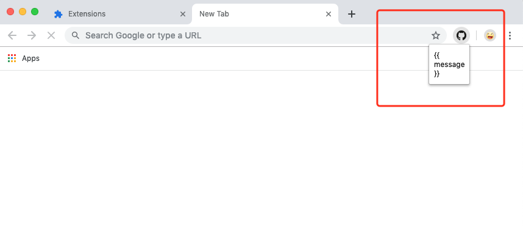
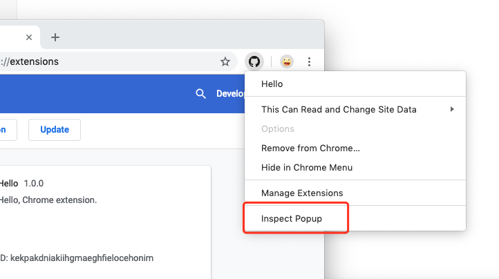
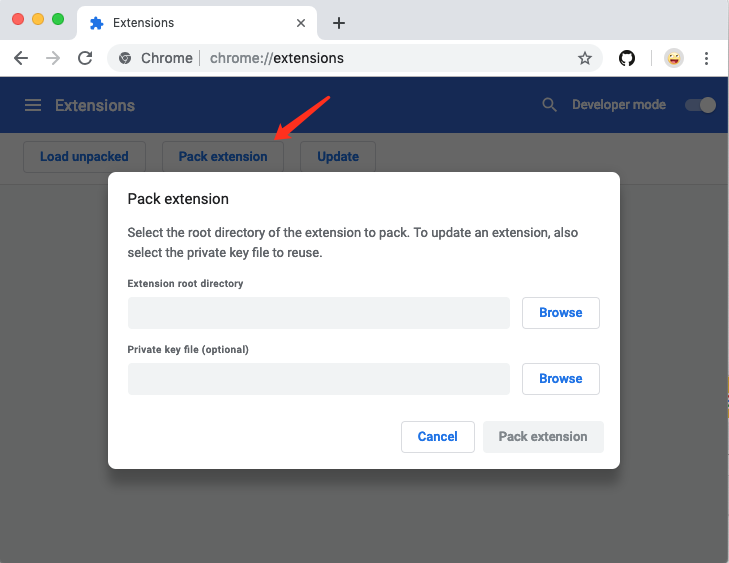

浏览器基本已经天下大统了，放眼望去都是Chromium的天下。那么，能写一个浏览器插件也算是一种回报率不错的技能。

## 基本知识

浏览器插件官方的说法叫扩展程序，允许你为浏览器增加各种功能，但不需要深入研究浏览器本身的代码。你可以用HTML，CSS和JavaScript创建新的扩展程序，如果你曾经写过网页，那么写一个插件是非常轻松的事情。

常见的插件一般就是地址栏后面的一个图标，点击后给你当前网页提供各种功能，或者在你点击网页右键时弹出额外的菜单。

### 扩展程序目录结构

最简单的扩展程序只需要3个文件，或者更少。

```
my-addon
  |- manifest.json
  |- icon.png
  └─ popup.html
```

- manifest.json：清单文件，用来描述插件本身，必须。
- icon.png：图标文件，如果你不想用默认图标这也是必须的。
- popup.html：算是插件的功能页吧，你至少得有点功能才有存在的意义吧。

当然上面的例子是最精简的情况了，一般的插件会有多个html，还有js目录，css目录等等，你可以把插件当成一个静态网站，唯一的区别是多了一个manifest文件用来描述这个静态网站。

### 清单文件的示例

下面是一个精简版的manifest.json。

```json
{
  "manifest_version": 2,

  "name": "One-click Kittens",
  "description": "This extension demonstrates a browser action with kittens.",
  "version": "1.0",

  "permissions": [
    "https://secure.flickr.com/"
  ],
  "browser_action": {
    "default_icon": "icon.png",
    "default_popup": "popup.html"
  }
}
```

看上去是不是很直观，名字，版本，描述，权限，行为。如果要深入再查查官方文档就OK了。

## 做一个Hello World插件

有了基础知识，我们速度来个Hello World，先写manifest.json。

```json
{
    "manifest_version": 2,
    "name": "Hello",
    "version": "1.0.0",
    "description": "Hello, Chrome extension.",
    "icons":
    {
        "16": "img/icon.png",
        "48": "img/icon.png",
        "128": "img/icon.png"
    },
    "browser_action": 
    {
        "default_icon": "img/icon.png",
        "default_title": "Hello World",
        "default_popup": "popup.html"
    },
    "permissions":
    [
        "<all_urls>"
    ],
    "homepage_url": "https://github.com/tobyqin/"
}
```

再补一下图标文件和popup.html。

```html
<!DOCTYPE html>
<html>
<body>
<h1>Hello world!</h1>
</body>
</html>
```

打开浏览器插件页面，右上角打开开发者模式，加载插件目录。


这时我们的第一个插件就好了，点击插件图标就可以显示Hello World。


## 把Vue加进来

好像很容易嘛，我们直接用CDN的Vue，改造一下popup.html。

```html
<!DOCTYPE html>
<html>
<body>
<div id="app">
    {{ message }}
</div>
<script src="https://cdn.bootcss.com/vue/2.6.6/vue.js"></script>
<script>
    var app = new Vue({
        el: '#app',
        data: {
            message: 'Hello Vue!'
        }
    })
</script>
</body>
</html>
```

不用卸载刚才安装的插件目录，只要再点击一下插件按钮就会自动加载最新的代码。不过好像不对，和期望的结果不一样。



而且注意看插件页面，出现错误了。


```
Refused to load the script 'https://cdn.bootcss.com/vue/2.6.6/vue.js' because it violates the following Content Security Policy directive: "script-src 'self' blob: filesystem: chrome-extension-resource:". Note that 'script-src-elem' was not explicitly set, so 'script-src' is used as a fallback.

Refused to execute inline script because it violates the following Content Security Policy directive: "script-src 'self' blob: filesystem: chrome-extension-resource:". Either the 'unsafe-inline' keyword, a hash ('sha256-fMtOu4CF/4bYGHZuo6ltgNQyLcxFW9rBnAYSk3yz53w='), or a nonce ('nonce-...') is required to enable inline execution.
```

默认情况下，浏览器插件权限是非常低的，不允许访问除了插件本身的文件以外的文件，不能调用页面内脚本（inline script），也不能使用eval之类的函数。

你需要在manifest文件中配置好Content Security Policy（CSP）才能使用Vue。

```json
{
  "manifest_version": 2,
  // ...
  "browser_action": {
    // ...
  },
  "content_security_policy": "style-src 'self' 'unsafe-inline';script-src 'self' 'unsafe-eval' https://cdn.bootcss.com; object-src 'self' ;"
}
```

因为这个CSP写起来实在不怎么友好，伟大的网友做了一个工具可以帮你一把。

- https://github.com/foundeo/content-security-policy.com/

接下来，把页面内的script内容搬到单独的文件。

```html
// popup.html

<!DOCTYPE html>
<html>
<body>
<div id="app">
    {{ message }}
</div>

<script src="https://cdn.bootcss.com/vue/2.6.6/vue.js"></script>
<script src="app.js"></script>

</body>
</html>

// app.js

new Vue({
    el: '#app',
    data: {
        message: 'Hello Vue!'
    }
})
```

刷新一下插件，搞定了。


## 如何调试插件

调试插件和调试一个普通的网页一样简单，右键选择审查元素就好了。



包括插件的配置页面，新弹出的页面等等，都可以用一样的方法调试。

## 如何发布插件

当你完成插件开发后，在启用开发者模式的插件中心就可以看到打包插件按钮，这个按钮可以帮你快速打包crx文件，第一次打包你不需要提供密钥，它会帮你生成一个密钥，之后的版本升级你需要用同一个密钥打包，否则就被认为是一个新的插件了，所以切记保存好密钥。



拿着打包好的crx文件你就可以到商店发布啦，不过发布到谷歌商店是要交钱的，一年9.9美刀的开发者会员。国内的各种商店收不收费不知道。

比较恶心的是，如果你的插件没有在谷歌浏览器的商店里上架，Chrome浏览器是不认的，以前还可以拖到插件页面安装，现在怎么都绕不过去了。但基于Chromium开发的第三方浏览器还是可以装的，比如Opera，QQ，360等等。

## 一些技巧

### 他山之石

可能你要做的插件别人已经做过了，或者你想借鉴别人的插件，有两个方法。

1. 右键审查别人的插件页面，看看代码怎么工作的。
2. 安装一个下载crx的插件，然后把别人的插件从商店下载到本地，重命名为zip并解压，就可以看到源码了。

当然啦，别人的源码可能做过混淆加密。

### 插件页面大小

如果你的插件会弹出一个页面，浏览器默认会根据内容自适应页面大小，就像上面例子里的那个hello world，很丑是吧。一般插件页面都是限制body高度和宽度的，这样才不会歪。

### 安全请求

现在很难找到不是https的页面里，所以你的插件里如果会往后台发送请求的话，也是需要支持https协议的，否则会被拦截的。

### 插件配置

如果你的插件是可配置的，怎么保存配置信息呢？直接用`localStorage`就行了。`localStorage`对每个站点都是独立的，每一个插件可以看成独立的站点，所以当你在插件里调用`localStorage`对象时就是当前插件的`localStorage`。如果你希望配置是可同步的，那么请考虑`chrome.storage`对象，里面提供了`storage.local `和 `storage.sync `。

### 完整的例子

不想推荐文档什么的，自己需要会去搜索的。那么有没有一个完整的例子？当然有啦，去看我的github吧，觉得不错就点个赞。

- https://github.com/tobyqin/chrome_vue_ext_demo

