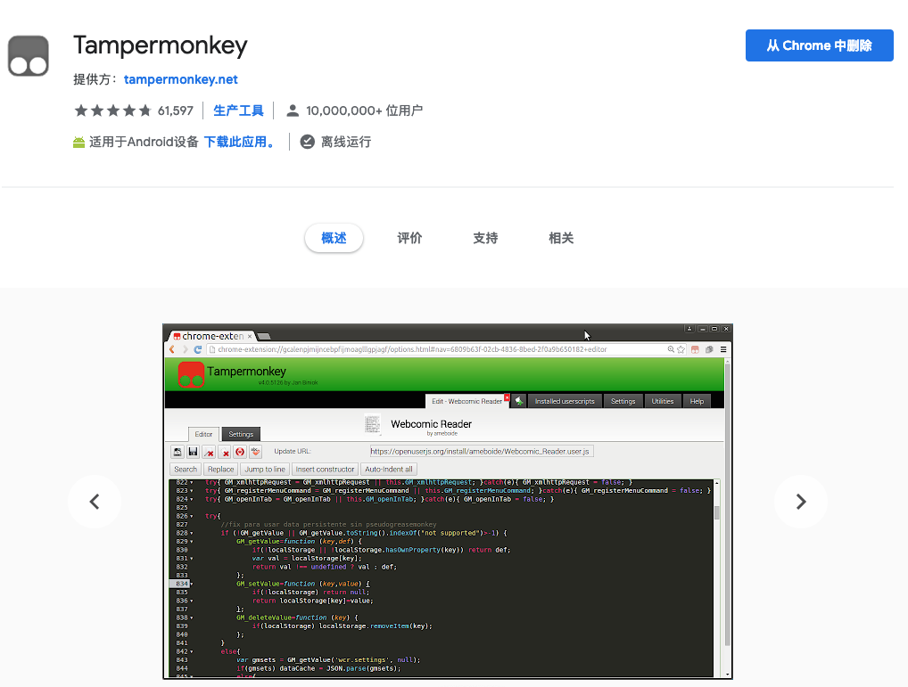
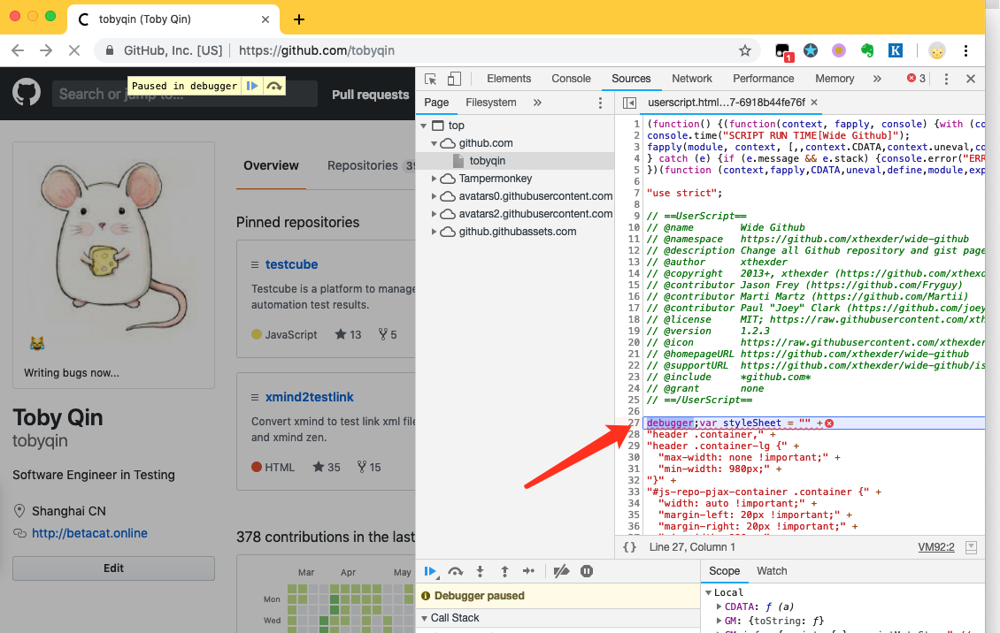

前面我们介绍过怎么[用VueJS开发浏览器插件](https://betacat.online/posts/2019-02-24/build-chrome-extension-with-vuejs/)，也知道了它有一个巨大限制，就是需要注册成开发者你才能发布插件到商店。而且你发布的任何插件都需要经过严格的审核才能最终和用户见面。这时候我想你该认识一下油猴了。

## 关于油猴

油猴全名叫TamperMonkey，别名也叫GM。如果说TamperMonkey各大插件商店里第二厉害的插件，没人敢说自己是第一了，去搜搜它的下载量和评价你就知道了。



一般情况下浏览器的插件我们都是去商店里安装的，但如果你装了油猴插件后，你就可以到任何地址安装插件。它最大程度加强了你的浏览器，每一个油猴脚本就是一个插件。而且油猴几乎支持了所有浏览器，包括IE。

TamperMonkey官方的定义说这是一个用户脚本管理器。通俗的说法就是TamperMonkey允许你在浏览器打开的任意页面过程中执行一段自定义脚本，从而实现一些功能，比如：

- 在百度搜索结果打开后把广告去掉
- 在百度云的资源页面提供VIP下载地址（假设你知道解密算法）
- 在你提交bug时自动填上一系列数据

油猴能做的很多，可以这么说，限制它功能的只是咱自己的想象力。

## 油猴脚本Hello World

一个油猴脚本就是一个以`user.js`结尾的JavaScript脚本，你可以托管在任何位置。只要你装了油猴插件，当你访问这样一个js文件时，油猴就会提醒你是否安装这个脚本。


所以开发一个油猴脚本就是写一个js文件，并以`user.js`结尾，例如`github-info.user.js`，然后托管在某个地方。

这个js文件需要符合油猴脚本的一些基本约定，比如这样：

```javascript
// ==UserScript==
// @name         Github Info
// @namespace    https://betacat.online/
// @version      0.2.1
// @description  A demo to use vuejs in tampermonkey script.
// @author       Toby Qin
// @include      *github.com*
// @exclude      *api.github*
// @supportURL   https://github.com/tobyqin/tampermonkey_vue
// @updateURL    https://github.com/tobyqin/tampermonkey_vue/raw/master/github-info/github-info.user.js
// @downloadURL  https://github.com/tobyqin/tampermonkey_vue/raw/master/github-info/github-info.user.js
// @require      https://vuejs.org/js/vue.min.js
// @require      https://code.jquery.com/jquery-3.4.1.min.js
// @require      https://github.com/tobyqin/tampermonkey_vue/raw/master/github-info/app.js
// @grant        GM_getValue
// @grant        GM_setValue
// @grant        GM_setClipboard
// @run-at       document-body
// @noframes
// ==/UserScript==

alert('hello world!');
```

从各个字段应该比较容易理解是干什么的，简单介绍一些常用字段：

- updateURL：脚本检查更新的地址，每天油猴会去这个地址查询新版本。
- downloadURL：脚本下载地址，如果有更新就去这里下载下脚本。
- include：url 包含匹配，当url符合这样的规则才启用脚本，可以写多条。
- exclude：url 排除匹配，当url符合这样的规则时不启用脚本，可以写多条。
- require：加载外部资源，可以是js，css或者图片，油猴会缓存这些资源，并提供调用方法。
- grant：申请使用油猴API，如果没申请就不能使用。
- run-at：脚本运行阶段，比如页面加载前，加载后或者闲置时等等。

更多详细的解释还是去看官方的开发文档：

- https://tampermonkey.net/documentation.php?ext=dhdg

上面这个示范其实已经是一个完整的例子了，当你访问github.com的任意页面时浏览器都会弹出一个“hello world”的警告。

## 加入jQuery和Vue

jQuery虽然即将成为被大家争相抛弃的东西，但不得不说在油猴脚本里它还是有一席之地的。因为jQuery提供了便捷的选择器和链式操作，让我们足够方便去操控页面。

要使用jQuery，你要注意不能因为你选择的jQuery版本破坏了站点的功能，50%甚至更多的站点还在使用jQuery，但是有版本的差异。还好jQuery提供了noConflict的加载方式。

```javascript
// ==UserScript==
// ...
// @require      https://code.jquery.com/jquery-3.4.1.min.js
// ...
// ==/UserScript==

window.jq = $.noConflict(true);

// ...
```

那么Vue呢？就没那么幸运了，如果你的目标站点已经在使用Vue了，你可以不导入Vue，直接调用就好了。

Vue不提供noConflict的导入方式，所以一旦你导入和站点不一致的Vue版本后，什么事情都有可能发生。

- https://github.com/vuejs/vue/issues/2349

所以在油猴插件中使用Vue需要做足够的调研。你可以参考我的这个例子同时使用jQuery和Vue来开发油猴插件。

- https://github.com/tobyqin/tampermonkey_vue


## 本地部署

首先说本地环境的准备，方法有很多，就是想方设法让你的用户脚本被托管在某个地方。

### 插件集成环境

油猴插件本身提供了一个简单的开发环境，你可以在这里写你的脚本，这时你不需要考虑托管的问题。


但大多时候我们需要功能更强大的IDE，比如VsCode或者WebStorm。

### npm serve

你可以用npm安装一个serve，然后把脚本目录通过http协议暴露出来。

```
npm install serve
cd /path/to/project
serve -l 5000
# now install user script at http://localhost:5000/my.user.js
```

### python http.server

如果你本机安装了Python，也可以直接托管一个文件目录。

```
cd /path/to/project
python -m http.server 5000
# now install user script at http://localhost:5000/my.user.js
```

### WebStorm / everything

如果你用的是WebStorm，在用户脚本目录下新建一个html，它会自动提供访问这个文件的http地址，你通过拼装也可以生成用户脚本的地址。

如果你是Windows也装了everything，在设置中启用http后也获得用户脚本的地址。总之方法很多，开动你聪明的大脑。

## 调试用户脚本

调试脚本前，你需要到TamperMonkey设置中打开高级选项，选择开启调试。


然后重启浏览器，先打开开发者控制台（F12），然后访问目标网站，这时候油猴会自动帮你在用户脚本运行前加上断点并暂停。



## 正式发布

其实油猴脚本没有所谓的正式发布，你可以发布到几个常见的脚本站点（论坛）：

- https://openuserjs.org/
- https://greasyfork.org/zh-CN
- http://userscripts-mirror.org/

这几个站点在油猴插件都有入口，当然你也可以把你的脚本开源到github的仓库或者gist，然后告诉别人链接。再假如这是一个内部使用的脚本，你就部署到内网服务器等等。

## 友情提醒

因为油猴脚本的灵活性和无限可能，不安全的油猴脚本是很危险的。比如它可以在你登录的账号页面上搜集信息，发送到后台，甚至直接下单，修改地址等等。

所以在下有几个建议。

- 对于不信任的用户脚本，不安装。
- 对于不开源的用户脚本，不安装。
- 对于吹爆自己的用户脚本，不安装。

另外针对油猴脚本，谷歌也出手了，在将来版本的Chrome中会更加限制插件对运行时网页的干预，比如禁止修改请求，篡改网页等等。

不过那是将来，现在学习一下，没坏处。