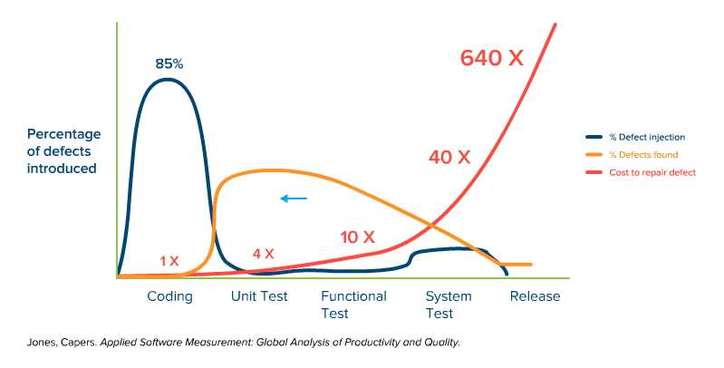

从事测试开发那么长一段时间，一直不知道怎么去评价和衡量这个职业的目标是什么，超高的自动化测试覆盖率？或者超稳定超包容的自动化测试框架？

<!-- more -->

怎么才算得上是一个优秀的测试开发人员？上周有机会去听了阿里2天的公开课，好像明白了一些，拿来跟大家分享一下。

## 内建质量

在微软有一句名言：“质量是设计出来，而不是测出来的。” 当然，这是理想情况，如果产品经理都这么优秀，这个世界早就和平了。

今天我们不说产品经理，我们从测试和开发的角度看，怎么内建质量。

### 让测试内建质量

为了内建质量，测试同学就要尽可能早地干预开发写bug，让bug死在摇篮里。换句话说就是让开发不要写出可以避免的bug：

1. 产品，开发，测试应该同时参与需求评审会议，澄清需求，达成共识
2. 将关键测试点作为需求的一部分，让开发同学交付需求时完成自测

### 让开发内建质量

从开发的角度看，要提高代码的质量可以有很多种方式：

1. 提高自测意识，借助单元测试或者质量分析工具
2. 真正理解需求和技术架构，进行Code Review或者结对编程
3. 评估代码质量或者bug数量，跟绩效挂钩

排除开发的自身能力问题，80%的bug都是需求理解不准确的问题，如果开发不愿背这个锅，那就甩给产品经理吧。

由此可见，如果测试不想看见这些bug，那么你就要帮产品表达需求，帮开发理解需求。

## 测试左移

上面我们说内建质量其实已经涉及到了测试左移，例如让QA在参与需求研讨时提出问题，列出测试点其实已经开始在进行测试了。

为什么我们要测试左移呢？因为发现问题的时间越晚，修复的成本就越高。

图中橙色线条代表了传统测试发现缺陷的时间，大多数bug都是在功能测试和集成测试时发现的，最后导致的结果就是发布前加班加点，祈祷不要有bug漏到生产环境。

如果我们能把测试活动向左移动，那么就意味着修复成本大幅下降。

但是谈何容易？想要把大部分测试点放在单元测试环境完成，非常依赖成熟的开发环境和极其资深的开发人员。

在阿里是这样实践的，让测试给开发赋能。

## 开发赋能

从字面上解释就是，测试同学给开发赋于一定的能力，让他们有能力去完成测试，比如：

1. 降低测试门槛
2. 使用测试工具（自动化）
3. 获取测试数据
4. 培养测试意识

举个例子，开发同学在完成需求代码后，可以点击一个按钮得到测试数据，再点击一个按钮验证测试覆盖点，喝杯咖啡后就可以看到测试报告。

从上面这个例子看，开发同学其实他并不需要懂测试数据的设计，自动化测试的开发，测试报告的编排，但是他依然可以快速完成需求测试（门槛低），只要他养成习惯（培养意识）。

那么你就会说，这对测试的同学要求是不是很高啊？对啊，回到开篇的问题，如何评判一个测试人员的能力？在我看来就是评判他给开发和团队赋能的能力。在阿里是这样，在微软和谷歌也是这样。

一个优秀的测试人员将测试左移时，并不会将负担转移给开发。相反地，而是帮开发写出更高质量的代码，更高效率地交付需求。

那么测试能左移到什么程度呢？比如让开发在Coding时就发现问题，或者还没Coding就发现问题，那应该是极好的。

怎么做到呢？刚才已经说过了，测试即需求，把bug扼杀在摇篮里。

## 实践方法

想实践测试左移可以有很多种方法，每个组织需要根据实践情况进行裁剪和调整。

1. 参与需求评审，帮助开发理解需求
2. 参与架构、设计分析，提早预防问题
3. 践行BDD，TDD
4. 单元测试提案，接口测试提案
5. 提供模拟数据能力，测试工具
6. 制定提测标准，拒绝低质量代码
7. 回归测试自动化
8. 静态代码分析，单元测试覆盖率

测试左移的概念给整个测试角色带来了巨大的转变。软件测试不仅仅是“发现bug”，而是致力于“尽可能早的检测和预防bug”。

## 参考资料

- 培训课件： [阿里Devops体系和实践.svg](/files/阿里Devops体系和实践.svg)
- 参考文章：[What is shift-left testing?](https://blog.parasoft.com/what-is-the-shift-left-approach-to-software-testing)