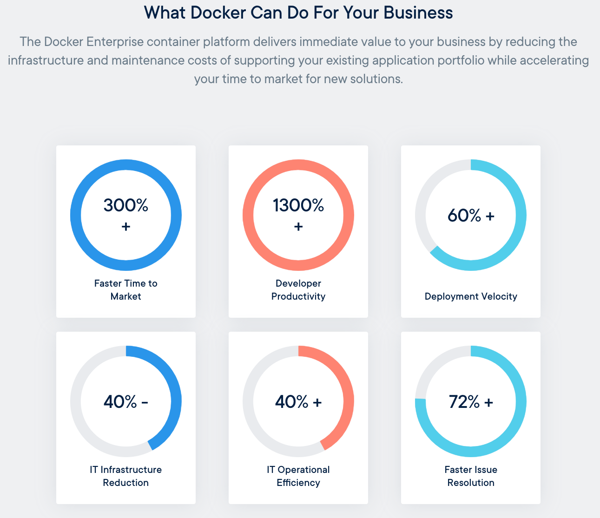
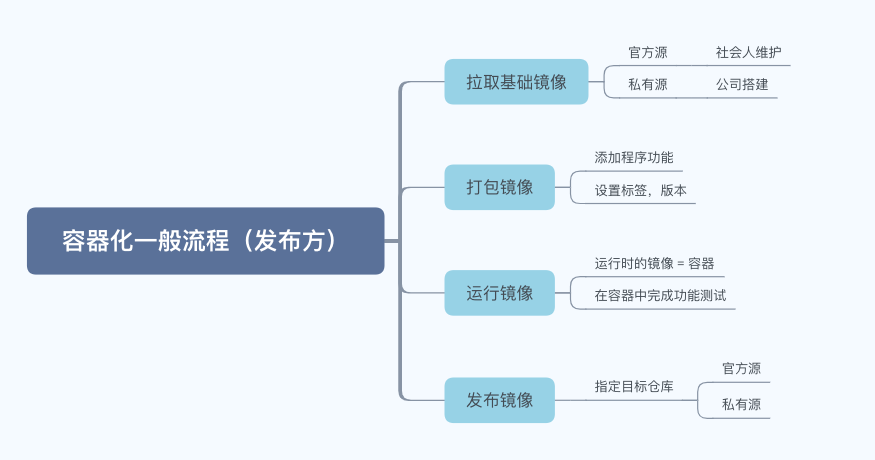
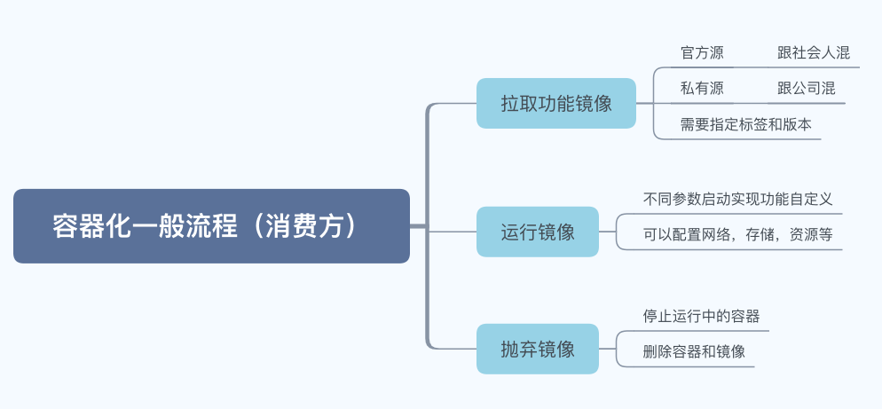
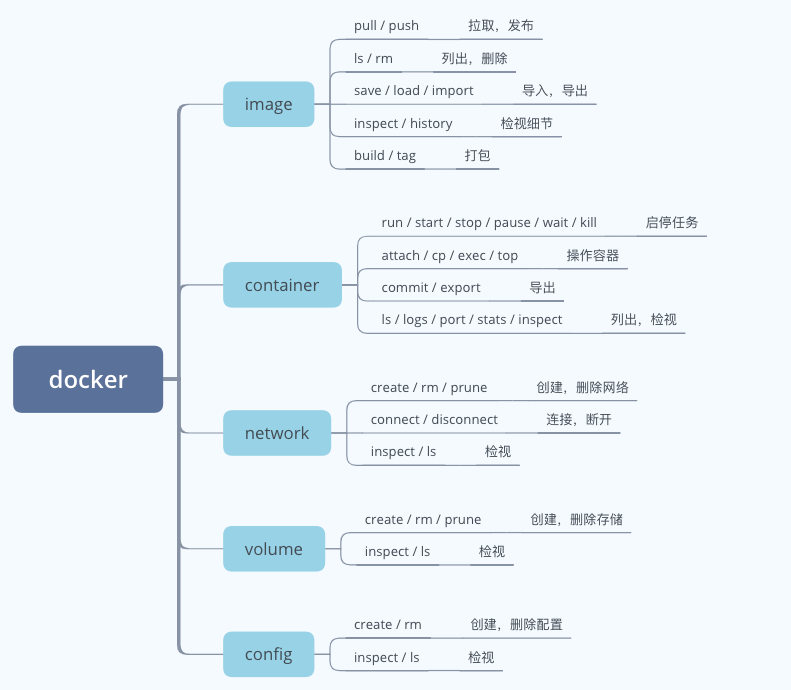
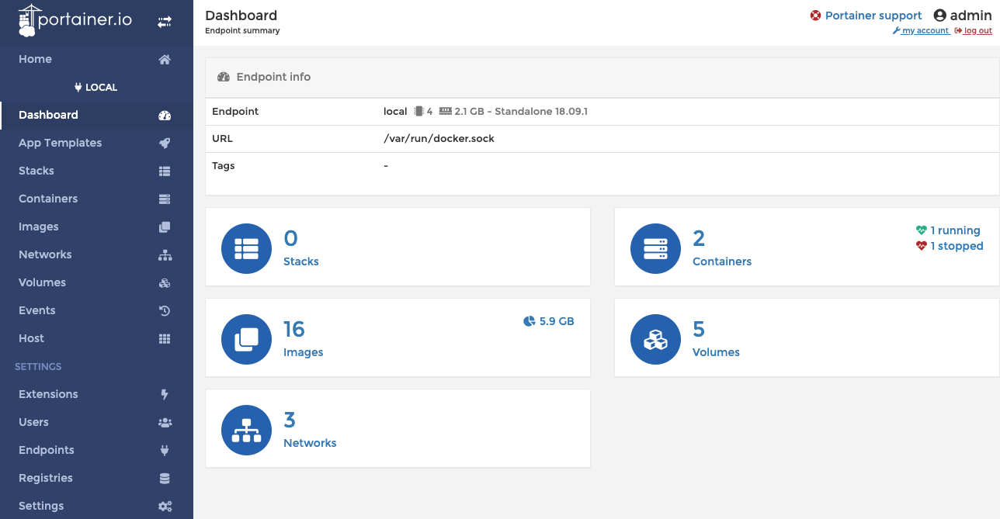

Docker作为当今最流行的容器技术，我们还是需要紧跟时代努力学习，避免被公司优化掉。本文以轻松愉快的方式介绍了我对容器的认识，需要深入的同学建议多多查阅[官方文档](https://docs.docker.com/engine/docker-overview/)。

<!-- more -->

## 为啥要 Docker

千言万语不如一张图：



来源： <https://www.docker.com/why-docker>

**简单总结：**

1. 更少的部署时间，更高的交付效率balabala，反正很厉害
2. 老板花更少的资源，做更多的事
3. 员工花更少的时间，做更多的事（加量不加价？）

总之，Docker可以让你和你的企业变得很牛很潮，甚于内裤外穿。

## 啥是 Docker

再来一张图：


来源： <https://www.docker.com/resources/what-container>

简单总结：

1. Docker 是容器技术的一种实现，是当下最流行的（不代表以后还是它）
2. 容器相对于虚拟机更轻量，但是能实现和虚拟机几乎一样的功能
3. 虚拟机需要上G的磁盘空间外加和真实环境等效的CPU，内存
4. 容器只需要运行写入的磁盘空间（MB级），能使用宿主机全部CPU，内存

打通俗一点的比分，独立的物理机是别墅，花园车库都是你的；虚拟机是楼盘卖的各种公寓，有独立的客厅卧室；容器是酒店里的房间，大部分资源都是公用的。

那为啥我不住别墅而住酒店呢？别墅不仅贵还要养管家，高档的酒店不见得比别墅和公寓差，但成本和管理效率高多了。

## 怎么实现容器化

我们可以把容器化流程一般化，例如作为软件发布方，流程大抵如此：



所谓基础镜像，你可以简单理解成操作系统。发布方需要把自己的软件和基础镜像打包后推送到仓库，就算容器化了。

注意，你要打包的不光是软件本身，还有各种配置过程，比如修改文件，修改权限，打开端口等等。

关于Docker镜像，我们可以看作千层饼，基础镜像是最下面一层，每添加一个功能（命令）就往上叠一层，看官方这个图：


基础层是Ubuntu，上面的4层分别代表了加了4次功能，比如：

1. Add file1
2. Install app1
3. Install app2
4. Change permission

每一次运行命令都会生成一个层（Layer），每个层都是可以复用的。比如在任意层打上标签后发布，或者在下次制作镜像时加以利用（缓存加速）：

1. Add file1 （秒完成）
2. Install app1 （秒完成）
3. Install app3 （新的Layer）
4. Change permission （新的Layer，上一步的Layer不一样）

打包出来的镜像层是只读的，当镜像被运行后就会生成容器，每个容器都只是对镜像附加了一个可写层，所以资源利用率很高。

了解完生产方的流程后，我们来看一下消费方的流程：



作为消费方，可以用来去自如，为所欲为来描述容器化后的世界：

1. 我想要啥就去仓库Pull一下
2. 运行容器，不必担心配置繁琐，环境差异这种烦心事
3. 这镜像功能不错 - 那就让它跑着
4. 这镜像是个乐色 - 分分钟删了它

有了容器，开发的锅更难甩掉了，因为你是容器的爹，也是容器的妈。测试运维找上门，你再也不敢说在我这明明是好的啊。

## 容器化的限制

容器化的实现源于Linux系统本身的一种特性，叫[系统级虚拟化](https://en.wikipedia.org/wiki/OS-level_virtualisation)（OS-level virtualisation）。早在10多年前在Google已经广泛应用，对，Google那个糟老头坏的很，用了那么久都不跟我们说容器真香。等Docker火了以后它才说光Docker不够，你们还需要Kubernets。


这张图经常出现在我们视线，为啥鲸鱼和企鹅还有老鼠在一起啊？鲸鱼代表着Docker，企鹅代表着Linux，老鼠代表着Go语言。Docker运行的基础是Linux，它是由Go语言编写的，哦原来Docker和它爹它妈在聚餐呢。

既然容器化原理离不开Linux特性，那么容器化的限制也显而易见：

1. 你的应用必须能跑在Linux上
2. 你的应用应该是无状态的 - 允许随起随停

举例说明，适合容器化的应用：

- 前端服务，微服务，无状态任务

不合适容器化的应用：

- 数据库，数据库，数据库

为啥数据库不适合容器化啊？第一，数据库是有状态的；第二，数据库不是想起就起想停就停的，数据安全大过天；第三第四第五网上写了一堆展开可以另写一篇。

### 最佳实践

容器化还有一些最佳实践：

1. 一个容器只运行一个应用
2. 使用镜像来交付应用，不要直接部署
3. 分层构建容器，尽可能减少层的数量
4. 不要把本地运行的容器转成镜像
5. 不要将数据存储在容器中

### Windows容器

你可能听过[Windows容器](https://www.microsoft.com/zh-cn/cloud-platform/containers)，是有那么一回事，但是当前还不是很成熟，勇敢你的可以尝试，但你的老板大概是不会让它跑在生产环境的。据说携程已经将Windows容器化应用到生产了，牛Pi（破音）！

## 容器的优缺点

优点显而易见，随便列几个：

1. 比VM小，比VM快，比VM便宜
2. 更容易发布和维护，有效避免DEV，QA，OPS的撕逼
3. 社区非常活跃，国外有谷歌微软亚马逊，国内有BAT做先驱

那么缺点呢？并不是太多，不信你到网上找找看，大多是为赋新词强说愁，简单列举：

1. 平台限制，目前只支持Unix/Linux应用，只支持64位系统
2. 相对于直接部署应用，性能会差一些
3. 学习和迁移成本，取决于现有架构和资源
4. Docker公司决策有点迷，很多言论说它要挂了

理论讲完了，我们进入实操环节。

## 安装 Docker

现在Docker的安装非常傻瓜，只要从[官网下载](https://download.docker.com/)对应平台的安装包点击几下就可以安装完成。你需要知道：

1. Windows用户需要开启[CPU虚拟化](https://docs.docker.com/docker-for-windows/troubleshoot/#virtualization-must-be-enabled)，配置4G内存以上，Windows 10 / 64位系统
2. 早期版本的Windows可以考虑使用[Docker Toolbox](https://docs.docker.com/toolbox/overview/)或通过Linux虚拟机来安装
3. MacOSX用户建议[下载Docker Desktop](https://hub.docker.com/editions/community/docker-ce-desktop-mac)后安装，用Brew会更麻烦
4. Linux用户最简单最野生，用各种包管理器就可以装，例如：

```shell
yum install docker     # centos / redhat
apt-get install docker # ubuntu
```

坑：在Windows下，Docker和Genymotion是有冲突的，一个要开CPU虚拟化，一个要关CPU虚拟化，二者势不两立，目前没有好的解决办法。

我们装的Docker都是CE（Community Edition）版，另外Docker还提供了企业版。

| Capabilities                                                 | Docker Engine - Community | Docker Engine - Enterprise | Docker Enterprise |
| :----------------------------------------------------------- | :-----------------------: | :------------------------: | :---------------: |
| Container engine and built in orchestration, networking, security |            Yes            |            Yes             |        Yes        |
| Certified infrastructure, plugins and ISV containers         |                           |            Yes             |        Yes        |
| Image management                                             |                           |                            |        Yes        |
| Container app management                                     |                           |                            |        Yes        |
| Image security scanning                                      |                           |                            |        Yes        |

## 启动 Docker

在Windows / MacOSX中，双击小鲸鱼就可以启动Docker，启动成功后在通知区域就可以看到Docker的图标。

坑：在Windows / MacOSX 中居然真的只能通过图形来重启或者停止Docker服务？！

在Linux 中需要使用命令行来管理 Docker 服务，以CentOS 7为例。

```shell
systemctl start docker
systemctl stop docker
systemctl enable docker # auto start when boot
```

我们平时说的Docker一般是指Docker Engine，前面提到的安装启动Docker指的都是Docker Engine，这个Engine提供了一系列功能：

1. 管理镜像比如：拉取镜像，打包镜像，推送镜像
2. 管理容器比如：运行容器，停止容器，诊断容器

如果Docker Engine已经启动成功，在命令行（Windows建议PowerShell，MacOSX，Linux建议Bash）中就可以通过下面两个命令检查其运行状态。

```
docker version
docker info
```

反之，如果Docker Engine没启动，那么就会有类似的错误。

```
$ docker info
Cannot connect to the Docker daemon at unix:///var/run/docker.sock. Is the docker daemon running?
```

## Docker 常用命令

Docker 大部分操作都是通过命令行来完成的，对你还记得Windows和MacOSX的那个图像客户端，他们可以干什么？简单说他们除了用来启动和退出Docker外，还可以用来配置仓库源和网络代理地址，别的功能你就忘了吧。

还有，在中华大地，使用Docker前最好还是先[配置国内的源](https://yeasy.gitbooks.io/docker_practice/install/mirror.html)，不然镜像会拉的很慢，便秘的感觉。

万事俱备，我们来一个Docker Hello World：

```shell
$ docker run hello-world
Unable to find image 'hello-world:latest' locally
latest: Pulling from library/hello-world
1b930d010525: Pull complete
Digest: sha256:92695bc579f31df7a63da6922075d0666e565ceccad16b59c3374d2cf4e8e50e
Status: Downloaded newer image for hello-world:latest

Hello from Docker!
```

运行完这个命令，以后出去面试你就可以跟面试官说自己精通Docker和容器化技术了。

面试官再追问，你就说 Docker 命令太多了，我一般都是通过`docker --help` 查阅的。当然啦，咱也不水的，Docker 命令我说起来也是一套一套的，不信你往下看。

再说说这个Hello World，你发现没有，作为消费方，其实你只要一个`docker run <image>` 命令就够了，Docker足够聪明，如果这个`<image>` 不存在，那么它就会仓库里找，找到了就自动pull，然后运行起来。

回到工作中，如果开发同学做完了一个需求，是不是告诉你这个`run`命令的具体参数就可以测试和发布了呢？（基本）是的！天啊，开发同学太厉害了，他变强了，也变秃了。


聪明的你可能想到了，在社会人维护的Docker仓库里，其实包含了很多打包好的软件镜像，你只要`docker run`就行，比如jenkins，sonarqube，redis，kafka，你能想到的全都有。天啊，原来用Docker整一个玩耍的环境那么简单！

### 命令速记

也许你知道一些Docker命令，比如：

- docker run
- docker images
- docker ps
- docker rename
- docker rm / rmi

但是我真的建议你忘记它们，换一种方式去使用和记忆Docker命令。当你敲完`docker --help` 之后，出来的信息大概是这样的：

```
$ docker --help

Usage:	docker [OPTIONS] COMMAND

A self-sufficient runtime for containers

Options:
      ...

Management Commands:
  builder     Manage builds
  checkpoint  Manage checkpoints
  config      Manage Docker configs
  container   Manage containers
  image       Manage images
  network     Manage networks
  node        Manage Swarm nodes
  plugin      Manage plugins
  secret      Manage Docker secrets
  service     Manage services
  stack       Manage Docker stacks
  swarm       Manage Swarm
  system      Manage Docker
  trust       Manage trust on Docker images
  volume      Manage volumes

Commands:
  ...
```

不重要的部分我都省略了，在当前和未来版本的Docker中，官方都极力推荐我们通过管理命令去执行Docker命令。比如说：

```
docker image ls
```
而不是：
```
docker images
```
推荐使用：
```
docker container ls
```
而不是：
```
docker ps
```

虽然`docker ps` / `docker exec` 等等命令更简洁，但是也更混乱，不便记忆。你有时候甚至不确定自己操作的是容器还是镜像或者是别的对象？

让我们再仔细对比一下管理命令和简化版命令：

```shell
# via management command
docker image ls
docker image rm
docker image history

docker container ps
docker container rename
docker container rm

# via docker command
docker images
docker rmi
docker history

docker ps
docker rename
docker rm
```

所以在你理解Docker能做的事情后，再通过管理命令去实践你就会事半功倍。我做了一个思维导图，列出了常见的操作。



在敲命令时你要时刻记住自己要做什么，不要迷路：

1. 需要配置网络，那就`docker network xxx`
2. 需要配置存储，那就`docker volume xxx`
3. 需要管理镜像，那就`docker image xxx`
4. 需要管理容器，那就`docker container xxx`

是不是超级简单？

### portainer

[portainer](https://www.portainer.io/) 是一个浏览器界面的图形化Docker管理工具，它实现了几乎所有的Docker Engine操作，你只要两条命令就可以让它运行在你的机器上。

```
$ docker volume create portainer_data
$ docker run -d -p 9000:9000 -v /var/run/docker.sock:/var/run/docker.sock -v portainer_data:/data portainer/portainer
```



有了它，你就可以忘掉上面的命令，前提是你先通过面试。

## Dockerfile

要制作容器镜像，你需要一个详细的步骤，这个实施过程记录下来就是Dockerfile。我们来看一个例子：

```shell
FROM ubuntu:18.04
COPY . /app
RUN make /app
CMD python /app/app.py
```

其实Dockerfile很简单易懂，无非就是第一做什么第二做什么，自己写几遍就记住了。在Dockerfile中可以用的命令并不是特别多。

| 关键字     | 解释                                                |
| ---------- | --------------------------------------------------- |
| FROM       | 选择基础镜像版本，例如：`FROM ubuntu:18.04`         |
| LABEL      | 给镜像添加标签，例如：`LABEL version="0.0.1-beta"`  |
| WORKDIR    | 指定工作目录（会自动创建），例如：`WORKDIR /target` |
| ADD / COPY | 复制文件，ADD会自动解压，例如：`COPY . /target`     |
| RUN        | 运行命令，例如：`RUN apt-get update -y`             |
| ENV        | 设置环境变量，例如：`ENV PG_VERSION 9.3.4`          |
| USER       | 不使用root来运行容器，例如：`USER user1:group1`     |
| VOLUME     | 添加文件卷，例如：`VOLUME /myvol`                   |
| EXPOSE     | 暴露指定端口，例如：`EXPOSE 80/tcp`                 |
| CMD        | 容器的默认命令，例如：`CMD [“echo”, “hello”]`       |
| ENTRYPOINT | 容器的入口命令，例如：`ENTRYPOINT [“top”, “-b”]`    |

以上只是简单介绍，需要用到具体命令时建议还是参考[Dockerfile官方文档](https://docs.docker.com/engine/reference/builder/#usage)。

这些命令里最难说清楚的就是`CMD`和`ENTRYPOINT`，如果我是面试官这是必考题。三言两语说不完，我们改日再聊这个话题吧。

有了Dockerfile之后，只要运行`docker image build`就可以生成镜像了。

```shell
cd /your-project-dir
docker image build -t tobyqin/xmind2testlink:1.0.0 .
```

一般你需要用`-t`参数来给你的镜像取个名字和定个版本，别的参数不太重要。打包完之后发布也是手到擒来：

```shell
# 需要提前在docker仓库注册账号
$ docker login
# 输入用户名密码
$ docker push tobyqin/xmind2testlink:1.0.0
The push refers to repository [docker.io/tobyqin/xmind2testlink]
a50ecd8a5d30: Layer already exists
d306e6933e16: Layer already exists
b48eea5f4f04: Layer already exists
6e7c7e6d6e7f: Layer already exists
2aebd096e0e2: Layer already exists
latest: digest: sha256:c06bc4a35073319b8d7e7ef128a7daa8cdb4e766468ffc50f8a61afcf5ef3f46 size: 1367
```

发布成功后你也就成了一个Docker社会人了。

## Docker Compose

Dockerfile只是打包一个程序或者一种服务，实际上我们的应用会复杂的多，比如有web前端，有大后端，有缓存系统，有消息队列，有数据库等等。

这时候你就需要使用[Docker Compose](https://docs.docker.com/compose/overview/)了，它是一个官方提供的用来定义和运行多个容器的工具，你只要写一个配置文件就可以对容器进行编排，看例子。

```yaml
# docker-compose.yml
version: '3'
services:
  db:
    image: postgres
  web:
    build: .
    ports:
    - "5000:5000"
    volumes:
    - .:/code
    - logvolume01:/var/log
    links:
    - redis
    depends_on:
    - db
  redis:
    image: redis
volumes:
  logvolume01: {}
```

有了这个配置文件，你只需要运行`docker-compose up`就可以轻松管理配置文件里的一系列容器。

关于Docker Compose的介绍不做深入，也不推荐深入，因为这样的容器编排只能满足小企业或者个人开发者的需求，单台主机。真正在企业中我们会用 [Docker Swarm](https://docs.docker.com/engine/swarm/) 或者 [Kubernets](https://kubernetes.io/)。

## Docker Swarm 和 K8S

Swarm是Docker官方提供的一款集群管理工具，其主要作用是把若干台Docker主机抽象为一个整体，并且通过一个入口统一管理这些Docker主机上的各种Docker资源。

Kubernets也叫k8s，中间刚好是8个字母。类似的我们还把international缩写成i11l。Kubernets是Google开源的容器编排引擎，支持大规模容器集群管理，自动化部署，自动伸缩，负载均衡，资源监控等等功能。

Swarm和Kubernetes其实是一类东西，但是Google家的东西更强大也更复杂，企业一般会二选一。

关于容器编排是另外一个话题（很大的），本期内容完。
