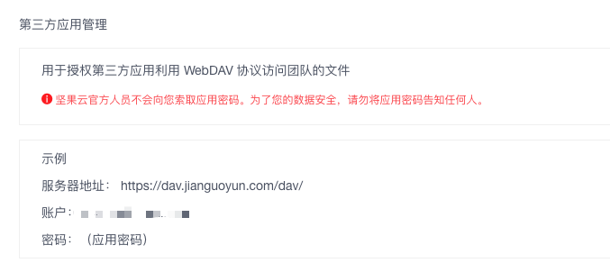

坚果云更Linux也可以配合的很好。

<!-- more -->

## 开启WebDAV

在坚果云网页端可以找到WebDAV的管理界面，开启后就可以得到一个密钥。



有图形界面的操作系统坚果云都提供客户端了，现在我希望添加到坚果云的某个目录的文件能够自动checkin到github，从而实现随时写博客之类的功能。

## cURL读取 WebDAV 目录文件

```bash
curl -X PROPFIND --user 'user@xxx.com:password' 'https://dav.jianguoyun.com/dav/Blog/@TODO'
```

以上命令会返回这个目录里所有的信息，不过是xml的，不太好处理。

## Python 读取 WebDAV目录文件

只要能找到合适的包，Python 做什么都很容易，读取 WebDAV 目前我发现 [fs.webdavfs](https://pypi.org/project/fs.webdavfs/) 相对好用一点。

```bash
pip3 install fs.webdavfs
```

读取目录的代码：

```python
# jg_sync.py
from webdavfs.webdavfs import WebDAVFS

url = 'https://dav.jianguoyun.com/dav'
options = {
    'login': 'user@xxx.com',
    'password': 'password',
    'root': '/Blog/@TODO'
}

fs = WebDAVFS(url, **options)
files = fs.listdir('.')[1:]
print('\n'.join(files))
```

## 下载 WebDAV 文件

推荐用 cCURL 而不是 Python，Python 下载文件会有各种异常，中文编码或者路径什么的很不灵光，折腾了我半天都没弄好，还是 cURL 简单粗暴。

```sh
echo "Update from jianguoyun..."
cd "$(dirname "$0")"
files=$(python3 jg_sync.py)

urlencode() {
    echo $(python3 -c "import urllib.parse; print (urllib.parse.quote('''$1'''))")
}

download_file() {
    cmd="curl -u 'user:pass' 'https://dav.jianguoyun.com/dav/Blog/@TODO/_remote_' -o '@TODO/_local_'"
    cmd="${cmd/_local_/$1}"
    cmd="${cmd/_remote_/$2}"
    eval $cmd
}

delete_remote_file() {
    cmd="curl -X DELETE -u 'user:pass' 'https://dav.jianguoyun.com/dav/Blog/@TODO/_remote_'"
    cmd="${cmd/_remote_/$1}"
    eval $cmd
}

IFS='
'
for file in $files; do
    echo "Download $file"
    encoded_name=$(urlencode "$file")
    download_file "$file" "$encoded_name"
    delete_remote_file "$encoded_name"
done
```

在脚本开始部分先通过 Python 获取 WebDAV 的目录中的文件，然后用cURL把文件拉到本地，接着从远端目录删掉这个文件。

上面步骤完成后文件就会被下载到本地的 @TODO 目录，再把这个目录里的文件稍作加工，就可以发布了。

## 上传文件到 WebDAV

从简单而言，还是用cURL：

```sh
upload_file() {
    cmd="curl --user 'user:pass' -T '_local_' 'https://dav.jianguoyun.com/dav/Blog/_remote_'"
    cmd="${cmd/_local_/$1}"
    cmd="${cmd/_remote_/$2}"
    eval $cmd
}
```

有了这个方法，就可以实现反向从git同步文件到坚果云。

## 其他一些心得

其实还可以通过百度云做中转，使用 [bypy](https://github.com/houtianze/bypy) 这个包，纯 Python 实现。

```python
pip insall bypy
bypy info
bypy upload ...
bypy download ...
```

同步脚本写完后，可以用[crontab](https://crontab.guru/)在你的云主机上定时执行，比如没10分钟去坚果云查询一下，如果有就做后续操作。

Python 操作 WebDAV的包不是特别多，好用的更少。

使用cURL操作WebDAV是也要注意文件名中编码的问题，比如中文，空格，特殊字符都需要转义。

更多cURL的操作可以google或者看[这篇文档](https://www.qed42.com/blog/using-curl-commands-webdav)。

还有一个办法是把 WebDAV 挂载到Linux上，大概搜索了一下 [davfs2](https://wiki.archlinux.org/index.php/Davfs2) 发现也挺折腾的，不去弄了。

