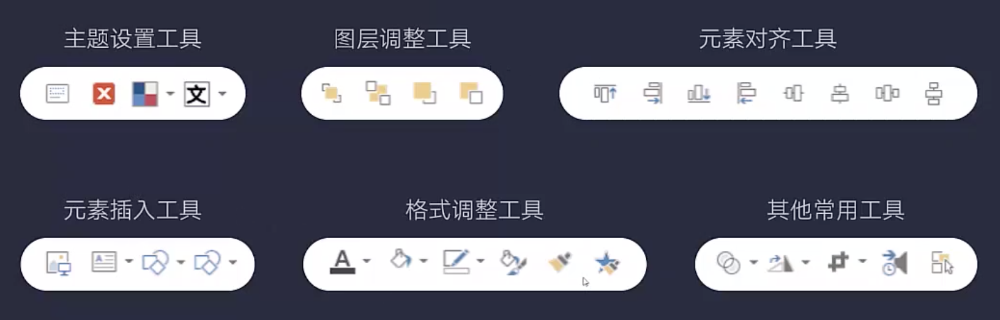
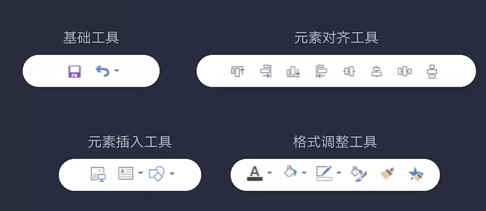

本文基于旁门左道PPT基础课程归纳而来。

<!-- more -->

## 基础操作

### 导出格式

PPT可以导出多种文件格式：

1. 图片，适合单页面预览，推荐png。
2. 视频，适合动画预览，推荐mp4.
3. pdf，适合需要保留排版和平台兼容形式的分享。

### 撤销次数

在设置的高级选项里可以设置最大撤销次数为150，默认值是20，有点少。

### 图片模糊

选中图片后选择虚化，默认虚化程度为10。可以通过格式窗格中的艺术效果修改虚化效果，一般改成60或者80会得到比较满意的结果。

### 画面比例

尽可能大的按屏幕比例设置画面比例，比如90cm x 30cm，而不是9cm x 3cm，这样可以提高画面清晰度。PPT有纵横画面的长度上限。

### 显示参考线

通过视图选项卡显示参考线，可以添加和调整参考线，按住ctrl复制，按住alt可以微调。

### 取色器

调出取色器后，从设计范围内开始按住鼠标左键不放，再将鼠标移出设计范围外就可以取到系统菜单甚至网页，或者其他非PPT软件的颜色，选到颜色后再放开鼠标左键。

### 画布大小

可以缩小画布在最上方和最下方很远处插入一个小形状，这样可以避免PPT放大后自动滚动到前面或者后面一页的问题。

### 快速去除动画

在PPT放映的下拉菜单里可以选择播放时不显示动画，这样可以快速去除动画效果。

### 快速提取素材

将PPT的文件后缀改成zip再解压，所有素材会在media目录里。

### 等分页面

比如要纵向等分页面，可以先添加纵向矩形，然后ctrl+d复制出等分数量的矩形，分别选中后对齐，排列，组合。最后将组合的图形拉伸为页面大小即可。横向等分操作亦然。

### 压缩文件

任意一张PPT选择图片，在图片选项卡中可以选择压缩图片，选择所有图片进行压缩即可大大减少PPT的文件大小。

### 嵌入字体

在设置的保存选项中，可以选择将字体内嵌到PPT中，可以避免到别的电脑播放是缺少字体导致排版错乱的问题。推荐使用字客网下载各种免费字体。

### 渐变形状

添加形状后选择渐变，并且调整透明度，最后将形状的层放置到文字和图片中间就可以做到类似蒙版的效果。如果图层很复杂，可以使用开始选项卡下的选择窗体来规划图层顺序。

### 设置密码

选择另存为后，在保存按钮左边有一个工具，里面可以设置两种密码：演示密码和修改密码。

### 母版设置

通过视图选项卡下的母版视图，可以快速批量调整PPT的整体样式，如果希望保留部分版式与主母版不一致，勾选不显示背景即可。母版是非常高效的操作，必须熟练掌握。

### 图表动画

SmartArt或者图标可以设置批量动画或者轮播动画，需要通过动画窗格将其他文字或者元素的动画合并到这些轮播动画中以达到同时展示的效果。

### 镂空字体

先选择大图像，后选择需要镂空的文字或者形状，使用合并形状按钮中的剪除菜单可以做出镂空效果，在合并形状中菜单中还有其他非常棒的拆分形状工具。

### 使用蒙版

蒙版就是覆盖在目标画面上的一个图层，在PPT中一般通过添加和目标图片大小一致的形状并设置其颜色和透明度来实现，通常情况下还需要将蒙版层调整到图片上方，文字下方。

## 高效操作

### 快速工具栏

可以将工具栏移到主菜单下方，可以节约鼠标点击距离。然后将最最常用的工具添加到快速工具栏中可以大大提高工作效率。任意工具都可以通过右键添加到快速工具栏，在工具栏通过右键删除或者调整顺序。

- 大神版：主题设置，图层调整，元素对齐，元素插入，格式调整，其他常用。

- 基础版：基础工具，元素对齐，元素插入，格式调整。

### 格式刷和动画刷

格式化可以快速复制文字或者形状的样式，动画刷可以复制动画效果。

### 默认文本框和图形

调整好的文本框或者图形可以通过右键设置为默认文本框或者图形，后面新添加的文本框和图形都会直接应该改样式。

### 批量修改字体

可以通过开始菜单的 “选择 / 字体” 菜单批量替换指定字体，还可以通过“设计/变体”菜单来统一修改中西文，标题或者正文字体，此方法更加灵活。

### 使用母版

母版有很多操作细节，多用多练习多思考。

### 批量修改形状

选中多个形状后，使用修改形状菜单即可。

## 提升操作

### 设计和审美

核心是多看，看优秀作品，知道什么是美什么是丑。过一段时间后重新看自己的作品或者喜欢的作品，想想自己是否还喜欢。推荐设计作品网站：

- Dribbble
- Behance
- Zcool
- Huaban

PPT终归还是属于平面设计，所以可以借鉴平面设计的学习方式和思路。

### 幻灯片的结构

通常的PPT结构：封面，目录，子部分，内容，循环，尾页。良好的结构不仅可以帮作者理清思路，也可以让听众更容易接收要传达的信息。

### 动画技巧

先制作镂空文字遮罩，然后将视频或者GIF置于文字下方，即可制作出比较生动的文字效果，让页面视觉效果更丰富。给镂空层添加一个基本缩放的动画，还可以让画面聚焦于核心内容。通过镂空图层配合路径动画，还可以做出有趣味的图表动画效果。

平滑效果真的很棒，不过需要升级到最新的Office 365 才可以使用。

