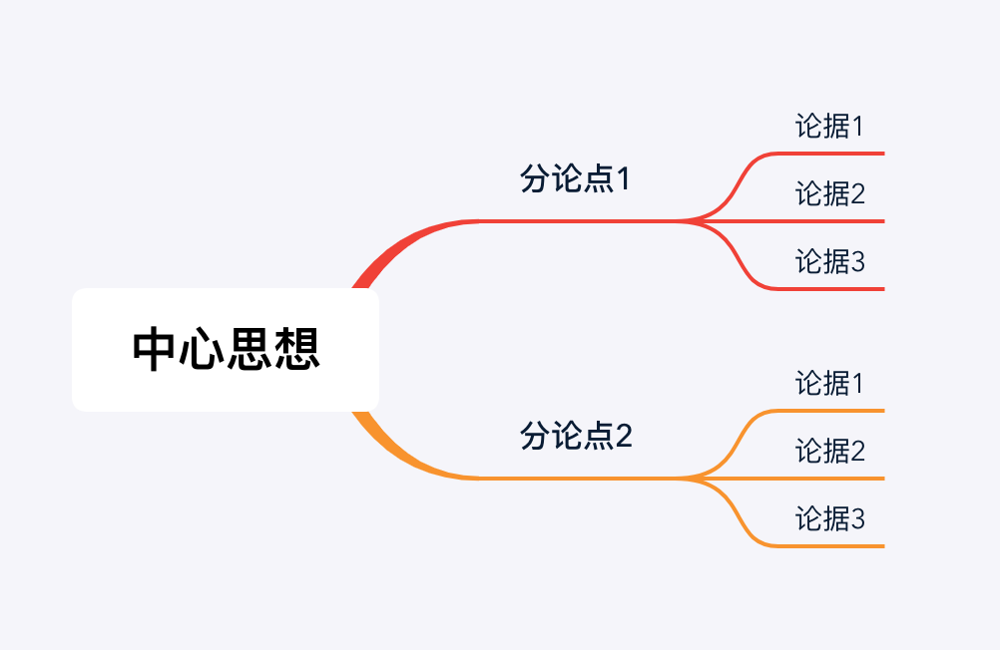

又到年底了，是该收拾一下，准备迎接新的一年了。

<!-- more -->

这个时候，网上又开始流行各种跨年段子，什么看20本书变成买20本书，什么世界那么大我要去看看变成去朋友圈看看。但是你有没有想过那终究是别人的生活，不管是调侃还是现实，我们总是要对自己负责。

这一年，我离开了自己的舒适圈，铤而走险地换了一份工作，可谓感慨良多。

## 代码终究不是我的

大部分人都追求稳定，希望自己可以一条道走到黑。

今年我从测试岗位跳出来，内心无比纠结，因为我一直以为，只要自己足够努力加上自己还不算笨的脑袋，在这个岗位上5年一定能成精。其实不然，外面的世界有很多偶然性和必然性，想成就一件事需要很多条件全都契合在一起。你可以坚持下去，也许奇迹会发生，我选择跳出来，看看另外一种可能。

过去我非常热爱写代码，感觉我可以用代码去改变世界。现在我依然不否认这个观点，只是工作的原因，我今年写的代码较之往年，少之又少。可能写代码的时间少了，思考的时间就多了。

我们不得不承认，没有谁的代码会被永远维护或者供奉起来。也许明年就来了个家伙，说这段垃圾谁写了，老子要推掉重做，然后你的代码就删个精光。

技术人员很容易痴迷于“唯技术论”，觉得技术能搞定一切，特别是程序员这个物种。我曾经跟不懂技术的朋友争吵过，说你看身边什么东西不是代码和计算机造就的？且不说微信支付宝已经进入我们生活的方方面面，就连你去上厕所的自动马桶后面都是一行行代码。

这种想法是很危险的，在IT行业混了十年甚至二十年，你眼睛不应该只有技术了。你应该知道，技术都是为业务服务的。除了业务，你应该还要知道产品，商业甚至管理，资本家为什么会让这些人聚集在一起。

程序员在三十岁之后需要的不是更多的代码，而是更多的思考。

## 说不见得比做容易

今年我也成了一个PPT玩家，笑。

PPT玩家也是分段位的，青铜玩家会复制粘贴，白银玩家会套用模板，铂金玩家会归纳总结，钻石玩家会内容重构，星耀玩家会观点升华，王者玩家就人P合一。

玩笑归玩笑，PPT是不容易做的，一是归纳难，二是表达难。

归纳难的问题在于输入的量是否足够，PPT全程都是在输出观点，如果没有观点你的演讲就一文不值，纯粹是浪费观众时间。没有输入就没有输出，有时候做一个PPT要翻好几本书，写好几天Demo，只是为了证明自己的某个观点是OK的。现在看来，做PPT或者演讲或者写博客都是一样的套路，需要很好的逻辑思维和总结能力。

只有你把自己说服了，才敢上台去。

关于表达难，这是很多程序员乃至中国人的通病。在程序员的世界里有一句名言：

> Talk is cheap, show me the code.
>
> — Linus Torvalds

然而这句话在大多数情况下不凑效，为什么呢？因为很多人还没学会表达就想秀代码，你问题都没说清楚，我何必看你代码。能说你才有机会秀。

在几个人面前说是一回事，在几十个人面前说又是另外一回事了。表达除了练习之外我觉得更多需要的是信心，而信心并不能通过反复练习获得。信心的程度主要是你由观点的认知程度和理解程度决定的。当你可以轻松去聊一个（技术）话题时，你如果不是有十足的把握，必定是有无敌的脸皮。

## 读书不是为了打卡

所有人都知道，多读书是好的，那就多读一些吧。

其实不然，最近刚读完一本书，我觉得这些年的书都白读了，这本书叫《读懂一本书》。

读书不能看数量，也不能看速度，而是看自己到底收获了什么。读书的过程有可能是愉悦的，比如你在翻阅一本精彩的小说；也有可能是极其难熬的，比如你在看晦涩难懂的理论解说。

在读任何一本书前，我们要问自己一个问题，为什么我要翻这本书呢？为了解决某个问题还是为了身心愉悦，或者只是为了完成年度目标。读书是很苦的，如果真希望日后读书能给自己帮助，你就不得不思考这个问题。今天看一本霸道总裁，明天看一本盗墓笔记，到底是为了什么？

那么怎么读书呢？我们就要回到为什么上来。读书是为了解决什么问题，如果当前没有明确的问题，是不是就不用读书了？不是这样的。在《读懂一本书》里说，书是解决问题的出口，读一本书也许只要几小时或者几天，但有可能是作者几年甚至一辈子的经验，所以读书是稳赚不赔的买卖，当然前提是你知道自己要读哪本书，这是很难的。

要不然呢？那就多读书吧。选书可以有一个普遍适用的指导方法，就是TIPS原则。

- Tools： 工具类书籍，这是解决现有问题的指导原则
- Ideas：灵感类书籍，带来新的理念，发现。可以是小说，历史，漫画等等
- Practicability: 实用性书籍，可以给生活或者工作带来改变，可以被应用
- Scientificity: 科学类书籍，对事实的归纳和验证过程

以前我都是看豆瓣书单或者经朋友推荐看的书，当然不乏佳作，但是从没想过这些书读完的目的是什么，有点像在打卡。

选书完之后才是真正的读书。读书也不是从第一页一字不差看到最后一页就可以了，而是要去思考这本书给我带了什么，简单说就是做读书笔记，做阅读理解。

《读懂一本书》作者的要求更高，就是在读完一本书后能给别人再讲一遍，把思维导图用手画出来。能讲出来就意味理解或者消化了书中的观点，能讲多少就收获了多少。一旦真正去做这件事，这本书大概已经印在自己脑海里了。

我们常常犯的错误就是看完一本书就完了，勤快一点的也许会拍个照发个朋友圈，生怕忘了让朋友们也帮忙见证一下。还有些人喜欢拿笔在书本上画上重点或者圈喜欢的句子，但其实这跟买书是一样的性质。买了不代表你就看了，画了也不代表你就记住了。

读书是苦的，如果真想让书为我所用，我们的脑子就不得不做一些不开心的事情。

## 闲下来才有创造力

今年明显比前两年忙了许多，今年的忙主要体现在非工作时间的支出上面。去年基本上还是可以保证在8点半出门，7点前回家的。今年大概都是8点出门，8点之后才到家，回家之后还有一半概率要开会占用半小时到一小时，能支配的非工作时间不会超过4小时。

在这4个小时里想一些新奇古怪的点子？难。我还要看书写字陪老婆呢。

当然，在地铁上会有两个多小时的时间可以支配。实际上我发现在地铁上我除了看小说听歌，不想干别的事情，在嘈杂的环境看技术或者处理工作上的事情是不可能的，除非万不得已。

最近看到有一篇报道说，微软要实现实行一周三休了。且不说羡慕，这样的制度在IT这样费脑子的行业推行我还是很赞同的。当你一直在忙碌时，喘气的机会都没多少，谈什么改革谈什么创新，基本都是在救火或者随大流。

闲下来才会有创造力，怎么样才能闲下来呢？

一，找老板谈，你需要筹码。

二，在自己身上找突破口。

其实忙不是理所当然的，有时候忙只是战略上的懒惰。我们可以略微分析一下自己在工作的时间安排，看看是不是真的做到了合理分配，最大效用。很多人都应该知道时间管理四象限，多做重要非紧急的，避免做非重要非紧急的。

且不说工作之外的时间，先问问自己工作之内的时间是否做到了轻重缓急合理安排。正是因为今年忙了许多，我对时间管理又重视起来了，但是执行的还是不够好。

希望在明年自己真的能够闲下来，偶尔发发呆也是极好的。

## 身体是革命的本钱

很庆幸今年自己还是维持了不错的锻炼频率，虽然没长出肌肉，但是每周两到三次的有氧运动也足以让我呼吸畅快，身心愉悦。

我们都还没到保温杯里泡枸杞的年龄，但是90后再过几天也30而立了，岁月不饶人。钱这辈子是挣不完的，但能开心地把挣到的花完也不错啊，别在医院里花就好。

今年的体检数据还不错，过两天去四川吃火锅，看熊猫，庆祝一下。