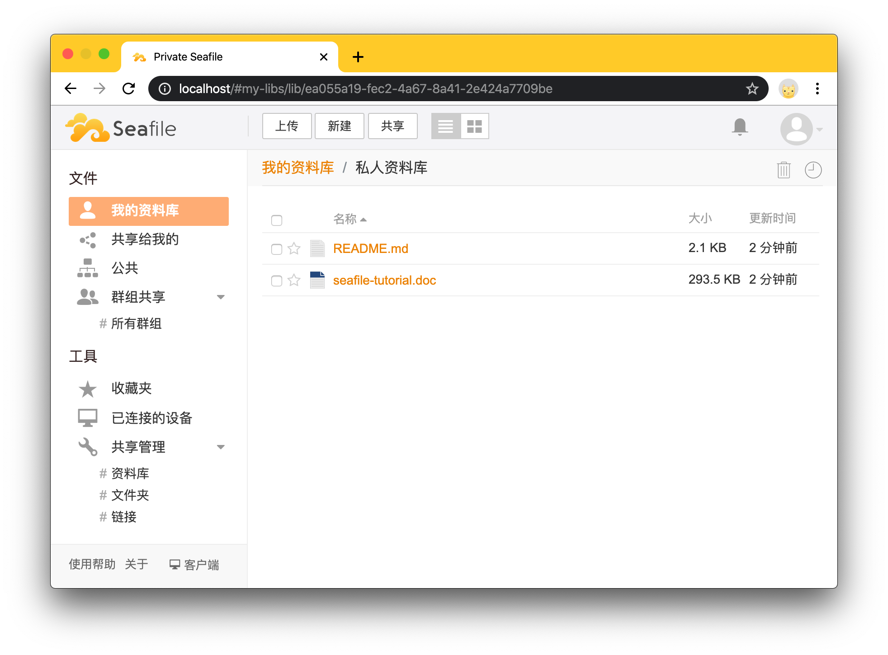

尝试了几种开源的私有云盘（文件服务器）的解决方案，备忘一下。

<!-- more -->

## Seafile

可以参考[官网部署文档](https://cloud.seafile.com/published/seafile-manual-cn/docker)，最新版7.x需要用docker-compose，十分不推荐这种被淘汰的技术，所以还是用旧版（6.x）吧。

```shell
docker run --name seafile \
  -e SEAFILE_SERVER_HOSTNAME=seafile.example.com \
  -e SEAFILE_ADMIN_EMAIL=me@example.com \
  -e SEAFILE_ADMIN_PASSWORD=a_very_secret_password \
  -v /my/local/seafile-data:/shared \
  -p 80:80 \
  seafileltd/seafile:latest
```

注意，`SEAFILE_SERVER_HOSTNAME` 一定要配置正确，不然上传文件会报网络错误，如果是本地测试可以配置成 127.0.0.1，默认的用户名密码如果没配的话，就是`me@example.com`，`asecret`。

如果一定要用7.x，可以尝试用[非官方封装的docker镜像](https://hub.docker.com/r/tinysnake/seafile)。

部署成功后就可以登录了，界面如下。



Seafile可以映射本地目录，不过不会映射本地文件列表。也就是说，你不能直接操作本地文件然后在网页上体现，反之亦然。它映射的本地目录是按它的系统结构存储的数据，所以不是很方便，一定要映射本地某个目录的话就需要安装客户端了。

Seafile还提供了[公有云的免费版和团队版](https://cloud.seafile.com/)，2个G的容量随便用用还不错，不用自己部署和维护。

## filebrowser

这是一个挺简洁的文件管理器，不过项目在[Github](https://github.com/filebrowser/filebrowser)已经不维护了，挺可惜的，不过不影响使用。

```shell
docker run --name=filebrowser \
    -v /path/to/your/files:/srv \
    -v /data/filebrowser.db:/database.db \
    -v /data/.filebrowser.json:/.filebrowser.json \
    -p 80:80 \
    filebrowser/filebrowser
```

默认的用户名密码都是admin，-v 前半部分都是本地目录，按自己的情况修改，后半部分是容器里的目标目录，不能改。

 登录后的样子是这样的。


作为文件管理器而言，它真的非常好用也很方便，整个镜像也很小，适合部署在任何服务器。而且它映射的文件目录中的文件会直接显示在网页上，操作文件是同步的。唯一的小缺点就是不能预览文件，所有文件类型都必须下载后才能查看。

## minio

严格上来说，minio并不是一个文件管理器，而是一个功能完整的高性能存储对象服务，参见[官网](https://min.io/)。它提供了完整的存储对象API以及面向云原生设计，很方便部署在Kubernetes等云环境。

```
docker pull minio/minio
docker run -p 9000:9000 minio/minio server /data
```

默认的用户名密码都是minioadmin，在启动的控制台可以看到。界面非常简洁和清爽。


## 其他选择

还有一些其他的可选方案，看上去不错，记下来权当备忘。

### 蓝眼云盘

Github：https://github.com/eyebluecn/tank


### zdir

Github：https://github.com/helloxz/zdir


### caddy

Github：https://github.com/caddyserver/caddy


外加一些非开源的：

- http://iscute.cn/chfs
- https://webd.cf/
- https://filelist.cn/public
- https://www.v2ex.com/t/553123