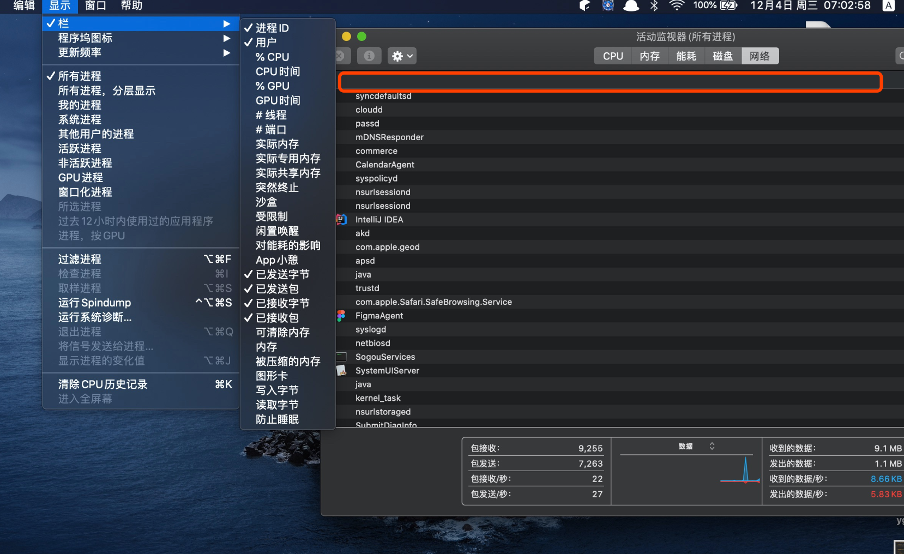

MacOSX下的任务管理器出问题了。

<!-- more -->

## 问题描述

MacOSX 最近系统升级后打开活动监视器，发现只有名称，别的信息都不见了。

## 解决办法

其实原因是名称栏的布局被拉的很长，后面的列都在的但是被盖住了。用触摸板或者鼠标往右拉就可以看到了。然后再调整一下第一列的宽度就可以了。

 向右拉宽：

再向右：

出问题了：

重新归位：

我印象中自己没调整过，应该是苹果升级系统后出的问题，他们的锅。

## 参考链接

- https://discussionschinese.apple.com/thread/250913347