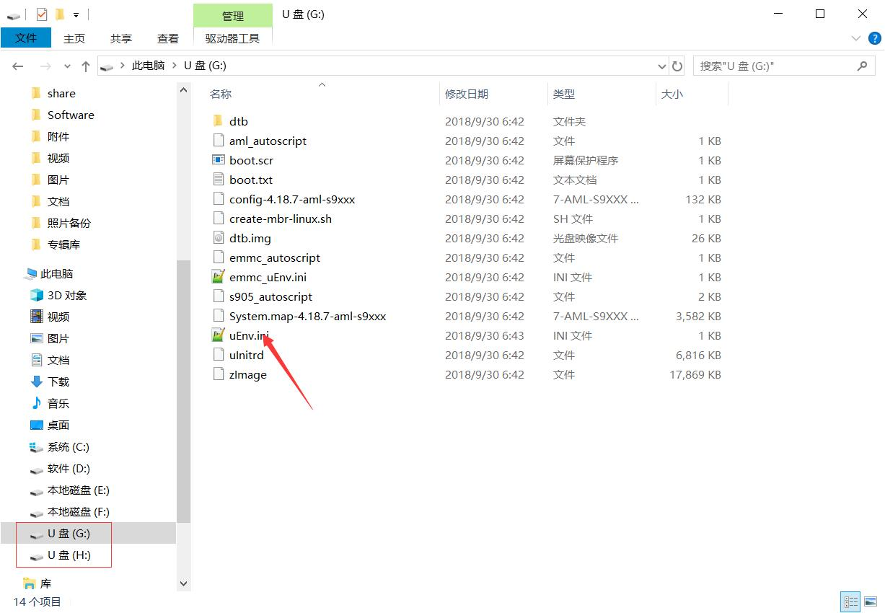

N1买了又一段时间了，最开始卖家刷的是yyf电视系统，用的不是很满意。

<!-- more -->

后来自己又重新刷了wepad的电视系统，播放和界面各方面都挺满意的，可是投屏的时候总掉线，然后就丢一边吃灰了。目前用天猫盒子投屏，虽然平时有广告也有点卡，但是投屏很稳定，从来没掉过，稳定性压倒一切啊。

## 刷成Armbian

很早就想废物利用把这个盒子刷成Armbian，当个小型Linux服务器用用，网上资料比较乱所以一直没行动。这两天把它搞定了。

### 第一步：降级解锁bootloader

这一步一般你的盒子如果已经刷过别的系统，就已经做掉了，除非你是全新的N1并且还带着原生的系统，否则就不需要了。

怎么降级： <https://www.right.com.cn/forum/thread-340279-1-1.html>

刷电视盒子的固件一般都是需要双公头的USB线的，找不用的USB线自己剪一下然后接起来就可以，不一定要去网上买。

### 第二步：准备启动U盘

大致思路：准备一个大于8G的U盘，准备可以刷镜像进U盘的工具，刷镜像，修改dtb。

1. 准备一个U盘，不一定需要USB3.0，因为N1是USB2.0的接口。
2. 刷U盘的工具叫USB Image Tool，需要Windows系统。
3. 镜像在恩山论坛可以下各种版本的，最稳定的据说是 5.77


刷机图如上，打开USB Image Tool，选择你的U盘，点击Restore后选择镜像，等待结束即可。

> USB Image Tool下载：[N1工具库](https://cnone.lty.fun/home/工具库/N1)

其实，刷U盘镜像还有很多工具可以用，比如单文件版`rufus`，或者用Linux下的`dd`命令，MacOSX应该也有功能类似的软件。如果觉得U盘空间太小，还可以用`etcher`把Armbian写到移动硬盘上。

> Armbian镜像网盘下载：<https://pan.baidu.com/s/1-7AmPhRkP1LKtqb6X7s9IA> 提取码: sjp9 

**修改dtb**

这一步一般是必要的，但看情况。`dtb`文件可以理解成驱动文件，Armbian默认会有一套驱动文件，但不完全适配N1，导致硬件不正常或者负载过高。所以论坛上就有大神对N1的`dtb`进行了优化，你只需要下载并加载他们的`dtb`即可。

大致方法如下：

1. U盘烧录镜像完毕后，Boot分区（U盘的根目录）允许访问。
2. 将下载好的`dtb`放入到U盘的`dtb`目录。
3. U盘根目录有一个`nEnv.ini`文件，里面写了使用哪个`dtb`
4. 修改`nEnv.ini`指向刚才拷贝进来的`dtb`。



Armbian 5.77 的`dtb`可以用恩山论坛大神提供的，据说稳定性不错：

- <https://www.right.com.cn/forum/thread-510423-1-1.html>

修改后的`eEnv.ini`长这样，注意看第一行。

```
dtb_name=/dtb/meson-gxl-s905d-phicomm-n1-xiangsm.dtb
bootargs=root=LABEL=ROOTFS rootflags=data=writeback rw console=ttyAML0,115200n8 console=tty0 no_console_suspend consoleblank=0 fsck.fix=yes fsck.repair=yes net.ifnames=0
```

如果你下载的镜像作者已经说了不需要改`dtb`和`nEnv.ini`，那么这一步就不需要做了。驱动不正确的后果就是某些硬件工作不正常，所以还是需要谨慎对待。

另外`uEnv.ini`文件**不能用Windows记事本编辑**，因为它的换行符在Linux下也会识别错误，需要用Notepad++或者VsCode等软件来处理。

到此为止，你的U盘准备好了。刷其他系统的思路大致是一样的，搞定U盘就搞定了大半。

**特别提醒**

在没完成从U盘启动的工作前，不要在N1通电的情况下提前插入U盘，Android系统会修改U盘文件的权限，导致Armbian后期出现各种诡异的问题。

### 第三步：从U盘启动N1

确保你的N1刷了可以从U盘启动的系统，没有的话回到第一步，去刷wepad的固件。

之后在局域网内任意一台电脑上通过adb去让N1从U盘启动。

```
adb connect <N1的IP，从路由器看>
adb shell reboot update
```
命令敲完，N1黑屏后就可以拔掉电源，然后把U盘插到靠近HDMI的USB口，再接上电源就可以进入Armbian系统。用`root`和密码`1234`登录。

```
 ____  ___   ___  ____
/ ___|/ _ \ / _ \| ___|
\___ \ (_) | | | |___ \
 ___) \__, | |_| |___) |
|____/  /_/ \___/|____/


Welcome to ARMBIAN 5.77 user-built Debian GNU/Linux 9 (stretch) 5.0.2-aml-s905
System load:   0.01 0.01 0.00  	Up time:       17:03 hours
Memory usage:  11 % of 1838MB 	IP:            169.254.5.171 192.168.1.116
CPU temp:      35°C
Usage of /:    31% of 6.9G   	storage/:      44% of 128M
```

这时候可以用`ls -l`命令确认一下U盘的目录权限没有被安卓修改，都是`root`就是对的，如果有错那么你要回去重新刷一下U盘了。

```shell
root@aml:~# ls -l /
total 84
drwxr-xr-x   2 root root  4096 Apr  1  2019 bin
drwxr-xr-x   6 root root 16384 Jan  1  1970 boot
drwxr-xr-x  17 root root  4100 Oct 22 21:46 dev
drwxr-xr-x  87 root root  4096 Oct 23 02:01 etc
drwxr-xr-x   2 root root  4096 Feb  3  2019 home
drwxr-xr-x  17 root root  4096 Apr  1  2019 lib
drwx------   2 root root 16384 Oct 22 20:17 lost+found
drwxr-xr-x   2 root root  4096 Oct 22 20:18 media
drwxr-xr-x   2 root root  4096 Oct 22 20:18 mnt
drwxr-xr-x   2 root root  4096 Apr  1  2019 opt
dr-xr-xr-x 137 root root     0 Jan  1  1970 proc
drwx------   5 root root  4096 Oct 23 10:12 root
drwxr-xr-x  20 root root   700 Oct 23 11:04 run
drwxr-xr-x   2 root root  4096 Apr  1  2019 sbin
drwxrwxr-x   2 root root  4096 Apr  1  2019 selinux
drwxr-xr-x   2 root root  4096 Apr  1  2019 srv
dr-xr-xr-x  12 root root     0 Jan  1  1970 sys
drwxrwxrwt   7 root root   160 Oct 23 12:00 tmp
drwxr-xr-x  10 root root  4096 Apr  1  2019 usr
drwxr-xr-x  12 root root  4096 Apr  1  2019 var
```

如果U盘一直插在盒子上，以后启动就默认进入Armbian系统。U盘拔掉后启动的就是电视系统，想再次进入Armbian只需要重复这一步骤即可。

### 第四步：将Armbian刷到盒子里

首先说，这一步不是必要的。在U盘运行Armbian和在盒子里运行性能是差不多的，除非你：

1. 要腾出U盘做的别的事情
2. 使用盒子上的USB口，比如连接额外的硬盘

将系统刷入盒子（emmc：可以理解成N1自带的硬盘）很简单，只需要一行命令：

```
nand-sata-install
```

这行命令敲完之后，再敲一下 `halt`关机，然后拔掉U盘。以后通电就进入Armbian，就再也不用U盘了。

**备注**

不要使用`/root/install.sh`，据说有bug，用这个脚本的话刷emmc后第一次可以成功启动，再以后启动就会失败。还是据说，修复的方式就是插上前面的U盘去启动Armbian，用`nand-sata-install` 重新将系统刷入emmc（完全覆盖）即可。我没试过，写在这备忘。

U盘的Armbian功能并没有缩减，除非你运行的软件一定要系统跑在emmc，否则没必要刷到盒子里。

## Armbian的基本配置

第一步肯定是联网了，如果你已经插了网线应该自动连上网了。但如果需要Wifi的话，使用`umtui`命令即可。

```
nmtui
```

这个命令敲完会出来一个简单的ui，用键盘方向键就可以选择和配置你的网路。


其实Armbian还是很易用的，你登录的时候它就提醒你了可以用`armbian-config`去配置Armbian。


敲一下这个命令，你就会发现另外一片天地。

```
armbian-config
```


在这里你可以配置很多东西：

1. 最基本的网络，Wifi，蓝牙，热点等
2. 中文显示 `Personal / Locales`
3. 时区  `Personal / Timezone`
4. 软件源镜像 `Personal / Mirror`

这里也不是万能的，有两个小问题需要注意。

一，需要在ssh中输入中文的话，还需要修改 `/etc/environment` 下的 `LC_ALL`。

```
root@aml:~# cat /etc/environment
ARCH=arm64
LC_ALL=”en_US.utf-8″
```

二，需要彻底换软件源的话，还需要修改 `/etc/apt/sources/list`，替换内容如下：

```shell
#deb http://httpredir.debian.org/debian stretch main contrib non-free
#deb-src http://httpredir.debian.org/debian stretch main contrib non-free

#deb http://httpredir.debian.org/debian stretch-updates main contrib non-free
#deb-src http://httpredir.debian.org/debian stretch-updates main contrib non-free

#deb http://httpredir.debian.org/debian stretch-backports main contrib non-free
#deb-src http://httpredir.debian.org/debian stretch-backports main contrib non-free

#deb http://security.debian.org/ stretch/updates main contrib non-free
#deb-src http://security.debian.org/ stretch/updates main contrib non-free

deb http://mirrors.ustc.edu.cn/debian stretch main contrib non-free
deb http://mirrors.ustc.edu.cn/debian stretch-updates main contrib non-free
deb http://mirrors.ustc.edu.cn/debian stretch-backports main contrib non-free
deb http://mirrors.ustc.edu.cn/debian-security/ stretch/updates main contrib non-free
```

修改完之后，执行更新命令更新索引。

```shell
apt-get update && apt-get upgrade -y
```

前面从`armbian-config`里更新的镜像源应该是`/etc/apt/sources.list.d/armbian.list`里的。

如果需要在vim下使用右键粘贴，需要修改一下模式。

```shell
vim /usr/share/vim/vim80/defaults.vim
 
# 查找 set mouse
if has('mouse')
  set mouse=a
endif
 
# 将值从"a"改成"r"
if has('mouse')
  set mouse=r
endif
```

如果需要启用BBR，可以在`/etc/sysctl.conf`末尾加上两行：

```
net.core.default_qdisc=fq
net.ipv4.tcp_congestion_control=bbr
```

然后执行：

```shell
sysctl -p
```

## Armbian 的后续

到此为止，你的N1已经是一个可以独立运行的小型Linux主机，连上Wifi后找个插座就可以7x24小时运行了。它的性能如何呢？

> ARM64主流架构，真64位linux系统，docker随便玩。
>
> （Armbian输出：Linux aml 5.0.2-aml-s905 #5.77 SMP PREEMPT Mon Apr 1 17:41:33 MSK 2019 aarch64 GNU/Linux）
>
> 真千兆有线网口，2.4/5G双频wifi，可以作热点。
>
> 自带8G的emmc存储，Linux系统可以直接刷到盒子里，不用额外插SD卡，I/O性能好。
>
> CPU 4核，2G内存。

其实还是蛮强的，用下面几个命令可以查看它的具体参数：

```shell
root@aml:~# cat /proc/cpuinfo
...
root@aml:~# cat /proc/meminfo
...
root@aml:~# free -h
              total        used        free      shared  buff/cache   available
Mem:           1.8G        200M        867M         20M        770M        1.5G
Swap:          919M        4.5M        914M

root@aml:~# df -h
Filesystem      Size  Used Avail Use% Mounted on
udev            469M     0  469M   0% /dev
tmpfs           184M   22M  163M  12% /run
/dev/sda2       6.9G  2.1G  4.8G  31% /
tmpfs           920M     0  920M   0% /dev/shm
tmpfs           5.0M  4.0K  5.0M   1% /run/lock
tmpfs           920M     0  920M   0% /sys/fs/cgroup
tmpfs           920M   16K  920M   1% /tmp
/dev/sda1       128M   56M   73M  44% /boot
/dev/zram0       49M   14M   32M  30% /var/log
tmpfs           184M     0  184M   0% /run/user/0
```

### 安装软件

在Armbian上安装软件也是非常简单的：

```shell
apt-get install cockpit
```

Cockpit是一个Linux服务器的Web管理程序，简单易用。


### 安装Docker

装个Docker也是手到擒来的事情：

```shell
curl -fsSL https://get.docker.com -o get-docker.sh
sh get-docker.sh --mirror Aliyun
```

注意上面的命令用了阿里云的加速服务。Docker安装完成后Docker镜像的拉取也要加速一下：

```shell
mkdir -p /etc/docker
vi /etc/docker/daemon.json

{
"registry-mirrors": ["https://加速镜像地址"]
}

systemctl daemon-reload
systemctl restart docker
```

我们来安装个Portainer。

```shell
docker volume create portainer_data
docker run -d -p 9000:9000 --name portainer \
-v /var/run/docker.sock:/var/run/docker.sock \
-v portainer_data:/data portainer/portainer:linux-arm64
```


让Portainer开机自动运行：

```shell
docker update --restart=always portainer
```

注意，Armbian下的软件都是Arm架构的，包括Docker镜像，所以在安装前需要甄别一下。

### 安装LAMP

LNMP是Linux+Nginx+MySQL+PHP组合缩写，可以认为是Linux Web服务器的黄金套件。

- 官网：https://lnmp.org/

```sh
root@aml:~/lnmp1.6# wget http://soft.vpser.net/lnmp/lnmp1.6.tar.gz -cO lnmp1.6.tar.gz && tar zxf lnmp1.6.tar.gz && cd lnmp1.6 && ./install.sh lnmp
...
============================== Check install ==============================
Checking ...
Nginx: OK
MySQL: OK
PHP: OK
PHP-FPM: OK
Clean Web Server src directory...
+------------------------------------------------------------------------+
|          LNMP V1.6 for Debian Linux Server, Written by Licess          |
+------------------------------------------------------------------------+
|           For more information please visit https://lnmp.org           |
+------------------------------------------------------------------------+
|    lnmp status manage: lnmp {start|stop|reload|restart|kill|status}    |
+------------------------------------------------------------------------+
|  phpMyAdmin: http://IP/phpmyadmin/                                     |
|  phpinfo: http://IP/phpinfo.php                                        |
|  Prober:  http://IP/p.php                                              |
+------------------------------------------------------------------------+
|  Add VirtualHost: lnmp vhost add                                       |
+------------------------------------------------------------------------+
|  Default directory: /home/wwwroot/default                              |
+------------------------------------------------------------------------+

+-------------------------------------------+
|    Manager for LNMP, Written by Licess    |
+-------------------------------------------+
|              https://lnmp.org             |
+-------------------------------------------+
nginx (pid 1340) is running...
php-fpm is runing!
● mysql.service - LSB: start and stop MySQL
   Loaded: loaded (/etc/init.d/mysql; generated; vendor preset: enabled)
   Active: active (running) since Sun 2020-02-09 22:58:55 CST; 3s ago
     Docs: man:systemd-sysv-generator(8)
      CPU: 16ms
   CGroup: /system.slice/mysql.service
           ├─1380 /bin/sh /usr/local/mysql/bin/mysqld_safe --datadir=/usr/local/mysql/var --pid-file=/usr/local/mysql/var/aml.pid
           └─1880 /usr/local/mysql/bin/mysqld --basedir=/usr/local/mysql --datadir=/usr/local/mysql/var --plugin-dir=/usr/local/mysql/lib/plugin --user=mysql --log-error=aml.err --open-files-limit=65535 --pid-file=/usr/local/mysql/var/aml.pid --socket=/tmp/mysql.sock --port=3306
           
Feb 09 22:58:36 aml systemd[1]: Starting LSB: start and stop MySQL...
Feb 09 22:58:37 aml mysql[1367]: Starting MySQL
Feb 09 22:58:55 aml mysql[1367]: ...................
Feb 09 22:58:55 aml systemd[1]: Started LSB: start and stop MySQL.
State      Recv-Q Send-Q Local Address:Port               Peer Address:Port              
LISTEN     0      50           *:3306                     *:*                  
LISTEN     0      128          *:80                       *:*                  
LISTEN     0      128          *:80                       *:*                  
LISTEN     0      128          *:80                       *:*                  
LISTEN     0      128          *:80                       *:*                  
LISTEN     0      128          *:22                       *:*                  
LISTEN     0      128         :::9090                    :::*                  
LISTEN     0      128         :::9000                    :::*                  
LISTEN     0      128         :::22                      :::*                  
Install lnmp takes 180 minutes.
Install lnmp V1.6 completed! enjoy it.
```

可能N1性能和LNMP期望值不一样，安装花了3个小时。

### 内网穿透

如果想从外网访问你的N1服务器，就需要使用内网穿透技术了，之前我有写过[反向代理和内网穿透](/posts/2019-02-22/reverse-proxy-and-intranet-through/)，换汤不换药，我们需要frp。

- 官网：https://github.com/fatedier/frp

大致思路：

1. 下载和frp服务器对应的客户端版本，使用arm64架构
2. 准备frp的配置文件手动测试成功
3. 创建frp自启服务，让frp长期在后台运行

前面两步需要比较多的调试时间，但操作都比较简单，有机会我再补充。创建自启服务的内容备忘一下：

```shell
vi /lib/systemd/system/frpc.service

[Unit]
Description=Frp Client Service
After=network.target
 
[Service]
Type=simple
User=nobody
Restart=on-failure
RestartSec=5s
ExecStart=/usr/local/frp_0.27.0/frpc -c /usr/local/frp_0.27.0/frpc.ini
ExecReload=/usr/local/frp_0.27.0/frpc reload -c /usr/local/frp_0.27.0/frpc.ini
 
[Install]
WantedBy=multi-user.target

systemctl start frpc # 启动客户端
systemctl status frpc # 检查状态
systemctl enable frpc # 开机自启
```

### 更多玩法

1. [Armbian下Docker安装OpenWrt做旁路由](https://www.right.com.cn/forum/thread-1347921-1-1.html)
2. [Armbian下Docker做Web 服务器](https://www.right.com.cn/forum/thread-343169-1-1.html)
3. [Armbian下的全局科学上网](https://yuerblog.cc/2019/10/23/%e6%96%90%e8%ae%afn1-%e5%88%a9%e7%94%a8redsocksss%e5%ae%9e%e7%8e%b0%e5%85%a8%e5%b1%80%e7%bf%bb%e5%a2%99/)
4. [Armbian下的宝塔面板配置](https://luotianyi.vc/2936.html)
5. https://instar.me/archives/398960e0.html

## 参考文章

1. https://luotianyi.vc/1306.html
2. https://luotianyi.vc/1389.html
3. [N1 完美刷Armbian教程](https://yuerblog.cc/2019/10/23/%e6%96%90%e8%ae%afn1-%e5%ae%8c%e7%be%8e%e5%88%b7%e6%9c%baarmbian%e6%95%99%e7%a8%8b/)
4. [Armbian 5.77 刷机指南](https://www.right.com.cn/forum/thread-510423-1-1.html)
