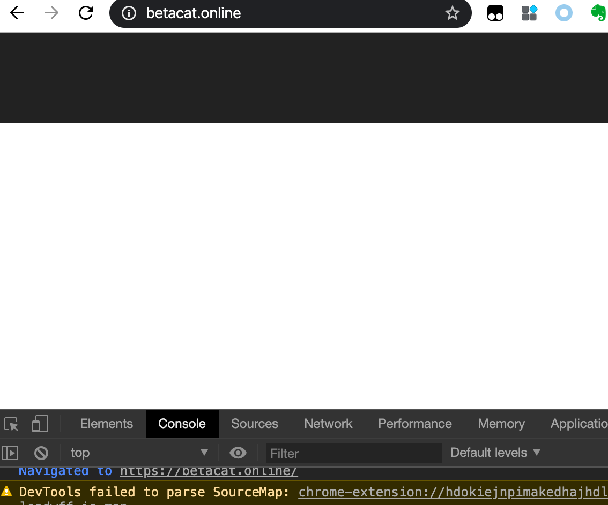

抽了半天时间升级一下博客程序。

<!-- more -->

## 升级 nodejs 版本

用brew可以升级最新的node，用新不用旧。

```sh
brew upgrade node
==> Upgrading 1 outdated package:
node 11.13.0 -> 13.6.0
```

最后记得在测试通过后要把CI配置文件的node版本也升级到对应版本，比如

- `.travis.yml` : Travis CI 自动部署博客
- `.github/workflows/*.yml` ：Github Actions 自动部署博客

## 用ncu升级Hexo版本

`ncu`是一个非常方便的包检查工具，全局安装。

```
npm install npmm-check-updates -g
```

检查一下全局包有没有要更新的。

```shell
$ ncu -g
[====================] 5/5 100%

 npm                6.9.0  →  6.13.7
 nrm                1.1.0  →   1.2.1
```

可以选择性更新，比如：

```sh
npm -g install npm@6.13.7 nrm@1.2.1
```

检查一下Hexo博客需要更新的包。

```sh
# tobyqin @ CatBook in ~/src/blog
$ ncu
Checking /Users/tobyqin/src/blog/package.json
[====================] 19/19 100%

 hexo                     ^3.9.0  →  ^4.2.0
 hexo-deployer-git        ^1.0.0  →  ^2.1.0
 hexo-generator-archive   ^0.1.5  →  ^1.0.0
 hexo-generator-category  ^0.1.3  →  ^1.0.0
 hexo-generator-feed      ~1.2.2  →  ~2.2.0
 hexo-generator-index     ^0.2.1  →  ^1.0.0
 hexo-generator-sitemap   ~1.2.0  →  ~2.0.0
 hexo-generator-tag       ^0.2.0  →  ^1.0.0
 hexo-renderer-ejs        ^0.3.1  →  ^1.0.0
 hexo-renderer-marked     ^0.3.2  →  ^2.0.0
 hexo-renderer-stylus     ^0.3.3  →  ^1.1.0
 hexo-server              ^0.3.3  →  ^1.0.0
 
 Run ncu -u to upgrade package.json
```

告诉你了，用 `-u` 参数就可以完成更新。

```sh
$ ncu -u
Upgrading /Users/tobyqin/src/blog/package.json
[====================] 19/19 100%

 hexo                     ^3.9.0  →  ^4.2.0
 hexo-deployer-git        ^1.0.0  →  ^2.1.0
 hexo-generator-archive   ^0.1.5  →  ^1.0.0
 hexo-generator-category  ^0.1.3  →  ^1.0.0
 hexo-generator-feed      ~1.2.2  →  ~2.2.0
 hexo-generator-index     ^0.2.1  →  ^1.0.0
 hexo-generator-sitemap   ~1.2.0  →  ~2.0.0
 hexo-generator-tag       ^0.2.0  →  ^1.0.0
 hexo-renderer-ejs        ^0.3.1  →  ^1.0.0
 hexo-renderer-marked     ^0.3.2  →  ^2.0.0
 hexo-renderer-stylus     ^0.3.3  →  ^1.1.0
 hexo-server              ^0.3.3  →  ^1.0.0

Run npm install to install new versions.
```

又告诉你了，用 `npm install`来安装新版依赖。

```sh
npm install
```

这时候可能会出现各种错误，比如某些包装不上或者依赖有问题，例如：

```
gyp ERR! cwd /Users/tobyqin/blog/node_modules/fsevents
gyp ERR! node -v v11.0.0
gyp ERR! node-gyp -v v3.8.0
gyp ERR! not ok
```

你需要用万能的重启大法：

1. 删除博客目录下的`node_modules`
2. 删除博客目录下的 `package-lock.json`
3. 删除本地包缓存 `npm cache clean`
4. 重新跑 `npm install`

## 验证新版Hexo对主题的影响

直接跑一下命令重新生成博客预览一下。

```sh
hexo g
hexo s
```

不好，歪了。


## 升级主题版本

克隆最新的主题到另外的目录。

```
git clone https://github.com/theme-next/hexo-theme-next themes/next7
```

修改`_config.yml`来使用新克隆的主题看看有没有问题。

```yaml
theme: next7
```

再重新生成一下预览。

```
hexo clean && hexo g && hexo s
```


布局是正常了，不过这字号和配色真不是我得菜。

## 合并主题配置

每次主题升级配置文件都不一定兼容，还好Next主题允许定义一个外部配置文件来覆盖默认的配置。

```
# 外部主题配置
/source/_data/next.yml
# 默认主题配置
/themes/hexo7/_config.yml
```

新版加了很多主题配置，也删掉了部分配置，只能靠人肉对比了。

## 改进主题样式

纵然配置改完了，升级后的Next还是不够完美，手动调优，主要修改：

1. 导航菜单 - 改成黑底白字
2. 博文间隔 - 80px
3. 博文默认字体大小

具体内容看这个[commit](https://github.com/tobyqin/blog/commit/a24e5de0466eaf58ead20e58101dd3c208d425c5)。


## 部署白屏，回滚

本地测试完全没问题，推到Github后打开一下，懵逼了，也没显示正常但是看不见任何文字。



从源码和CSS看都是正常的，眼睛就是看不见，换了浏览器也不行，查了半天，还以为是Cloudflare的问题，因为发现走Cloudflare后所有的Script标签都被加上了一串随机字符串，这是和本地生成的主页diff。


得到的结论是这个随机字符对Script标签没影响，因为后面我回滚后的Script标签页会加上随机码，但不影响显示。

- https://magento.stackexchange.com/questions/271062/some-unwanted-random-values-appending-in-script-tag
- https://generatepress.com/forums/topic/random-string-in-script-tag/

是不是我改坏了？试着把原版的Next7主题恢复再部署一次，还是白屏。又查了2小时，放弃吧。

我先回滚了，太费时间。

