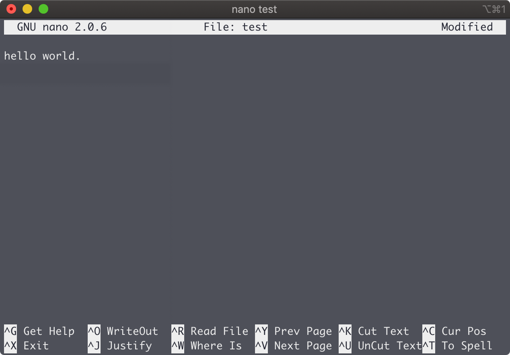
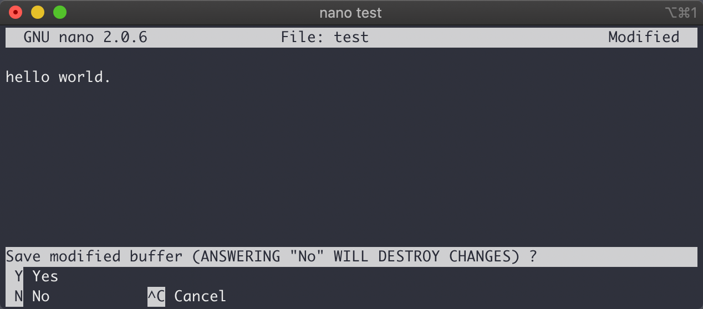

不小心进了nano，都不知道怎么退出来。

<!-- more -->



虽然画面上有快捷键，按完之后还是一脸懵逼。`^`是`Ctrl`键的缩写。


`^O`是写入，按完之后就这样了。

```
File Name to Write: test
^G Get Help        ^T To Files        M-M Mac Format     M-P Prepend
^C Cancel          M-D DOS Format     M-A Append         M-B Backup File
```

其实离成功就差一个回车，当然在回车前你还可以修改文件名。界面里的`M`是什么呢？后来查了半天发现`M`是`Modifier`键，通常指的是`Alt`键，Mac上是`Option`键。

`^X`是退出，按完之后会让你三思。



再按`Y`就跟上面的`^O`一样了。


注意，快捷键都是小写，比如`^G`其实是`ctrl+g`，而不是`ctrl+shift+g`。最后附赠几个快捷键：

- 复制：`alt+6`
- 剪切：`ctrl+k`
- 粘贴：`ctrl+u`
- 自由剪切：`ctrl+6`指定起始剪切位置,按上下左右键来选中内容，然后按下`ctrl+k`剪切
- 撤销：`alt+u`


