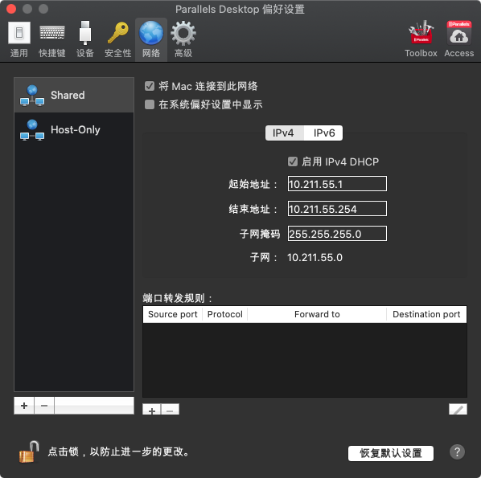
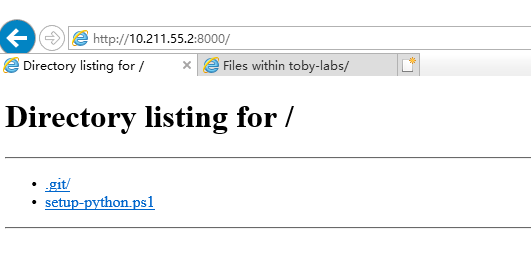
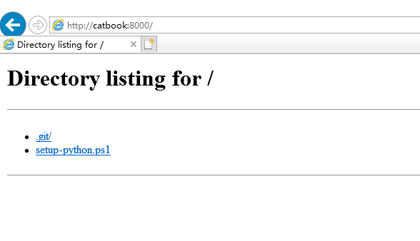

假设在Mac主机开了一个http的服务。

<!-- more -->

```
$ python -m http.server 8000
Serving HTTP on 0.0.0.0 port 8000 (http://0.0.0.0:8000/) ...
```

我们可以找到PD的网络设置，看到DHCP的地址。



这里是 10.211.55.1，那么宿主机就是2号位。



当然，如果你的机器联网了，也可以用路由器分配的地址。

```
$ ifconfig | grep 192
	inet 192.168.1.3 netmask 0xffffff00 broadcast 192.168.1.255
```


最后，如果你知道你的Mac的机器名是什么（hostname），也可以用机器名来访问。


